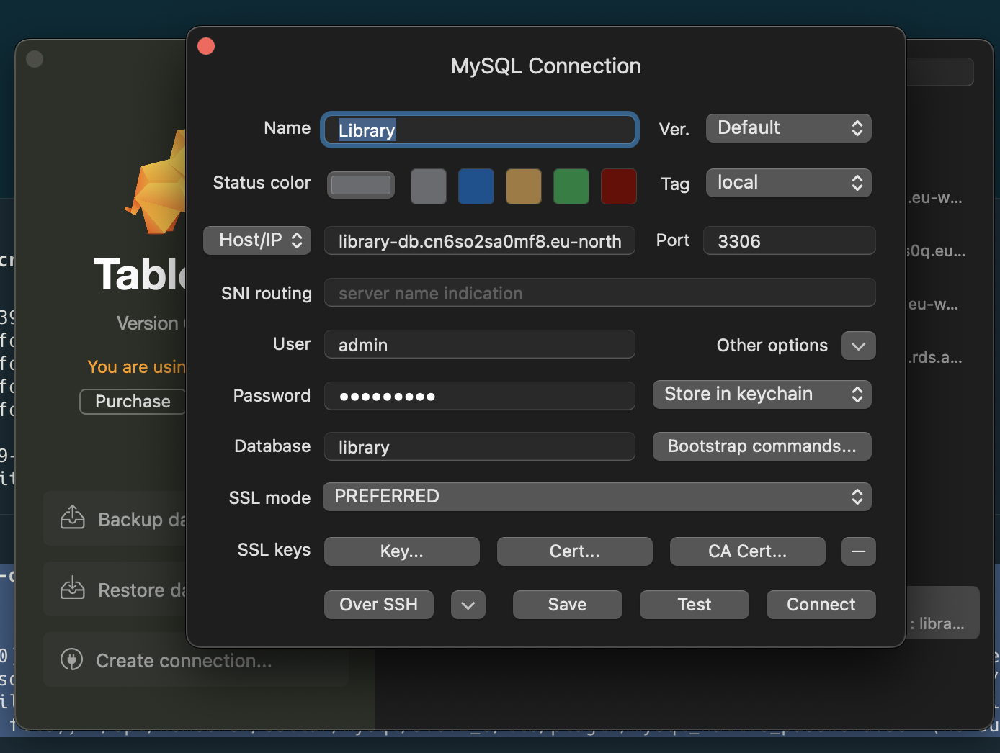
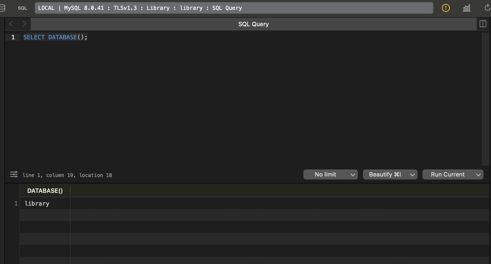
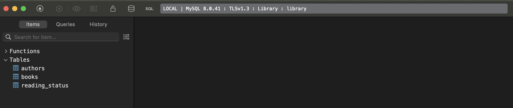
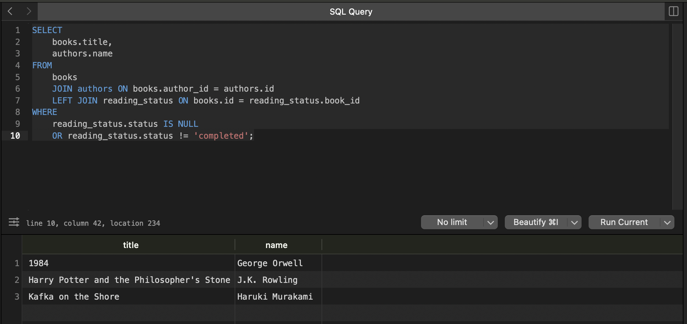
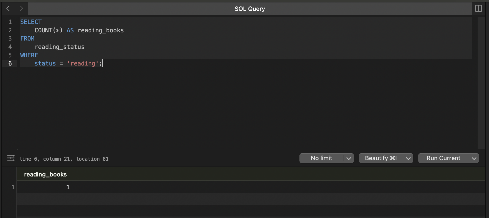
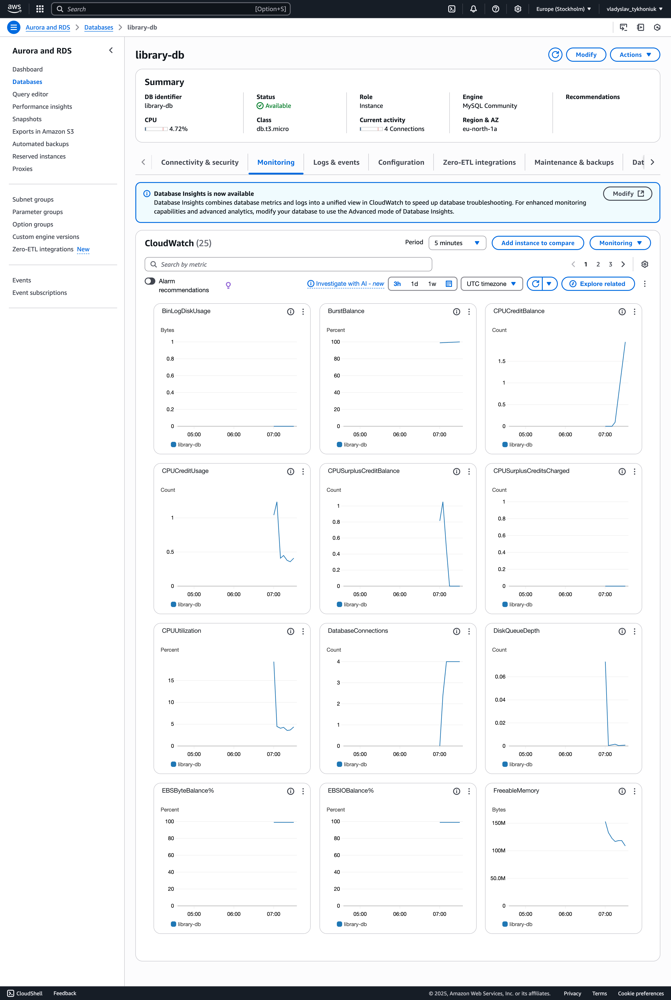
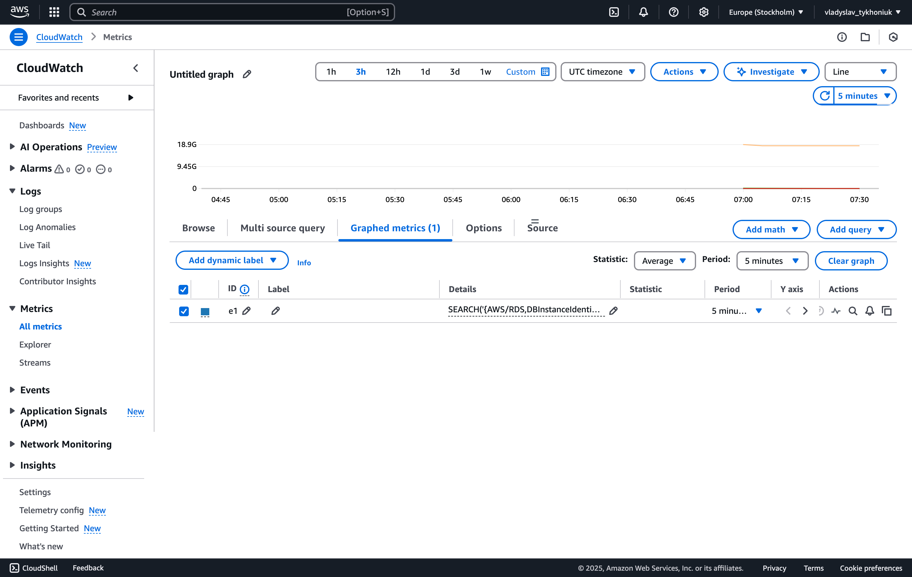

## HM-27 -> RDS (Terraform)

1. Створення RDS інстансу

1. Увійдіть до AWS Management Console
2. Відкрийте сервіс RDS та створіть інстанс бази даних:
* Виберіть Create database
* Тип бази: MySQL (можна обрати PostgreSQL за бажанням)
* Шаблон: Free tier
* Конфігурація:
    * DB instance identifier: library-db
    * Master username: admin
    * Master password: створіть надійний пароль
    * DB instance class: db.t3.micro
    * Дисковий простір: 20 ГБ (General Purpose SSD)
    * Увімкніть Public access для підключення до бази з вашого комп'ютера
* У розділі Network & Security:
    * Виберіть існуючу VPC або створіть нову
    * Додайте нову security group, що дозволяє доступ лише з вашого IP
3. Дочекайтесь завершення створення інстансу.

## [Helpful resource](https://github.com/pvarentsov/terraform-aws-free-tier)
```textmate
Для створення rds instance, було використано terraform, який значно спрощує взаємодію 
з використанням AWS, тому що було декілька спроб створення через консоль, 
але це прогулянка в 3 соснах. 
```
```textmate
main.tf
```
```terraform
provider "aws" {
  region = var.aws_region
}

module "vpc" {
  source = "./modules/VPC"
}

resource "aws_db_subnet_group" "library" {
  name       = "library-db-subnet-group"
  subnet_ids = [
    module.vpc.public_subnet1_id,
    module.vpc.public_subnet2_id
  ]

  tags = {
    Name = "Library DB subnet group"
  }
}

resource "aws_security_group" "library-db-security-group" {
  name   = "library-db-security-group"
  vpc_id = module.vpc.vpc_id

  ingress {
    from_port   = 3306
    to_port     = 3306
    protocol    = "tcp"
    cidr_blocks = [var.local_ip]
  }

  tags = {
    Name = "library-db-security-group"
  }
}

resource "aws_db_instance" "library-db" {
  identifier               = "library-db"
  engine                   = "mysql"
  engine_version           = "8.0"
  instance_class           = "db.t3.micro"
  allocated_storage        = 20
  db_name                  = var.db_name
  username                 = var.root_user
  password                 = var.root_password
  publicly_accessible      = true
  skip_final_snapshot      = true
  storage_type             = "gp2"
  vpc_security_group_ids   = [aws_security_group.library-db-security-group.id]
  db_subnet_group_name     = aws_db_subnet_group.library.name

  tags = {
    Name = "library-db"
  }
}
```

```textmate
outputs.tf
```
```terraform
output "rds_endpoint" {
  value = aws_db_instance.library-db.endpoint
}

output "rds_port" {
  value = aws_db_instance.library-db.port
}
```


```textmate
terraform.tfvars.json
```

```json
{
  "aws_region": "eu-north-1",
  "local_ip": "xx-xx-xxx-xx/32", // тут був мій локальний ip-address, але змінив на правах анонімності
  "db_name": "library",
  "root_user": "admin",
  "root_password": "xxxxxx" // тут також був пароль, це вже не настільки важливо але все ж
}
```

```textmate
variables.tf
```
```terraform
variable "aws_region" {}
variable "local_ip" {}
variable "db_name" {}
variable "root_user" {}
variable "root_password" {}
```

```textmate
modules/vpc.tf
```

```terraform
resource "aws_vpc" "main" {
  cidr_block           = "10.0.0.0/16"
  enable_dns_support   = true
  enable_dns_hostnames = true

  tags = {
    Name = "library-vpc"
  }
}

resource "aws_internet_gateway" "gw" {
  vpc_id = aws_vpc.main.id

  tags = {
    Name = "main-gateway"
  }
}

resource "aws_subnet" "public1" {
  vpc_id                  = aws_vpc.main.id
  cidr_block              = "10.0.1.0/24"
  availability_zone       = "eu-north-1a"
  map_public_ip_on_launch = true

  tags = {
    Name = "public-subnet-1"
  }
}

resource "aws_subnet" "public2" {
  vpc_id                  = aws_vpc.main.id
  cidr_block              = "10.0.2.0/24"
  availability_zone       = "eu-north-1b"
  map_public_ip_on_launch = true

  tags = {
    Name = "public-subnet-2"
  }
}

resource "aws_route_table" "public" {
  vpc_id = aws_vpc.main.id

  route {
    cidr_block = "0.0.0.0/0"
    gateway_id = aws_internet_gateway.gw.id
  }

  tags = {
    Name = "public-route-table"
  }
}

resource "aws_route_table_association" "public1" {
  subnet_id      = aws_subnet.public1.id
  route_table_id = aws_route_table.public.id
}

resource "aws_route_table_association" "public2" {
  subnet_id      = aws_subnet.public2.id
  route_table_id = aws_route_table.public.id
}
```

```textmate
modules/outputs.tf
```

```terraform
output "vpc_id" {
  value = aws_vpc.main.id
}

output "public_subnet1_id" {
  value = aws_subnet.public1.id
}

output "public_subnet2_id" {
  value = aws_subnet.public2.id
}
```


2. Підключення до бази
1. Під'єднайтеся до бази даних за допомогою SQL-клієнта (наприклад, MySQL Workbench)
2. Використовуйте параметри підключення, надані в RDS (адреса хоста, порт 3306, ім'я користувача admin та пароль)



3. Створення бази даних та таблиць

Створіть базу даних library:

```sql

CREATE DATABASE library;
USE library;

```



Створіть три таблиці для зберігання даних про авторів, книги та статус читання:

Таблиця №1

```sql
CREATE TABLE authors (
  id INT AUTO_INCREMENT PRIMARY KEY,
  name VARCHAR(255) NOT NULL,
  country VARCHAR(255)
);
```

```textmate
Query 1 OK: 0 rows affected
```

Таблиця №2

```sql
CREATE TABLE books (
  id INT AUTO_INCREMENT PRIMARY KEY,
  title VARCHAR(255) NOT NULL,
  author_id INT,
  genre VARCHAR(50),
  FOREIGN KEY (author_id) REFERENCES authors(id)
);
```

```textmate
Query 1 OK: 0 rows affected
```

Таблиця №3

```sql
CREATE TABLE reading_status (
  id INT AUTO_INCREMENT PRIMARY KEY,
  book_id INT,
  status ENUM('reading', 'completed', 'planned') NOT NULL,
  last_updated TIMESTAMP DEFAULT CURRENT_TIMESTAMP,
  FOREIGN KEY (book_id) REFERENCES books(id)
);
```

```textmate
Query 1 OK: 0 rows affected
```



4. Внесення даних

Додайте кількох авторів:
```sql
INSERT INTO authors (name, country) VALUES
  ('George Orwell', 'United Kingdom'),
  ('J.K. Rowling', 'United Kingdom'),
  ('Haruki Murakami', 'Japan');
```

```textmate
Query 1 OK: 3 rows affected
```

Додайте кілька книг:

```sql
INSERT INTO books (title, author_id, genre) VALUES
  ('1984', 1, 'Dystopian'),
  ('Harry Potter and the Philosopher\'s Stone', 2, 'Fantasy'),
  ('Kafka on the Shore', 3, 'Magical realism');
```

```textmate
Query 1 OK: 3 rows affected
```

Додайте статус для однієї з книг:

```sql
INSERT INTO reading_status (book_id, status) VALUES
(1, 'reading');
```

```textmate
Query 1 OK: 1 row affected
```

5. Виконання запитів

Знайдіть всі книги, які ще не прочитані:

```sql
SELECT books.title, authors.name
  FROM books
  JOIN authors ON books.author_id = authors.id
  LEFT JOIN reading_status ON books.id = reading_status.book_id
  WHERE reading_status.status IS NULL OR reading_status.status != 'completed';
```



Визначте кількість книг, які в процесі читання:

```sql
SELECT COUNT(*) AS reading_books
  FROM reading_status
  WHERE status = 'reading';
```



6. Налаштування доступу

Створіть нового користувача для бази даних:

```sql
CREATE USER 'library_user'@'%' IDENTIFIED BY 'strong_password';
```

```textmate
Query 1 OK: 0 rows affected
```

Надайте йому права:

```sql

GRANT SELECT, INSERT, UPDATE ON library.* TO 'library_user'@'%';
  FLUSH PRIVILEGES;
```

```textmate
Query 1 OK: 0 rows affected
```

7. Моніторинг та резервне копіювання
1. Увімкніть автоматичне резервне копіювання у налаштуваннях RDS (Backup retention period: 7 днів).
2. Перегляньте метрики вашого інстансу в CloudWatch (CPU utilization, connections, IOPS).

```main.tf -> library-db```
```textmate
...
  backup_retention_period = 7
  monitoring_interval = 60
...
```

### 1. First Apply
```textmate
aws_db_instance.library-db: Modifying... [id=db-HX7QSVTEV7VJTPW6C4UJAQGTDM]
╷
│ Error: updating RDS DB Instance (library-db): operation error RDS: ModifyDBInstance, https response error StatusCode: 400, RequestID: 5d0d5cfe-4588-4322-a0c9-711127910dee, api error InvalidParameterCombination: A MonitoringRoleARN value is required if you specify a MonitoringInterval value other than 0.
│ 
│   with aws_db_instance.library-db,
│   on main.tf line 37, in resource "aws_db_instance" "library-db":
│   37: resource "aws_db_instance" "library-db" {
│ 
╵
```

### 2. Added IAM role
```main.tf```
```textmate
resource "aws_iam_role" "rds_monitoring" {
  name = "rds-monitoring-role"

  assume_role_policy = jsonencode({
    Version = "2012-10-17"
    Statement = [{
      Action = "sts:AssumeRole"
      Effect = "Allow"
      Principal = {
        Service = "monitoring.rds.amazonaws.com"
      }
    }]
  })
}
```

```Vo.2: main.tf -> library-db```
```textmate
  backup_retention_period = 7
  monitoring_interval = 60
  monitoring_role_arn = "arn:aws:iam::602682890304:role/rds-monitoring-role"
```

```textmate
Apply complete! Resources: 0 added, 1 changed, 0 destroyed.

Outputs:

rds_endpoint = "library-db.cn6so2sa0mf8.eu-north-1.rds.amazonaws.com:3306"
rds_port = 3306
```





```textmate
Тут трошки є питання, де можна познайомитись більш детально з практиками,
як правильно організувати структуру файлів і всього в terraform. 

Тому що я спробував трошки це поділити, але певно зробив це не дуже тому що в мене 
дивно поділені модулі, але певно було б цікаво щось подивитись чи почитати на цю тему.
```