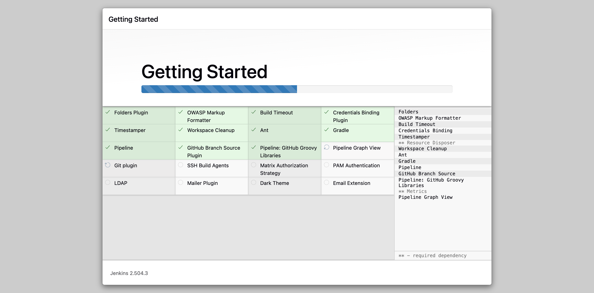
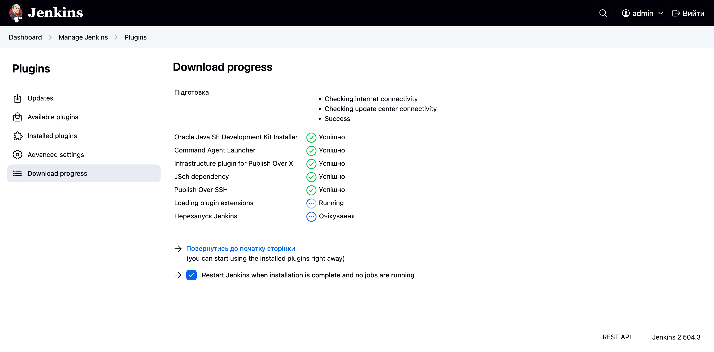
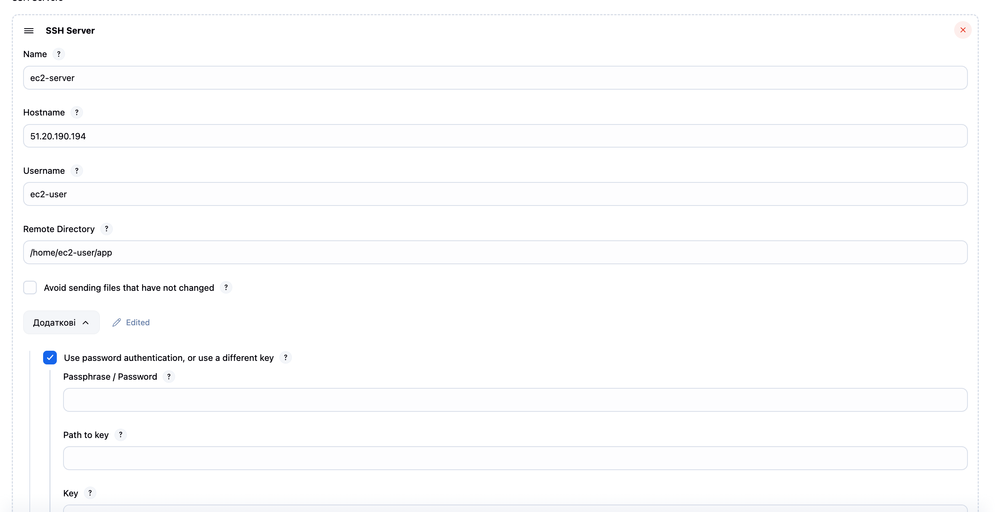
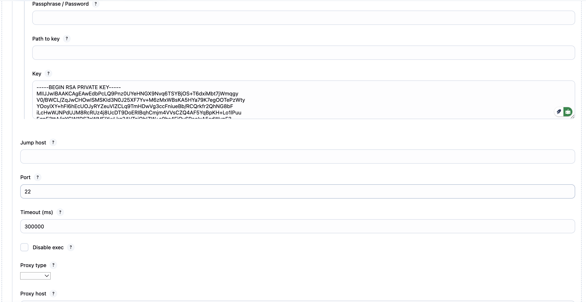
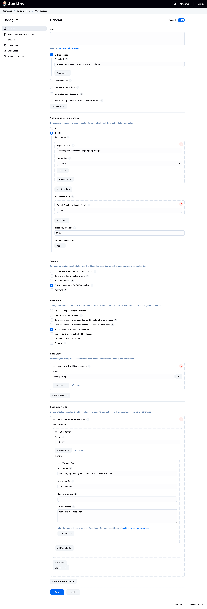
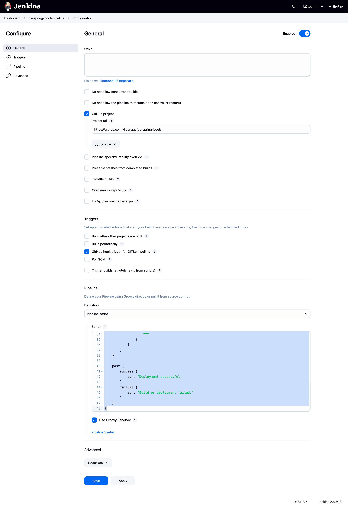
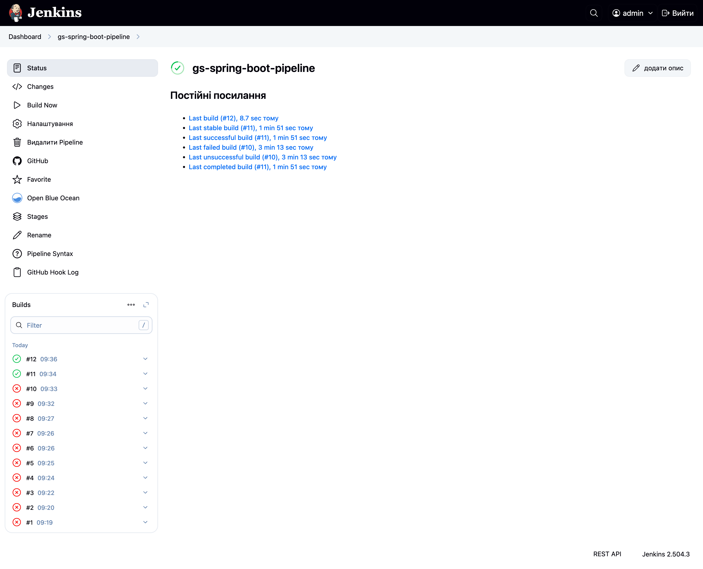
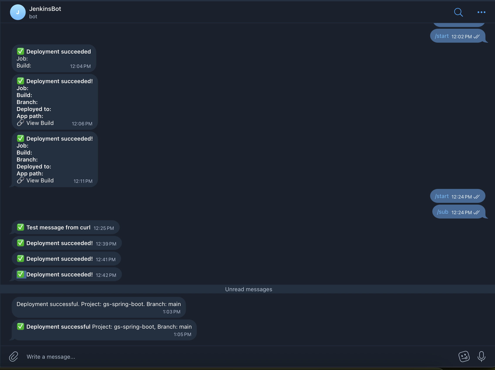

## HM-34 -> Jenkins

```textmate
Основний проєкт

Візьмемо простий Java-проєкт на основі Maven. Використовуйте репозиторій Spring Boot Example Application.

1. Форкніть проєкт:
  * Зайдіть у репозиторій gs-spring-boot і форкніть його у свій GitHub-акаунт
  * Клонувати локально не обов’язково — Jenkins автоматично звантажить репозиторій під час виконання завдань

📌 Завдання 1: Деплой Jenkins

Запустіть Jenkins на вашому локальному сервері або в Docker:

1. Додайте плагіни:
  * Git Plugin
  * Pipeline Plugin
  * Telegram Notification Plugin (для завдання з нотифікаціями)

📌 Завдання 2: Налаштувати EC2

1. Створіть інстанс Amazon EC2 (Amazon Linux 2 або Ubuntu).

Налаштуйте SSH-доступ і встановіть Java та переконайтеся, що ваш Jenkins може підключатися до EC2 через SSH.

📌 Завдання 3: Налаштувати Freestyle Job

1. Створіть Freestyle Job у Jenkins:
  * Назва: Simple Freestyle Job
2. У налаштуваннях:
  * Source Code Management: оберіть Git і вкажіть ваш форк-репозиторій
  * Build Steps:
  * Використайте Maven для збирання проєкту:
mvn clean install
  * Post-build Actions: додайте деплой на EC2 через SCP або SSH

Результат: після успішного виконання білда ваш проєкт має бути скопійований і запущений на EC2.
```

```textmate
hibana@mac robot_dreams_petclinic % docker exec jenkins-blueocean cat /var/jenkins_home/secrets/initialAdminPassword
<ID>
```

```textmate
Далі після початкового екрану вибрав встановити плагіни, але не вдалось знайти Telegram Notification Plugin, його не знаходить в пошуку 
```




```textmate
ssh -i private_key.pem ec2-user@51.20.190.194
```



```textmate
[ec2-user@ip-10-0-1-24 ~]$ mkdir -p /home/ec2-user/app
[ec2-user@ip-10-0-1-24 ~]$ chmod 755 /home/ec2-user/app
[ec2-user@ip-10-0-1-24 ~]$ ^C
```




```textmate
[ec2-user@ip-10-0-1-24 ~]$ sudo yum install java-17-amazon-corretto -y
Amazon Linux 2023 Kernel Livepatch repository                                                                                                   168 kB/s |  17 kB     00:00    
Dependencies resolved.
================================================================================================================================================================================
 Package                                                 Architecture                  Version                                         Repository                          Size
================================================================================================================================================================================
Installing:
 java-17-amazon-corretto                                 x86_64                        1:17.0.15+6-1.amzn2023.1                        amazonlinux                        213 k
Installing dependencies:
 alsa-lib                                                x86_64                        1.2.7.2-1.amzn2023.0.2                          amazonlinux                        504 k
 cairo                                                   x86_64                        1.18.0-4.amzn2023.0.1                           amazonlinux                        718 k
 dejavu-sans-fonts                                       noarch                        2.37-16.amzn2023.0.2                            amazonlinux                        1.3 M
 dejavu-sans-mono-fonts                                  noarch                        2.37-16.amzn2023.0.2                            amazonlinux                        467 k
 dejavu-serif-fonts                                      noarch                        2.37-16.amzn2023.0.2                            amazonlinux                        1.0 M
 fontconfig                                              x86_64                        2.13.94-2.amzn2023.0.2                          amazonlinux                        273 k
 fonts-filesystem                                        noarch                        1:2.0.5-12.amzn2023.0.2                         amazonlinux                        9.5 k
 freetype                                                x86_64                        2.13.2-5.amzn2023.0.1                           amazonlinux                        423 k
 giflib                                                  x86_64                        5.2.1-9.amzn2023.0.1                            amazonlinux                         49 k
 google-noto-fonts-common                                noarch                        20201206-2.amzn2023.0.2                         amazonlinux                         15 k
 google-noto-sans-vf-fonts                               noarch                        20201206-2.amzn2023.0.2                         amazonlinux                        492 k
 graphite2                                               x86_64                        1.3.14-7.amzn2023.0.2                           amazonlinux                         97 k
 harfbuzz                                                x86_64                        7.0.0-2.amzn2023.0.2                            amazonlinux                        873 k
 java-17-amazon-corretto-headless                        x86_64                        1:17.0.15+6-1.amzn2023.1                        amazonlinux                         91 M
 javapackages-filesystem                                 noarch                        6.0.0-7.amzn2023.0.6                            amazonlinux                         12 k
 langpacks-core-font-en                                  noarch                        3.0-21.amzn2023.0.4                             amazonlinux                         10 k
 libICE                                                  x86_64                        1.1.1-3.amzn2023.0.1                            amazonlinux                         76 k
 libSM                                                   x86_64                        1.2.4-3.amzn2023.0.1                            amazonlinux                         45 k
 libX11                                                  x86_64                        1.8.10-2.amzn2023.0.1                           amazonlinux                        659 k
 libX11-common                                           noarch                        1.8.10-2.amzn2023.0.1                           amazonlinux                        147 k
 libXau                                                  x86_64                        1.0.11-6.amzn2023.0.1                           amazonlinux                         33 k
 libXext                                                 x86_64                        1.3.6-1.amzn2023.0.1                            amazonlinux                         42 k
 libXi                                                   x86_64                        1.8.2-1.amzn2023.0.1                            amazonlinux                         42 k
 libXinerama                                             x86_64                        1.1.5-6.amzn2023.0.1                            amazonlinux                         16 k
 libXrandr                                               x86_64                        1.5.4-3.amzn2023.0.1                            amazonlinux                         29 k
 libXrender                                              x86_64                        0.9.11-6.amzn2023.0.1                           amazonlinux                         29 k
 libXt                                                   x86_64                        1.3.0-3.amzn2023.0.1                            amazonlinux                        183 k
 libXtst                                                 x86_64                        1.2.5-1.amzn2023.0.1                            amazonlinux                         22 k
 libbrotli                                               x86_64                        1.0.9-4.amzn2023.0.2                            amazonlinux                        315 k
 libjpeg-turbo                                           x86_64                        2.1.4-2.amzn2023.0.5                            amazonlinux                        190 k
 libpng                                                  x86_64                        2:1.6.37-10.amzn2023.0.6                        amazonlinux                        128 k
 libxcb                                                  x86_64                        1.17.0-1.amzn2023.0.1                           amazonlinux                        235 k
 pixman                                                  x86_64                        0.43.4-1.amzn2023.0.4                           amazonlinux                        296 k
 xml-common                                              noarch                        0.6.3-56.amzn2023.0.2                           amazonlinux                         32 k

Transaction Summary
================================================================================================================================================================================
Install  35 Packages

Total download size: 100 M
Installed size: 261 M
Downloading Packages:
(1/35): dejavu-sans-fonts-2.37-16.amzn2023.0.2.noarch.rpm                                                                                        22 MB/s | 1.3 MB     00:00    
(2/35): alsa-lib-1.2.7.2-1.amzn2023.0.2.x86_64.rpm                                                                                              7.3 MB/s | 504 kB     00:00    
(3/35): cairo-1.18.0-4.amzn2023.0.1.x86_64.rpm                                                                                                  9.4 MB/s | 718 kB     00:00    
(4/35): dejavu-sans-mono-fonts-2.37-16.amzn2023.0.2.noarch.rpm                                                                                   12 MB/s | 467 kB     00:00    
(5/35): fontconfig-2.13.94-2.amzn2023.0.2.x86_64.rpm                                                                                            7.6 MB/s | 273 kB     00:00    
(6/35): fonts-filesystem-2.0.5-12.amzn2023.0.2.noarch.rpm                                                                                       449 kB/s | 9.5 kB     00:00    
(7/35): dejavu-serif-fonts-2.37-16.amzn2023.0.2.noarch.rpm                                                                                       16 MB/s | 1.0 MB     00:00    
(8/35): freetype-2.13.2-5.amzn2023.0.1.x86_64.rpm                                                                                                12 MB/s | 423 kB     00:00    
(9/35): giflib-5.2.1-9.amzn2023.0.1.x86_64.rpm                                                                                                  1.7 MB/s |  49 kB     00:00    
(10/35): google-noto-fonts-common-20201206-2.amzn2023.0.2.noarch.rpm                                                                            710 kB/s |  15 kB     00:00    
(11/35): graphite2-1.3.14-7.amzn2023.0.2.x86_64.rpm                                                                                             3.4 MB/s |  97 kB     00:00    
(12/35): google-noto-sans-vf-fonts-20201206-2.amzn2023.0.2.noarch.rpm                                                                            13 MB/s | 492 kB     00:00    
(13/35): harfbuzz-7.0.0-2.amzn2023.0.2.x86_64.rpm                                                                                                21 MB/s | 873 kB     00:00    
(14/35): java-17-amazon-corretto-17.0.15+6-1.amzn2023.1.x86_64.rpm                                                                              6.9 MB/s | 213 kB     00:00    
(15/35): javapackages-filesystem-6.0.0-7.amzn2023.0.6.noarch.rpm                                                                                512 kB/s |  12 kB     00:00    
(16/35): langpacks-core-font-en-3.0-21.amzn2023.0.4.noarch.rpm                                                                                  468 kB/s |  10 kB     00:00    
(17/35): libICE-1.1.1-3.amzn2023.0.1.x86_64.rpm                                                                                                 2.1 MB/s |  76 kB     00:00    
(18/35): libSM-1.2.4-3.amzn2023.0.1.x86_64.rpm                                                                                                  1.8 MB/s |  45 kB     00:00    
(19/35): libX11-1.8.10-2.amzn2023.0.1.x86_64.rpm                                                                                                 19 MB/s | 659 kB     00:00    
(20/35): libX11-common-1.8.10-2.amzn2023.0.1.noarch.rpm                                                                                         3.8 MB/s | 147 kB     00:00    
(21/35): libXau-1.0.11-6.amzn2023.0.1.x86_64.rpm                                                                                                1.4 MB/s |  33 kB     00:00    
(22/35): libXext-1.3.6-1.amzn2023.0.1.x86_64.rpm                                                                                                1.1 MB/s |  42 kB     00:00    
(23/35): libXi-1.8.2-1.amzn2023.0.1.x86_64.rpm                                                                                                  1.7 MB/s |  42 kB     00:00    
(24/35): libXrandr-1.5.4-3.amzn2023.0.1.x86_64.rpm                                                                                              1.3 MB/s |  29 kB     00:00    
(25/35): libXinerama-1.1.5-6.amzn2023.0.1.x86_64.rpm                                                                                            530 kB/s |  16 kB     00:00    
(26/35): libXt-1.3.0-3.amzn2023.0.1.x86_64.rpm                                                                                                  6.2 MB/s | 183 kB     00:00    
(27/35): libXrender-0.9.11-6.amzn2023.0.1.x86_64.rpm                                                                                            739 kB/s |  29 kB     00:00    
(28/35): libXtst-1.2.5-1.amzn2023.0.1.x86_64.rpm                                                                                                1.1 MB/s |  22 kB     00:00    
(29/35): libbrotli-1.0.9-4.amzn2023.0.2.x86_64.rpm                                                                                              9.2 MB/s | 315 kB     00:00    
(30/35): libjpeg-turbo-2.1.4-2.amzn2023.0.5.x86_64.rpm                                                                                          7.1 MB/s | 190 kB     00:00    
(31/35): libpng-1.6.37-10.amzn2023.0.6.x86_64.rpm                                                                                               5.1 MB/s | 128 kB     00:00    
(32/35): libxcb-1.17.0-1.amzn2023.0.1.x86_64.rpm                                                                                                8.2 MB/s | 235 kB     00:00    
(33/35): pixman-0.43.4-1.amzn2023.0.4.x86_64.rpm                                                                                                9.9 MB/s | 296 kB     00:00    
(34/35): xml-common-0.6.3-56.amzn2023.0.2.noarch.rpm                                                                                            1.3 MB/s |  32 kB     00:00    
(35/35): java-17-amazon-corretto-headless-17.0.15+6-1.amzn2023.1.x86_64.rpm                                                                      71 MB/s |  91 MB     00:01    
--------------------------------------------------------------------------------------------------------------------------------------------------------------------------------
Total                                                                                                                                            67 MB/s | 100 MB     00:01     
Running transaction check
Transaction check succeeded.
Running transaction test
Transaction test succeeded.
Running transaction
  Preparing        :                                                                                                                                                        1/1 
  Installing       : fonts-filesystem-1:2.0.5-12.amzn2023.0.2.noarch                                                                                                       1/35 
  Installing       : libpng-2:1.6.37-10.amzn2023.0.6.x86_64                                                                                                                2/35 
  Installing       : dejavu-sans-mono-fonts-2.37-16.amzn2023.0.2.noarch                                                                                                    3/35 
  Installing       : dejavu-sans-fonts-2.37-16.amzn2023.0.2.noarch                                                                                                         4/35 
  Installing       : libICE-1.1.1-3.amzn2023.0.1.x86_64                                                                                                                    5/35 
  Installing       : libSM-1.2.4-3.amzn2023.0.1.x86_64                                                                                                                     6/35 
  Installing       : dejavu-serif-fonts-2.37-16.amzn2023.0.2.noarch                                                                                                        7/35 
  Running scriptlet: xml-common-0.6.3-56.amzn2023.0.2.noarch                                                                                                               8/35 
  Installing       : xml-common-0.6.3-56.amzn2023.0.2.noarch                                                                                                               8/35 
  Installing       : pixman-0.43.4-1.amzn2023.0.4.x86_64                                                                                                                   9/35 
  Installing       : libjpeg-turbo-2.1.4-2.amzn2023.0.5.x86_64                                                                                                            10/35 
  Installing       : libbrotli-1.0.9-4.amzn2023.0.2.x86_64                                                                                                                11/35 
  Installing       : libXau-1.0.11-6.amzn2023.0.1.x86_64                                                                                                                  12/35 
  Installing       : libxcb-1.17.0-1.amzn2023.0.1.x86_64                                                                                                                  13/35 
  Installing       : libX11-common-1.8.10-2.amzn2023.0.1.noarch                                                                                                           14/35 
  Installing       : libX11-1.8.10-2.amzn2023.0.1.x86_64                                                                                                                  15/35 
  Installing       : libXext-1.3.6-1.amzn2023.0.1.x86_64                                                                                                                  16/35 
  Installing       : libXrender-0.9.11-6.amzn2023.0.1.x86_64                                                                                                              17/35 
  Installing       : libXi-1.8.2-1.amzn2023.0.1.x86_64                                                                                                                    18/35 
  Installing       : libXtst-1.2.5-1.amzn2023.0.1.x86_64                                                                                                                  19/35 
  Installing       : libXrandr-1.5.4-3.amzn2023.0.1.x86_64                                                                                                                20/35 
  Installing       : libXinerama-1.1.5-6.amzn2023.0.1.x86_64                                                                                                              21/35 
  Installing       : libXt-1.3.0-3.amzn2023.0.1.x86_64                                                                                                                    22/35 
  Installing       : javapackages-filesystem-6.0.0-7.amzn2023.0.6.noarch                                                                                                  23/35 
  Installing       : graphite2-1.3.14-7.amzn2023.0.2.x86_64                                                                                                               24/35 
  Installing       : google-noto-fonts-common-20201206-2.amzn2023.0.2.noarch                                                                                              25/35 
  Installing       : google-noto-sans-vf-fonts-20201206-2.amzn2023.0.2.noarch                                                                                             26/35 
  Installing       : langpacks-core-font-en-3.0-21.amzn2023.0.4.noarch                                                                                                    27/35 
  Installing       : cairo-1.18.0-4.amzn2023.0.1.x86_64                                                                                                                   28/35 
  Installing       : harfbuzz-7.0.0-2.amzn2023.0.2.x86_64                                                                                                                 29/35 
  Installing       : freetype-2.13.2-5.amzn2023.0.1.x86_64                                                                                                                30/35 
  Installing       : fontconfig-2.13.94-2.amzn2023.0.2.x86_64                                                                                                             31/35 
  Running scriptlet: fontconfig-2.13.94-2.amzn2023.0.2.x86_64                                                                                                             31/35 
  Installing       : giflib-5.2.1-9.amzn2023.0.1.x86_64                                                                                                                   32/35 
  Installing       : alsa-lib-1.2.7.2-1.amzn2023.0.2.x86_64                                                                                                               33/35 
  Installing       : java-17-amazon-corretto-headless-1:17.0.15+6-1.amzn2023.1.x86_64                                                                                     34/35 
  Running scriptlet: java-17-amazon-corretto-headless-1:17.0.15+6-1.amzn2023.1.x86_64                                                                                     34/35 
  Installing       : java-17-amazon-corretto-1:17.0.15+6-1.amzn2023.1.x86_64                                                                                              35/35 
  Running scriptlet: fontconfig-2.13.94-2.amzn2023.0.2.x86_64                                                                                                             35/35 
  Running scriptlet: java-17-amazon-corretto-1:17.0.15+6-1.amzn2023.1.x86_64                                                                                              35/35 
  Verifying        : alsa-lib-1.2.7.2-1.amzn2023.0.2.x86_64                                                                                                                1/35 
  Verifying        : cairo-1.18.0-4.amzn2023.0.1.x86_64                                                                                                                    2/35 
  Verifying        : dejavu-sans-fonts-2.37-16.amzn2023.0.2.noarch                                                                                                         3/35 
  Verifying        : dejavu-sans-mono-fonts-2.37-16.amzn2023.0.2.noarch                                                                                                    4/35 
  Verifying        : dejavu-serif-fonts-2.37-16.amzn2023.0.2.noarch                                                                                                        5/35 
  Verifying        : fontconfig-2.13.94-2.amzn2023.0.2.x86_64                                                                                                              6/35 
  Verifying        : fonts-filesystem-1:2.0.5-12.amzn2023.0.2.noarch                                                                                                       7/35 
  Verifying        : freetype-2.13.2-5.amzn2023.0.1.x86_64                                                                                                                 8/35 
  Verifying        : giflib-5.2.1-9.amzn2023.0.1.x86_64                                                                                                                    9/35 
  Verifying        : google-noto-fonts-common-20201206-2.amzn2023.0.2.noarch                                                                                              10/35 
  Verifying        : google-noto-sans-vf-fonts-20201206-2.amzn2023.0.2.noarch                                                                                             11/35 
  Verifying        : graphite2-1.3.14-7.amzn2023.0.2.x86_64                                                                                                               12/35 
  Verifying        : harfbuzz-7.0.0-2.amzn2023.0.2.x86_64                                                                                                                 13/35 
  Verifying        : java-17-amazon-corretto-1:17.0.15+6-1.amzn2023.1.x86_64                                                                                              14/35 
  Verifying        : java-17-amazon-corretto-headless-1:17.0.15+6-1.amzn2023.1.x86_64                                                                                     15/35 
  Verifying        : javapackages-filesystem-6.0.0-7.amzn2023.0.6.noarch                                                                                                  16/35 
  Verifying        : langpacks-core-font-en-3.0-21.amzn2023.0.4.noarch                                                                                                    17/35 
  Verifying        : libICE-1.1.1-3.amzn2023.0.1.x86_64                                                                                                                   18/35 
  Verifying        : libSM-1.2.4-3.amzn2023.0.1.x86_64                                                                                                                    19/35 
  Verifying        : libX11-1.8.10-2.amzn2023.0.1.x86_64                                                                                                                  20/35 
  Verifying        : libX11-common-1.8.10-2.amzn2023.0.1.noarch                                                                                                           21/35 
  Verifying        : libXau-1.0.11-6.amzn2023.0.1.x86_64                                                                                                                  22/35 
  Verifying        : libXext-1.3.6-1.amzn2023.0.1.x86_64                                                                                                                  23/35 
  Verifying        : libXi-1.8.2-1.amzn2023.0.1.x86_64                                                                                                                    24/35 
  Verifying        : libXinerama-1.1.5-6.amzn2023.0.1.x86_64                                                                                                              25/35 
  Verifying        : libXrandr-1.5.4-3.amzn2023.0.1.x86_64                                                                                                                26/35 
  Verifying        : libXrender-0.9.11-6.amzn2023.0.1.x86_64                                                                                                              27/35 
  Verifying        : libXt-1.3.0-3.amzn2023.0.1.x86_64                                                                                                                    28/35 
  Verifying        : libXtst-1.2.5-1.amzn2023.0.1.x86_64                                                                                                                  29/35 
  Verifying        : libbrotli-1.0.9-4.amzn2023.0.2.x86_64                                                                                                                30/35 
  Verifying        : libjpeg-turbo-2.1.4-2.amzn2023.0.5.x86_64                                                                                                            31/35 
  Verifying        : libpng-2:1.6.37-10.amzn2023.0.6.x86_64                                                                                                               32/35 
  Verifying        : libxcb-1.17.0-1.amzn2023.0.1.x86_64                                                                                                                  33/35 
  Verifying        : pixman-0.43.4-1.amzn2023.0.4.x86_64                                                                                                                  34/35 
  Verifying        : xml-common-0.6.3-56.amzn2023.0.2.noarch                                                                                                              35/35 

Installed:
  alsa-lib-1.2.7.2-1.amzn2023.0.2.x86_64                                                      cairo-1.18.0-4.amzn2023.0.1.x86_64                                                
  dejavu-sans-fonts-2.37-16.amzn2023.0.2.noarch                                               dejavu-sans-mono-fonts-2.37-16.amzn2023.0.2.noarch                                
  dejavu-serif-fonts-2.37-16.amzn2023.0.2.noarch                                              fontconfig-2.13.94-2.amzn2023.0.2.x86_64                                          
  fonts-filesystem-1:2.0.5-12.amzn2023.0.2.noarch                                             freetype-2.13.2-5.amzn2023.0.1.x86_64                                             
  giflib-5.2.1-9.amzn2023.0.1.x86_64                                                          google-noto-fonts-common-20201206-2.amzn2023.0.2.noarch                           
  google-noto-sans-vf-fonts-20201206-2.amzn2023.0.2.noarch                                    graphite2-1.3.14-7.amzn2023.0.2.x86_64                                            
  harfbuzz-7.0.0-2.amzn2023.0.2.x86_64                                                        java-17-amazon-corretto-1:17.0.15+6-1.amzn2023.1.x86_64                           
  java-17-amazon-corretto-headless-1:17.0.15+6-1.amzn2023.1.x86_64                            javapackages-filesystem-6.0.0-7.amzn2023.0.6.noarch                               
  langpacks-core-font-en-3.0-21.amzn2023.0.4.noarch                                           libICE-1.1.1-3.amzn2023.0.1.x86_64                                                
  libSM-1.2.4-3.amzn2023.0.1.x86_64                                                           libX11-1.8.10-2.amzn2023.0.1.x86_64                                               
  libX11-common-1.8.10-2.amzn2023.0.1.noarch                                                  libXau-1.0.11-6.amzn2023.0.1.x86_64                                               
  libXext-1.3.6-1.amzn2023.0.1.x86_64                                                         libXi-1.8.2-1.amzn2023.0.1.x86_64                                                 
  libXinerama-1.1.5-6.amzn2023.0.1.x86_64                                                     libXrandr-1.5.4-3.amzn2023.0.1.x86_64                                             
  libXrender-0.9.11-6.amzn2023.0.1.x86_64                                                     libXt-1.3.0-3.amzn2023.0.1.x86_64                                                 
  libXtst-1.2.5-1.amzn2023.0.1.x86_64                                                         libbrotli-1.0.9-4.amzn2023.0.2.x86_64                                             
  libjpeg-turbo-2.1.4-2.amzn2023.0.5.x86_64                                                   libpng-2:1.6.37-10.amzn2023.0.6.x86_64                                            
  libxcb-1.17.0-1.amzn2023.0.1.x86_64                                                         pixman-0.43.4-1.amzn2023.0.4.x86_64                                               
  xml-common-0.6.3-56.amzn2023.0.2.noarch                                                    

Complete!
[ec2-user@ip-10-0-1-24 ~]$ java --version
openjdk 17.0.15 2025-04-15 LTS
OpenJDK Runtime Environment Corretto-17.0.15.6.1 (build 17.0.15+6-LTS)
OpenJDK 64-Bit Server VM Corretto-17.0.15.6.1 (build 17.0.15+6-LTS, mixed mode, sharing)
```


```textmate
Тут незнання цього магічного світу привело нелегко до того що мусив додатково встановити, maven але чомусь це через плагіни не хотіло працювати.
```

```textmate
root@a7f3f36e96fb:/# apt-get install -y maven
Fetched 9306 kB in 1s (10.2 MB/s)                    
Reading package lists... Done
root@a7f3f36e96fb:/# apt-get install -y maven
Reading package lists... Done
Building dependency tree... Done
Reading state information... Done
The following additional packages will be installed:
Maven home: /usr/share/maven
Java version: 21.0.7, vendor: Eclipse Adoptium, runtime: /opt/java/openjdk
Default locale: en, platform encoding: UTF-8
OS name: "linux", version: "6.14.10-orbstack-00291-g1b252bd3edea", arch: "aarch64", family: "unix"
```



## Jenkins Output:
```textmate
...
welcomePageNotAcceptableHandlerMapping
[INFO] Tests run: 1, Failures: 0, Errors: 0, Skipped: 0, Time elapsed: 0.177 s -- in com.example.springboot.HelloControllerTest
[INFO] 
[INFO] Results:
[INFO] 
[INFO] Tests run: 2, Failures: 0, Errors: 0, Skipped: 0
[INFO] 
[INFO] 
[INFO] --- maven-jar-plugin:3.4.1:jar (default-jar) @ spring-boot-complete ---
[INFO] Building jar: /var/jenkins_home/workspace/gs-spring-boot/complete/target/spring-boot-complete-0.0.1-SNAPSHOT.jar
[INFO] 
[INFO] --- spring-boot-maven-plugin:3.3.0:repackage (repackage) @ spring-boot-complete ---
[INFO] Replacing main artifact /var/jenkins_home/workspace/gs-spring-boot/complete/target/spring-boot-complete-0.0.1-SNAPSHOT.jar with repackaged archive, adding nested dependencies in BOOT-INF/.
[INFO] The original artifact has been renamed to /var/jenkins_home/workspace/gs-spring-boot/complete/target/spring-boot-complete-0.0.1-SNAPSHOT.jar.original
[INFO] ------------------------------------------------------------------------
[INFO] BUILD SUCCESS
[INFO] ------------------------------------------------------------------------
[INFO] Total time:  2.603 s
[INFO] Finished at: 2025-07-05T08:52:58Z
[INFO] ------------------------------------------------------------------------
SSH: Connecting from host [a7f3f36e96fb]
SSH: Connecting with configuration [ec2-server] ...
SSH: Creating session: username [ec2-user], hostname [51.20.190.194], port [22]
SSH: Connecting session ...
SSH: Connected
SSH: Opening SFTP channel ...
SSH: SFTP channel open
SSH: Connecting SFTP channel ...
SSH: Connected
SSH: cd [/home/ec2-user/app]
SSH: OK
SSH: cd [/home/ec2-user/app]
SSH: OK
SSH: put [spring-boot-complete-0.0.1-SNAPSHOT.jar]
SSH: Opening exec channel ...
SSH: EXEC: channel open
SSH: EXEC: STDOUT/STDERR from command [/home/ec2-user/deploy.sh] ...
SSH: EXEC: connected
SSH: EXEC: completed after 207 ms
SSH: Disconnecting configuration [ec2-server] ...
SSH: Transferred 1 file(s)
Finished: SUCCESS
```

## EC2 output:
```textmate
cat deploy.log
[INFO] Triggered by Jenkins at Sat Jul  5 08:05:11 UTC 2025
[INFO] Triggered by Jenkins at Sat Jul  5 08:10:07 UTC 2025
[INFO] Triggered by Jenkins at Sat Jul  5 08:12:40 UTC 2025
[INFO] Triggered by Jenkins at Sat Jul  5 08:18:37 UTC 2025
[INFO] Triggered by Jenkins at Sat Jul  5 08:22:23 UTC 2025
[INFO] Triggered by Jenkins at Sat Jul  5 08:26:39 UTC 2025
[INFO] Triggered by Jenkins at Sat Jul  5 08:29:16 UTC 2025
[INFO] Triggered by Jenkins at Sat Jul  5 08:30:33 UTC 2025
[INFO] Triggered by Jenkins at Sat Jul  5 08:33:29 UTC 2025
[INFO] Listing contents of app directory
total 8
drwxr-xr-x. 3 ec2-user ec2-user  51 Jul  5 08:24 .
drwx------. 4 ec2-user ec2-user 123 Jul  5 07:56 ..
-rw-rw-r--. 1 ec2-user ec2-user  91 Jul  5 08:30 app.log
-rw-rw-r--. 1 ec2-user ec2-user 581 Jul  5 08:33 deploy.log
drwxrwxr-x. 3 ec2-user ec2-user  22 Jul  5 07:49 home
[INFO] Killing existing java processes
[INFO] No existing process found
[ERROR] JAR file not found at /home/ec2-user/app/spring-boot-complete-0.0.1-SNAPSHOT.jar
[INFO] Triggered by Jenkins at Sat Jul  5 08:36:14 UTC 2025
[INFO] Listing contents of app directory
total 8
drwxr-xr-x. 3 ec2-user ec2-user   51 Jul  5 08:24 .
drwx------. 4 ec2-user ec2-user  123 Jul  5 07:56 ..
-rw-rw-r--. 1 ec2-user ec2-user   91 Jul  5 08:30 app.log
-rw-rw-r--. 1 ec2-user ec2-user 1125 Jul  5 08:36 deploy.log
drwxrwxr-x. 3 ec2-user ec2-user   22 Jul  5 07:49 home
[INFO] Killing existing java processes
[INFO] No existing process found
[ERROR] JAR file not found at /home/ec2-user/app/spring-boot-complete-0.0.1-SNAPSHOT.jar
[INFO] Triggered by Jenkins at Sat Jul  5 08:39:24 UTC 2025
[INFO] Listing contents of app directory
total 8
drwxr-xr-x. 3 ec2-user ec2-user   51 Jul  5 08:24 .
drwx------. 4 ec2-user ec2-user  123 Jul  5 07:56 ..
-rw-rw-r--. 1 ec2-user ec2-user   91 Jul  5 08:30 app.log
-rw-rw-r--. 1 ec2-user ec2-user 1674 Jul  5 08:39 deploy.log
drwxrwxr-x. 3 ec2-user ec2-user   22 Jul  5 07:49 home
[INFO] Killing existing java processes
[INFO] No existing process found
[ERROR] JAR file not found at /home/ec2-user/app/spring-boot-complete-0.0.1-SNAPSHOT.jar
[INFO] Triggered by Jenkins at Sat Jul  5 08:44:26 UTC 2025
[INFO] Listing contents of app directory
total 8
drwxr-xr-x. 3 ec2-user ec2-user   51 Jul  5 08:24 .
drwx------. 4 ec2-user ec2-user  123 Jul  5 07:56 ..
-rw-rw-r--. 1 ec2-user ec2-user   91 Jul  5 08:30 app.log
-rw-rw-r--. 1 ec2-user ec2-user 2223 Jul  5 08:44 deploy.log
drwxrwxr-x. 3 ec2-user ec2-user   22 Jul  5 07:49 home
[INFO] Killing existing java processes
[INFO] No existing process found
[ERROR] JAR file not found at /home/ec2-user/app/spring-boot-complete-0.0.1-SNAPSHOT.jar
[INFO] Triggered by Jenkins at Sat Jul  5 08:49:15 UTC 2025
[INFO] Listing contents of app directory
total 8
drwxr-xr-x. 3 ec2-user ec2-user   51 Jul  5 08:49 .
drwx------. 4 ec2-user ec2-user  123 Jul  5 07:56 ..
-rw-rw-r--. 1 ec2-user ec2-user   91 Jul  5 08:30 app.log
-rw-rw-r--. 1 ec2-user ec2-user 2772 Jul  5 08:49 deploy.log
drwxrwxr-x. 3 ec2-user ec2-user   22 Jul  5 08:49 home
[INFO] Killing existing java processes
[INFO] No existing process found
[ERROR] JAR file not found at /home/ec2-user/app/spring-boot-complete-0.0.1-SNAPSHOT.jar
[INFO] Triggered by Jenkins at Sat Jul  5 08:53:01 UTC 2025
[INFO] Listing contents of app directory
total 22296
drwxr-xr-x. 2 ec2-user ec2-user       86 Jul  5 08:52 .
drwx------. 4 ec2-user ec2-user      123 Jul  5 07:56 ..
-rw-rw-r--. 1 ec2-user ec2-user       91 Jul  5 08:30 app.log
-rw-rw-r--. 1 ec2-user ec2-user     3321 Jul  5 08:53 deploy.log
-rw-rw-r--. 1 ec2-user ec2-user 22819800 Jul  5 08:53 spring-boot-complete-0.0.1-SNAPSHOT.jar
[INFO] Killing existing java processes
[INFO] No existing process found
[INFO] Starting new jar
[INFO] DONE
```

### Post-run
```textmate
curl http://localhost:8080/actuator/health

{"status":"UP"}

curl http://localhost:8080

Greetings from Spring Boot!
```

```textmate
Завдання із зірочкою: налаштувати декларативний пайплайн

Створіть Jenkinsfile у вашому репозиторії:

1. Створіть і запустіть пайплайн через Jenkins, у якому збиратимете проєкт і розгортатимете на сервері EC2.
```





```yaml
pipeline {
    agent any

    environment {
        EC2_USER = 'ec2-user'
        EC2_HOST = '51.20.190.194'
        SSH_KEY_ID = 'ec2-ssh-key'
        DEPLOY_DIR = '/home/ec2-user/app'
        JAR_NAME = 'spring-boot-complete-0.0.1-SNAPSHOT.jar'
    }

    stages {
        stage('Checkout') {
            steps {
                git branch: 'main', url: 'https://github.com/Hibanaga/gs-spring-boot.git'
            }
        }

        stage('Build') {
            steps {
                sh 'mvn -f complete/pom.xml clean package'
            }
        }

        stage('Deploy') {
            steps {
                sshagent (credentials: [env.SSH_KEY_ID]) {
                    sh """
                        mkdir -p ~/.ssh
                        ssh-keyscan -H ${EC2_HOST} >> ~/.ssh/known_hosts

                        scp complete/target/${JAR_NAME} ${EC2_USER}@${EC2_HOST}:${DEPLOY_DIR}/${JAR_NAME}
                        ssh ${EC2_USER}@${EC2_HOST} "chmod +x ~/deploy.sh && ~/deploy.sh"
                    """
                }
            }
        }
    }

    post {
        success {
            echo 'Deployment successful.'
        }
        failure {
            echo 'Build or deployment failed.'
        }
    }
}
```

```textmate
Завдання з двома зірочками (опційно): налаштувати нотифікації в Telegram

1. Створіть Telegram-бота:
  * Зайдіть у Telegram → знайдіть BotFather → створіть нового бота 
  * й отримайте токен
  * Додайте вашого бота в групу, де ви хочете отримувати нотифікації
2. Налаштуйте Telegram Notification Plugin:
  * Встановіть плагін через Manage Jenkins → Manage Plugins
  * У Manage Jenkins → Configure System додайте параметри Telegram:
    * Token: ваш токен
    * Chat ID: ідентифікатор групи/користувача

Додайте нотифікації в пайплайн
```


1. https://plugins.jenkins.io/telegram-notifications/ -> це не працюючий плагін
2. https://plugins.jenkins.io/build-notifications/ -> це як показаний знизу лог, теж не пруцує

```textmate
12:58:24 ERROR: Step ‘Telegram Notification’ aborted due to exception: 
12:58:24 java.lang.ClassNotFoundException: org.apache.commons.httpclient.HttpMethod
12:58:24 	at java.base/java.net.URLClassLoader.findClass(Unknown Source)
12:58:24 	at jenkins.util.URLClassLoader2.findClass(URLClassLoader2.java:64)
12:58:24 	at java.base/java.lang.ClassLoader.loadClass(Unknown Source)
12:58:24 	at java.base/java.lang.ClassLoader.loadClass(Unknown Source)
12:58:24 Caused: java.lang.NoClassDefFoundError: org/apache/commons/httpclient/HttpMethod
12:58:24 	at PluginClassLoader for build-notifications//tools.devnull.jenkins.plugins.buildnotifications.TelegramNotifier.createMessage(TelegramNotifier.java:64)
12:58:24 	at PluginClassLoader for build-notifications//tools.devnull.jenkins.plugins.buildnotifications.BaseNotifier.perform(BaseNotifier.java:168)
12:58:24 	at hudson.tasks.BuildStepMonitor$3.perform(BuildStepMonitor.java:47)
12:58:24 	at hudson.model.AbstractBuild$AbstractBuildExecution.perform(AbstractBuild.java:818)
12:58:24 	at hudson.model.AbstractBuild$AbstractBuildExecution.performAllBuildSteps(AbstractBuild.java:767)
12:58:24 	at hudson.model.Build$BuildExecution.post2(Build.java:179)
12:58:24 	at hudson.model.AbstractBuild$AbstractBuildExecution.post(AbstractBuild.java:711)
12:58:24 	at hudson.model.Run.execute(Run.java:1863)
12:58:24 	at hudson.model.FreeStyleBuild.run(FreeStyleBuild.java:44)
12:58:24 	at hudson.model.ResourceController.execute(ResourceController.java:101)
12:58:24 	at hudson.model.Executor.run(Executor.java:446)
```

```textmate
Єдине що мені прийшло в голову це зробити, це буквально едітнути логіку pipiline
і без всяких додаткових речей просто висилати запитання.
```

```textmate
pipeline {
    agent any

    environment {
        EC2_USER = 'ec2-user'
        EC2_HOST = '51.20.190.194'
        SSH_KEY_ID = 'ec2-ssh-key'
        DEPLOY_DIR = '/home/ec2-user/app'
        JAR_NAME = 'spring-boot-complete-0.0.1-SNAPSHOT.jar'
        TELEGRAM_TOKEN = '7507664750:AAF9ytMcmqj2GChLko6efUDwat0bmeyi6UU'
        TELEGRAM_CHAT_ID = '378538258'
    }

    stages {
        stage('Checkout') {
            steps {
                git branch: 'main', url: 'https://github.com/Hibanaga/gs-spring-boot.git'
                script {
                    env.GIT_BRANCH = sh(script: "git rev-parse --abbrev-ref HEAD", returnStdout: true).trim()
                }
            }
        }

        stage('Build') {
            steps {
                sh 'mvn -f complete/pom.xml clean package'
            }
        }

        stage('Deploy') {
            steps {
                sshagent (credentials: [env.SSH_KEY_ID]) {
                    sh """
                        mkdir -p ~/.ssh
                        ssh-keyscan -H ${EC2_HOST} >> ~/.ssh/known_hosts
                        scp complete/target/${JAR_NAME} ${EC2_USER}@${EC2_HOST}:${DEPLOY_DIR}/${JAR_NAME}
                        ssh ${EC2_USER}@${EC2_HOST} "chmod +x ~/deploy.sh && ~/deploy.sh"
                    """
                }
            }
        }
    }

    post {
        success {
            echo 'Deployment successful.'
            sh """
                curl -s -X POST "https://api.telegram.org/bot${TELEGRAM_TOKEN}/sendMessage" \
                -d chat_id=${TELEGRAM_CHAT_ID} \
                -d parse_mode=Markdown \
                -d text="✅ *Deployment successful* Project: gs-spring-boot, Branch: ${GIT_BRANCH}"
            """
        }

        failure {
            echo 'Build or deployment failed.'
            sh """
                curl -s -X POST "https://api.telegram.org/bot${TELEGRAM_TOKEN}/sendMessage" \
                -d chat_id=${TELEGRAM_CHAT_ID} \
                -d parse_mode=Markdown \
                -d text="❌ *Deployment failed* nProject: gs-spring-boot, Branch: ${GIT_BRANCH}"
            """
        }
    }
}
```

