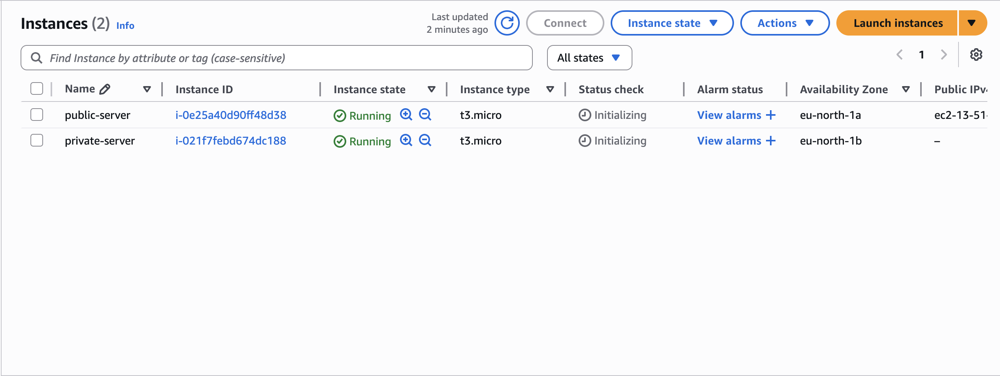
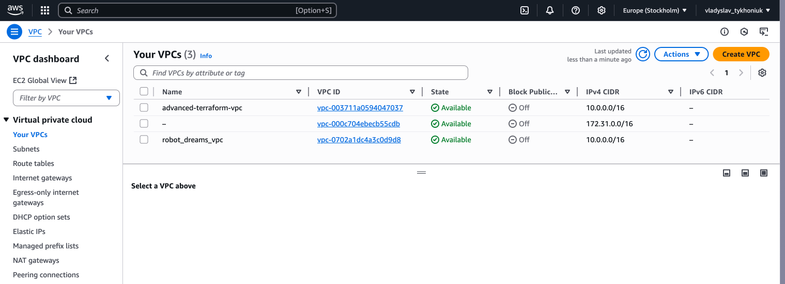
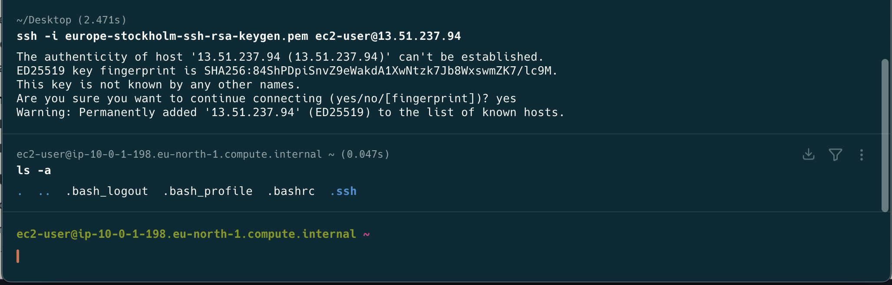
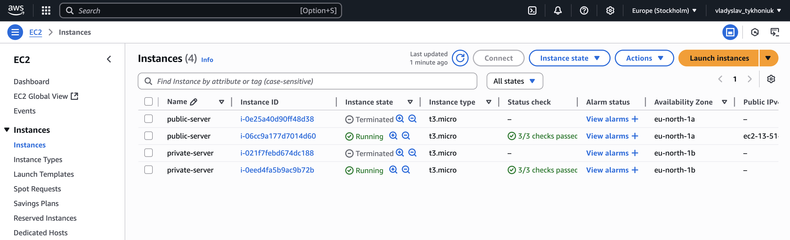

# HM-30 -> Terraform

```text
* Створити VPC з двома серверами у публічній та приватній підмережі за допомогою Terraform, застосовуючи модулі
  * Створіть модуль для VPC
  * Створіть модуль для підмереж
  * Створіть модуль для EC2-інстансів
  * Використовуйте ці модулі в основному конфігураційному файлі для створення інфраструктури
```

## Modules
### VPC
```textmate
modules/vpc/main.tf
```
```terraform
resource "aws_vpc" "main" {
  cidr_block = var.cidr_block
  enable_dns_support = true
  enable_dns_hostnames = true

  tags = {
    Name = "${var.name}-vpc"
  }
}

resource "aws_internet_gateway" "gateway" {
  vpc_id = aws_vpc.main.id

  tags = {
    Name = "${var.name}-gateway"
  }
}

resource "aws_route_table" "public" {
  vpc_id = aws_vpc.main.id

  route {
    cidr_block = "0.0.0.0/0"
    gateway_id = aws_internet_gateway.gateway.id
  }

  tags = {
    Name = "${var.name}-public-route-table"
  }
}
```

```textmate
modules/vpc/variables.tf
```
```terraform
variable "cidr_block" {
  type = string
}

variable "name" {
  type = string
}
```

```textmate
modules/vpc/outputs.tf
```
```terraform
output "vpc_id" {
  value = aws_vpc.main.id
}

output "public_route_table_id" {
  value = aws_route_table.public.id
}
```

### Subnets
```textmate
modules/subnets/main.tf
```
```terraform
resource "aws_subnet" "this" {
  for_each = var.subnets

  vpc_id = var.vpc_id
  cidr_block = each.value.cidr_block
  availability_zone = each.value.aviability_zone
  map_public_ip_on_launch = each.value.public
}

resource "aws_route_table_association" "public_association" {
  for_each = {
    for key,value in var.subnets : key => value
    if value.public
  }

  subnet_id = aws_subnet.this[each.key].id
  route_table_id = var.route_table_id
}
```

```textmate
modules/subnets/variables.tf
```
```terraform
variable "subnets" {
  type = map(object({
    cidr_block = string
    aviability_zone = string
    public = bool
  }))
}

variable "vpc_id" {
  type = string
}

variable "route_table_id" {
  type = string
}
```
```textmate
modules/subnets/outputs.tf
```
```terraform
output "subnet_ids" {
  value = { for key, value in aws_subnet.this : key => value.id }
}
```
### EC2
```textmate
modules/ec2/main.tf
```
```terraform
resource "aws_instance" "this" {
  for_each = var.instances

  ami = each.value.ami
  instance_type = each.value.instance_type
  key_name = each.value.key_name
  subnet_id = var.subnet_ids[each.value.subnet_key]
  vpc_security_group_ids = [
    each.value.public ? var.public_ec2_security_group_id : var.private_ec2_security_group_id
  ]

  tags = {
    Name = each.key
  }
}
```

```textmate
modules/ec2/variables.tf
```
```terraform
variable "subnet_ids" {
  type = map(string)
}

variable "instances" {
  type = map(object({
    ami = string
    instance_type = string
    subnet_key = string
    public = bool
    key_name = string
  }))
}

variable "public_ec2_security_group_id" {
  type = string
}

variable "private_ec2_security_group_id" {
  type = string
}
```

```textmate
modules/ec2/outputs.tf
```
```terraform
output "instance_ids" {
  value = { for key,value in aws_instance.this : key => value.id }
}
```

### Security Groups
```textmate
modules/security_groups/main.tf
```
```terraform

resource "aws_security_group" "public_ec2_security_group" {
  name = "${var.name}-public-ec2-security-group"
  vpc_id = var.vpc_id

  ingress {
    from_port = 22
    to_port = 22
    protocol = "tcp"
    cidr_blocks = ["0.0.0.0/0"]
  }

  egress {
    from_port = 0
    to_port = 0
    protocol = "-1"
    cidr_blocks = ["0.0.0.0/0"]
  }
}

resource "aws_security_group" "private_ec2_security_group" {
  name = "${var.name}-private-ec2-security-group"
  vpc_id = var.vpc_id

  egress {
    from_port = 0
    to_port = 0
    protocol = "-1"
    cidr_blocks = ["0.0.0.0/0"]
  }
}
```
```textmate
modules/security_groups/variables.tf
```
```terraform
variable "name" {
  type = string
}

variable "vpc_id" {
  type = string
}
```
```textmate
modules/security_groups/outputs.tf
```
```terraform
output "public_ec2_security_group_id" {
  value = aws_security_group.public_ec2_security_group.id
}

output "private_ec2_security_group_id" {
  value = aws_security_group.private_ec2_security_group.id
}
```


### Global Context:
```textmate
main.tf
```
```terraform
provider "aws" {
  region = "eu-north-1"
}

module "vpc" {
  source = "./modules/vpc"
  cidr_block = "10.0.0.0/16"
  name = "advanced-terraform"
}

module "subnets" {
  source = "./modules/subnets"
  vpc_id = module.vpc.vpc_id
  route_table_id = module.vpc.public_route_table_id
  subnets = var.subnets
}

module "ec2_security_group" {
  source = "./modules/security_groups"
  vpc_id = module.vpc.vpc_id
  name = "advanced-terraform"
}

module "ec2" {
  source = "./modules/ec2"
  subnet_ids = module.subnets.subnet_ids

  instances = var.instances

  public_ec2_security_group_id = module.ec2_security_group.public_ec2_security_group_id
  private_ec2_security_group_id = module.ec2_security_group.private_ec2_security_group_id
}
```

```textmate
variables.tf
```
```terraform
variable "subnets" {
  type = map(object({
    cidr_block = string
    aviability_zone = string
    public = bool
  }))
}

variable "instances" {
  type = map(object({
    ami = string
    instance_type = string
    subnet_key = string
    public = bool
    key_name = string
  }))
}
```

```textmate
terraform.tfvars
```
```terraform
subnets = {
  "public-1" = {
    cidr_block = "10.0.1.0/24"
    aviability_zone = "eu-north-1a"
    public = true
  }
  "private-1" = {
    cidr_block = "10.0.2.0/24"
    aviability_zone = "eu-north-1b"
    public = false
  }
}

instances = {
  "public-server" = {
    ami = "ami-05fcfb9614772f051"
    instance_type = "t3.micro"
    subnet_key = "public-1"
    public = true
    key_name = "europe-stockholm-ssh-rsa-keygen"
  }
  "private-server" = {
    ami = "ami-05fcfb9614772f051"
    instance_type = "t3.micro"
    subnet_key = "private-1"
    public = false
    key_name = "europe-stockholm-ssh-rsa-keygen"
  }
}
```

```text
hibana@mac terraform % terraform plan

Terraform used the selected providers to generate the following execution plan. Resource actions are indicated with the following symbols:
  + create

Terraform will perform the following actions:

  # module.ec2.aws_instance.this["private-server"] will be created
  + resource "aws_instance" "this" {
      + ami                                  = "ami-05fcfb9614772f051"
      + arn                                  = (known after apply)
      + associate_public_ip_address          = (known after apply)
      + availability_zone                    = (known after apply)
      + disable_api_stop                     = (known after apply)
      + disable_api_termination              = (known after apply)
      + ebs_optimized                        = (known after apply)
      + enable_primary_ipv6                  = (known after apply)
      + get_password_data                    = false
      + host_id                              = (known after apply)
      + host_resource_group_arn              = (known after apply)
      + iam_instance_profile                 = (known after apply)
      + id                                   = (known after apply)
      + instance_initiated_shutdown_behavior = (known after apply)
      + instance_lifecycle                   = (known after apply)
      + instance_state                       = (known after apply)
      + instance_type                        = "t3.micro"
      + ipv6_address_count                   = (known after apply)
      + ipv6_addresses                       = (known after apply)
      + key_name                             = (known after apply)
      + monitoring                           = (known after apply)
      + outpost_arn                          = (known after apply)
      + password_data                        = (known after apply)
      + placement_group                      = (known after apply)
      + placement_partition_number           = (known after apply)
      + primary_network_interface_id         = (known after apply)
      + private_dns                          = (known after apply)
      + private_ip                           = (known after apply)
      + public_dns                           = (known after apply)
      + public_ip                            = (known after apply)
      + region                               = "eu-north-1"
      + secondary_private_ips                = (known after apply)
      + security_groups                      = (known after apply)
      + source_dest_check                    = true
      + spot_instance_request_id             = (known after apply)
      + subnet_id                            = (known after apply)
      + tags                                 = {
          + "Name" = "private-server"
        }
      + tags_all                             = {
          + "Name" = "private-server"
        }
      + tenancy                              = (known after apply)
      + user_data_base64                     = (known after apply)
      + user_data_replace_on_change          = false
      + vpc_security_group_ids               = (known after apply)

      + capacity_reservation_specification (known after apply)

      + cpu_options (known after apply)

      + ebs_block_device (known after apply)

      + enclave_options (known after apply)

      + ephemeral_block_device (known after apply)

      + instance_market_options (known after apply)

      + maintenance_options (known after apply)

      + metadata_options (known after apply)

      + network_interface (known after apply)

      + private_dns_name_options (known after apply)

      + root_block_device (known after apply)
    }

  # module.ec2.aws_instance.this["public-server"] will be created
  + resource "aws_instance" "this" {
      + ami                                  = "ami-05fcfb9614772f051"
      + arn                                  = (known after apply)
      + associate_public_ip_address          = (known after apply)
      + availability_zone                    = (known after apply)
      + disable_api_stop                     = (known after apply)
      + disable_api_termination              = (known after apply)
      + ebs_optimized                        = (known after apply)
      + enable_primary_ipv6                  = (known after apply)
      + get_password_data                    = false
      + host_id                              = (known after apply)
      + host_resource_group_arn              = (known after apply)
      + iam_instance_profile                 = (known after apply)
      + id                                   = (known after apply)
      + instance_initiated_shutdown_behavior = (known after apply)
      + instance_lifecycle                   = (known after apply)
      + instance_state                       = (known after apply)
      + instance_type                        = "t3.micro"
      + ipv6_address_count                   = (known after apply)
      + ipv6_addresses                       = (known after apply)
      + key_name                             = (known after apply)
      + monitoring                           = (known after apply)
      + outpost_arn                          = (known after apply)
      + password_data                        = (known after apply)
      + placement_group                      = (known after apply)
      + placement_partition_number           = (known after apply)
      + primary_network_interface_id         = (known after apply)
      + private_dns                          = (known after apply)
      + private_ip                           = (known after apply)
      + public_dns                           = (known after apply)
      + public_ip                            = (known after apply)
      + region                               = "eu-north-1"
      + secondary_private_ips                = (known after apply)
      + security_groups                      = (known after apply)
      + source_dest_check                    = true
      + spot_instance_request_id             = (known after apply)
      + subnet_id                            = (known after apply)
      + tags                                 = {
          + "Name" = "public-server"
        }
      + tags_all                             = {
          + "Name" = "public-server"
        }
      + tenancy                              = (known after apply)
      + user_data_base64                     = (known after apply)
      + user_data_replace_on_change          = false
      + vpc_security_group_ids               = (known after apply)

      + capacity_reservation_specification (known after apply)

      + cpu_options (known after apply)

      + ebs_block_device (known after apply)

      + enclave_options (known after apply)

      + ephemeral_block_device (known after apply)

      + instance_market_options (known after apply)

      + maintenance_options (known after apply)

      + metadata_options (known after apply)

      + network_interface (known after apply)

      + private_dns_name_options (known after apply)

      + root_block_device (known after apply)
    }

  # module.subnets.aws_route_table_association.public_association["public-1"] will be created
  + resource "aws_route_table_association" "public_association" {
      + id             = (known after apply)
      + region         = "eu-north-1"
      + route_table_id = (known after apply)
      + subnet_id      = (known after apply)
    }

  # module.subnets.aws_subnet.this["private-1"] will be created
  + resource "aws_subnet" "this" {
      + arn                                            = (known after apply)
      + assign_ipv6_address_on_creation                = false
      + availability_zone                              = "eu-north-1b"
      + availability_zone_id                           = (known after apply)
      + cidr_block                                     = "10.0.2.0/24"
      + enable_dns64                                   = false
      + enable_resource_name_dns_a_record_on_launch    = false
      + enable_resource_name_dns_aaaa_record_on_launch = false
      + id                                             = (known after apply)
      + ipv6_cidr_block_association_id                 = (known after apply)
      + ipv6_native                                    = false
      + map_public_ip_on_launch                        = false
      + owner_id                                       = (known after apply)
      + private_dns_hostname_type_on_launch            = (known after apply)
      + region                                         = "eu-north-1"
      + tags_all                                       = (known after apply)
      + vpc_id                                         = (known after apply)
    }

  # module.subnets.aws_subnet.this["public-1"] will be created
  + resource "aws_subnet" "this" {
      + arn                                            = (known after apply)
      + assign_ipv6_address_on_creation                = false
      + availability_zone                              = "eu-north-1a"
      + availability_zone_id                           = (known after apply)
      + cidr_block                                     = "10.0.1.0/24"
      + enable_dns64                                   = false
      + enable_resource_name_dns_a_record_on_launch    = false
      + enable_resource_name_dns_aaaa_record_on_launch = false
      + id                                             = (known after apply)
      + ipv6_cidr_block_association_id                 = (known after apply)
      + ipv6_native                                    = false
      + map_public_ip_on_launch                        = true
      + owner_id                                       = (known after apply)
      + private_dns_hostname_type_on_launch            = (known after apply)
      + region                                         = "eu-north-1"
      + tags_all                                       = (known after apply)
      + vpc_id                                         = (known after apply)
    }

  # module.vpc.aws_internet_gateway.gateway will be created
  + resource "aws_internet_gateway" "gateway" {
      + arn      = (known after apply)
      + id       = (known after apply)
      + owner_id = (known after apply)
      + region   = "eu-north-1"
      + tags     = {
          + "Name" = "advanced-terraform-gateway"
        }
      + tags_all = {
          + "Name" = "advanced-terraform-gateway"
        }
      + vpc_id   = (known after apply)
    }

  # module.vpc.aws_route_table.public will be created
  + resource "aws_route_table" "public" {
      + arn              = (known after apply)
      + id               = (known after apply)
      + owner_id         = (known after apply)
      + propagating_vgws = (known after apply)
      + region           = "eu-north-1"
      + route            = [
          + {
              + cidr_block                 = "0.0.0.0/0"
              + gateway_id                 = (known after apply)
                # (11 unchanged attributes hidden)
            },
        ]
      + tags             = {
          + "Name" = "advanced-terraform-public-route-table"
        }
      + tags_all         = {
          + "Name" = "advanced-terraform-public-route-table"
        }
      + vpc_id           = (known after apply)
    }

  # module.vpc.aws_vpc.main will be created
  + resource "aws_vpc" "main" {
      + arn                                  = (known after apply)
      + cidr_block                           = "10.0.0.0/16"
      + default_network_acl_id               = (known after apply)
      + default_route_table_id               = (known after apply)
      + default_security_group_id            = (known after apply)
      + dhcp_options_id                      = (known after apply)
      + enable_dns_hostnames                 = true
      + enable_dns_support                   = true
      + enable_network_address_usage_metrics = (known after apply)
      + id                                   = (known after apply)
      + instance_tenancy                     = "default"
      + ipv6_association_id                  = (known after apply)
      + ipv6_cidr_block                      = (known after apply)
      + ipv6_cidr_block_network_border_group = (known after apply)
      + main_route_table_id                  = (known after apply)
      + owner_id                             = (known after apply)
      + region                               = "eu-north-1"
      + tags                                 = {
          + "Name" = "advanced-terraform-vpc"
        }
      + tags_all                             = {
          + "Name" = "advanced-terraform-vpc"
        }
    }

Plan: 8 to add, 0 to change, 0 to destroy.
```

```textmate
Apply complete! Resources: 8 added, 0 changed, 0 destroyed.

Outputs:

instance_ids = [
  "i-0e25a40d90ff48d38",
]
route_table_id = "rtb-0faa1af67482faa70"
subnet_ids = [
  "subnet-01cd35bd6eec74803",
]
vpc_id = "vpc-003711a0594047037"
```





## Added Security groups to make possible connect via terminal to ec2 instances
```textmate
Тут був вимушений перестворювати EC2 інстанси, тому що після створення EC2 інстансів,
вирішив перевірити чи зможу підключитись, і згадав що я забув прокинути ssh-key, а також 
не прокинув можливість підключитись до інстансів. 

Тому було прийнято вольове рішення перестворити (насправді при зміні ssh-key),
перестворення є обов'язкове. Тому перестворив і після цього все запрацьовало.
```
```textmate
hibana@mac terraform % terraform plan
module.vpc.aws_vpc.main: Refreshing state... [id=vpc-003711a0594047037]
module.vpc.aws_internet_gateway.gateway: Refreshing state... [id=igw-0dac3f29edcfd93b5]
module.subnets.aws_subnet.this["public-1"]: Refreshing state... [id=subnet-01cd35bd6eec74803]
module.subnets.aws_subnet.this["private-1"]: Refreshing state... [id=subnet-04794883604aefb0e]
module.vpc.aws_route_table.public: Refreshing state... [id=rtb-0faa1af67482faa70]
module.ec2.aws_instance.this["private-server"]: Refreshing state... [id=i-0eed4fa5b9ac9b72b]
module.ec2.aws_instance.this["public-server"]: Refreshing state... [id=i-06cc9a177d7014d60]
module.subnets.aws_route_table_association.public_association["public-1"]: Refreshing state... [id=rtbassoc-041f9f193ddce37f4]

Terraform used the selected providers to generate the following execution plan. Resource actions are indicated with the following symbols:
  + create
  ~ update in-place

Terraform will perform the following actions:

  # module.ec2.aws_instance.this["private-server"] will be updated in-place
  ~ resource "aws_instance" "this" {
        id                                   = "i-0eed4fa5b9ac9b72b"
        tags                                 = {
            "Name" = "private-server"
        }
      ~ vpc_security_group_ids               = [
          - "sg-00b4aebc043a1fc8d",
        ] -> (known after apply)
        # (37 unchanged attributes hidden)

        # (8 unchanged blocks hidden)
    }

  # module.ec2.aws_instance.this["public-server"] will be updated in-place
  ~ resource "aws_instance" "this" {
        id                                   = "i-06cc9a177d7014d60"
        tags                                 = {
            "Name" = "public-server"
        }
      ~ vpc_security_group_ids               = [
          - "sg-00b4aebc043a1fc8d",
        ] -> (known after apply)
        # (37 unchanged attributes hidden)

        # (8 unchanged blocks hidden)
    }

  # module.ec2_security_group.aws_security_group.private_ec2_security_group will be created
  + resource "aws_security_group" "private_ec2_security_group" {
      + arn                    = (known after apply)
      + description            = "Managed by Terraform"
      + egress                 = [
          + {
              + cidr_blocks      = [
                  + "0.0.0.0/0",
                ]
              + from_port        = 0
              + ipv6_cidr_blocks = []
              + prefix_list_ids  = []
              + protocol         = "-1"
              + security_groups  = []
              + self             = false
              + to_port          = 0
                # (1 unchanged attribute hidden)
            },
        ]
      + id                     = (known after apply)
      + ingress                = (known after apply)
      + name                   = "advanced-terraform-private-ec2-security-group"
      + name_prefix            = (known after apply)
      + owner_id               = (known after apply)
      + region                 = "eu-north-1"
      + revoke_rules_on_delete = false
      + tags_all               = (known after apply)
      + vpc_id                 = "vpc-003711a0594047037"
    }

  # module.ec2_security_group.aws_security_group.public_ec2_security_group will be created
  + resource "aws_security_group" "public_ec2_security_group" {
      + arn                    = (known after apply)
      + description            = "Managed by Terraform"
      + egress                 = [
          + {
              + cidr_blocks      = [
                  + "0.0.0.0/0",
                ]
              + from_port        = 0
              + ipv6_cidr_blocks = []
              + prefix_list_ids  = []
              + protocol         = "-1"
              + security_groups  = []
              + self             = false
              + to_port          = 0
                # (1 unchanged attribute hidden)
            },
        ]
      + id                     = (known after apply)
      + ingress                = [
          + {
              + cidr_blocks      = [
                  + "0.0.0.0/0",
                ]
              + from_port        = 22
              + ipv6_cidr_blocks = []
              + prefix_list_ids  = []
              + protocol         = "tcp"
              + security_groups  = []
              + self             = false
              + to_port          = 22
                # (1 unchanged attribute hidden)
            },
        ]
      + name                   = "advanced-terraform-public-ec2-security-group"
      + name_prefix            = (known after apply)
      + owner_id               = (known after apply)
      + region                 = "eu-north-1"
      + revoke_rules_on_delete = false
      + tags_all               = (known after apply)
      + vpc_id                 = "vpc-003711a0594047037"
    }

Plan: 2 to add, 2 to change, 0 to destroy.

───────────────────────────────────────────────────────────────────────────────────────────────────────────────────────────────────────────────────────────────────────────────

Note: You didn't use the -out option to save this plan, so Terraform can't guarantee to take exactly these actions if you run "terraform apply" now.
```

