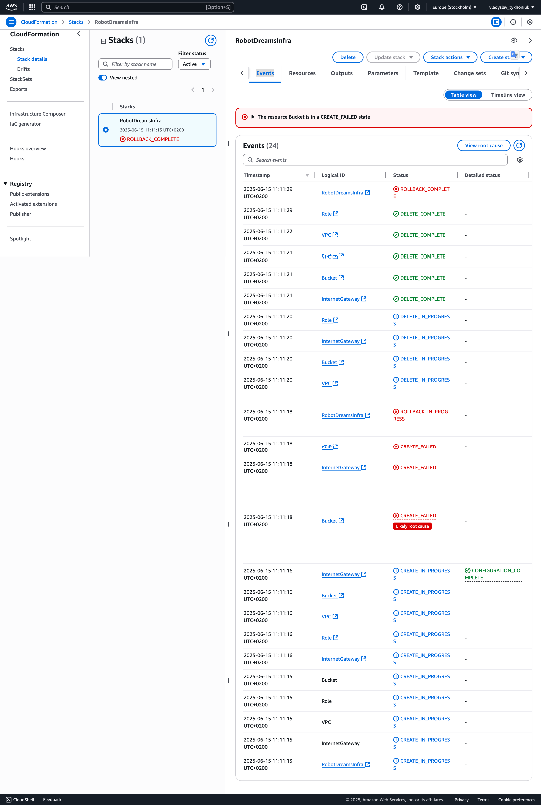
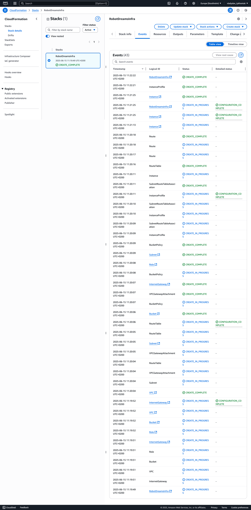
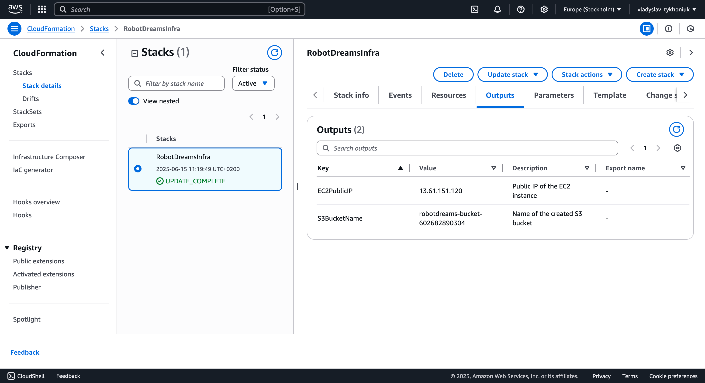
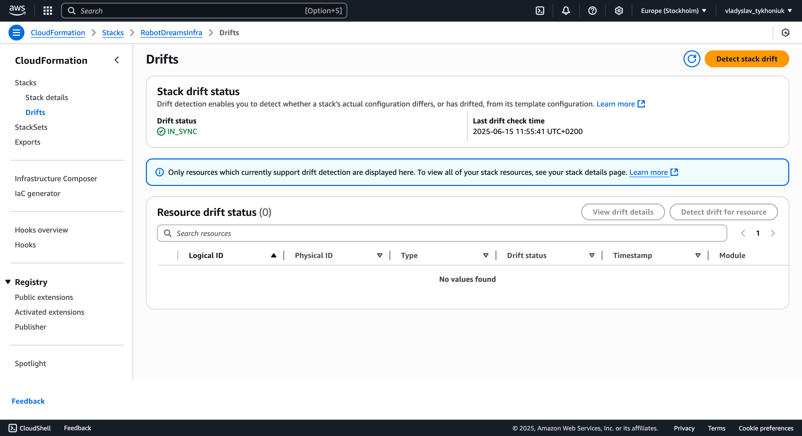

## HM-28 -> CloudFormation

Завдання
Використовуючи CloudFormation, створіть інфраструктуру, яка включає:

1. VPC – Віртуальну приватну мережу
2. EC2 інстанс – Віртуальну машину в створеній VPC
3. IAM Role – Роль для доступу до S3 bucket
4. S3 Bucket – Приватний bucket для зберігання даних

📌 Вимоги до завдання
1. VPC:
* Створити VPC з CIDR-блоком 10.0.0.0/16.
* Додати одну публічну підмережу (10.0.1.0/24) у регіоні us-east-1.
* Створити Internet Gateway для доступу до інтернету.
* Налаштувати Route Table для підмережі з виходом у інтернет.

2.    EC2 інстанс:
* Використовуйте AMI ID для Amazon Linux 2.
* Тип інстансу – t2.micro.
* Додайте IAM Role для доступу до S3.
* Інстанс має бути у публічній підмережі.
3.     IAM Role:
* Створіть IAM роль з політикою AmazonS3ReadOnlyAccess.
* Призначте роль EC2 інстансу.
4.     S3 Bucket:
* Створіть S3 bucket з унікальним ім'ям.
* Налаштуйте Bucket Policy для обмеження доступу.
* Увімкніть версіонування

## 1. Cloudformation

```try 1: error```


```try 2: success (missing bucker versioning && outputs)```
```yaml
AWSTemplateFormatVersion: '2010-09-09'
Resources:
  VPC:
    Type: AWS::EC2::VPC
    Properties:
      CidrBlock: 10.0.0.0/16
      EnableDnsSupport: true
      EnableDnsHostnames: true
      Tags:
        - Key: Name
          Value: VPC

  Subnet:
    Type: AWS::EC2::Subnet
    Properties:
      VpcId: !Ref VPC
      CidrBlock: 10.0.1.0/24
      AvailabilityZone: eu-north-1a
      MapPublicIpOnLaunch: true
      Tags:
        - Key: Name
          Value: PublicSubnet_1

  InternetGateway:
    Type: AWS::EC2::InternetGateway

  VPCGatewayAttachment:
    Type: AWS::EC2::VPCGatewayAttachment
    Properties:
      VpcId: !Ref VPC
      InternetGatewayId: !Ref InternetGateway

  RouteTable:
    Type: AWS::EC2::RouteTable
    Properties:
      VpcId: !Ref VPC

  Route:
    Type: AWS::EC2::Route
    Properties:
      RouteTableId: !Ref RouteTable
      DestinationCidrBlock: 0.0.0.0/0
      GatewayId: !Ref InternetGateway

  SubnetRouteTableAssociation:
    Type: AWS::EC2::SubnetRouteTableAssociation
    Properties:
      RouteTableId: !Ref RouteTable
      SubnetId: !Ref Subnet

  Role:
    Type: AWS::IAM::Role
    Properties:
      AssumeRolePolicyDocument:
        Version: '2012-10-17'
        Statement:
          - Effect: Allow
            Principal:
              Service: ec2.amazonaws.com
            Action: sts:AssumeRole
      ManagedPolicyArns:
        - arn:aws:iam::aws:policy/AmazonS3ReadOnlyAccess

  InstanceProfile:
    Type: AWS::IAM::InstanceProfile
    Properties:
      Roles:
        - !Ref Role

  Instance:
    Type: AWS::EC2::Instance
    Properties:
      ImageId: ami-05fcfb9614772f051
      InstanceType: t3.micro
      SubnetId: !Ref Subnet
      IamInstanceProfile: !Ref InstanceProfile
      Tags:
        - Key: Name
          Value: EC2Instance

  Bucket:
    Type: AWS::S3::Bucket
    Properties:
      BucketName: !Sub "robotdreams-bucket-${AWS::AccountId}"
      BucketEncryption:
        ServerSideEncryptionConfiguration:
          - ServerSideEncryptionByDefault:
              SSEAlgorithm: aws:kms
              KMSMasterKeyID: alias/aws/s3
      PublicAccessBlockConfiguration:
        IgnorePublicAcls: true
        RestrictPublicBuckets: true

  BucketPolicy:
    Type: AWS::S3::BucketPolicy
    Properties:
      Bucket: !Ref Bucket
      PolicyDocument:
        Id: RequireEncryptionInTransit
        Version: '2012-10-17'
        Statement:
          - Principal: '*'
            Action: '*'
            Effect: Deny
            Resource:
              - !GetAtt Bucket.Arn
              - !Sub 
                  - "${BucketArn}/*"
                  - BucketArn: !GetAtt Bucket.Arn
            Condition:
              Bool:
                aws:SecureTransport: 'false'

Metadata:
  AWS::Composer::Groups:
    Group:
      Label: Network
      Members:
        - VPC
        - VPCGatewayAttachment
        - Group2
        - Group3
        - Group4
    Group2:
      Label: Gateway
      Members:
        - InternetGateway
    Group3:
      Label: Subnets
      Members:
        - Subnet
        - SubnetRouteTableAssociation
    Group4:
      Label: Route Tables
      Members:
        - RouteTable
        - Route
    Group5:
      Label: EC2
      Members:
        - Instance
        - InstanceProfile
    Group6:
      Label: IAM
      Members:
        - Role
    Group7:
      Label: S3
      Members:
        - Bucket
        - BucketPolicy
```


```textmate
В другій конфігурації було допущено кілька речей яких не зауважив, тому прийшлось
робити через change set зміни і аплаїти їх
```

```final.yaml```
```yaml
AWSTemplateFormatVersion: '2010-09-09'
Resources:
  VPC:
    Type: AWS::EC2::VPC
    Properties:
      CidrBlock: 10.0.0.0/16
      EnableDnsSupport: true
      EnableDnsHostnames: true
      Tags:
        - Key: Name
          Value: VPC

  Subnet:
    Type: AWS::EC2::Subnet
    Properties:
      VpcId: !Ref VPC
      CidrBlock: 10.0.1.0/24
      AvailabilityZone: eu-north-1a
      MapPublicIpOnLaunch: true
      Tags:
        - Key: Name
          Value: PublicSubnet_1

  InternetGateway:
    Type: AWS::EC2::InternetGateway

  VPCGatewayAttachment:
    Type: AWS::EC2::VPCGatewayAttachment
    Properties:
      VpcId: !Ref VPC
      InternetGatewayId: !Ref InternetGateway

  RouteTable:
    Type: AWS::EC2::RouteTable
    Properties:
      VpcId: !Ref VPC

  Route:
    Type: AWS::EC2::Route
    Properties:
      RouteTableId: !Ref RouteTable
      DestinationCidrBlock: 0.0.0.0/0
      GatewayId: !Ref InternetGateway

  SubnetRouteTableAssociation:
    Type: AWS::EC2::SubnetRouteTableAssociation
    Properties:
      RouteTableId: !Ref RouteTable
      SubnetId: !Ref Subnet

  Role:
    Type: AWS::IAM::Role
    Properties:
      AssumeRolePolicyDocument:
        Version: '2012-10-17'
        Statement:
          - Effect: Allow
            Principal:
              Service: ec2.amazonaws.com
            Action: sts:AssumeRole
      ManagedPolicyArns:
        - arn:aws:iam::aws:policy/AmazonS3ReadOnlyAccess

  InstanceProfile:
    Type: AWS::IAM::InstanceProfile
    Properties:
      Roles:
        - !Ref Role

  Instance:
    Type: AWS::EC2::Instance
    Properties:
      ImageId: ami-05fcfb9614772f051
      InstanceType: t3.micro
      SubnetId: !Ref Subnet
      IamInstanceProfile: !Ref InstanceProfile
      Tags:
        - Key: Name
          Value: EC2Instance

  Bucket:
    Type: AWS::S3::Bucket
    Properties:
      BucketName: !Sub "robotdreams-bucket-${AWS::AccountId}"
      VersioningConfiguration:
        Status: Enabled
      BucketEncryption:
        ServerSideEncryptionConfiguration:
          - ServerSideEncryptionByDefault:
              SSEAlgorithm: aws:kms
              KMSMasterKeyID: alias/aws/s3
      PublicAccessBlockConfiguration:
        IgnorePublicAcls: true
        RestrictPublicBuckets: true
  BucketPolicy:
    Type: AWS::S3::BucketPolicy
    Properties:
      Bucket: !Ref Bucket
      PolicyDocument:
        Id: RequireEncryptionInTransit
        Version: '2012-10-17'
        Statement:
          - Principal: '*'
            Action: '*'
            Effect: Deny
            Resource:
              - !GetAtt Bucket.Arn
              - !Sub 
                  - "${BucketArn}/*"
                  - BucketArn: !GetAtt Bucket.Arn
            Condition:
              Bool:
                aws:SecureTransport: 'false'
Outputs:
  EC2PublicIP:
    Description: "Public IP of the EC2 instance"
    Value: !GetAtt Instance.PublicIp

  S3BucketName:
    Description: "Name of the created S3 bucket"
    Value: !Ref Bucket
Metadata:
  AWS::Composer::Groups:
    Group:
      Label: Network
      Members:
        - VPC
        - VPCGatewayAttachment
        - Group2
        - Group3
        - Group4
    Group2:
      Label: Gateway
      Members:
        - InternetGateway
    Group3:
      Label: Subnets
      Members:
        - Subnet
        - SubnetRouteTableAssociation
    Group4:
      Label: Route Tables
      Members:
        - RouteTable
        - Route
    Group5:
      Label: EC2
      Members:
        - Instance
        - InstanceProfile
    Group6:
      Label: IAM
      Members:
        - Role
    Group7:
      Label: S3
      Members:
        - Bucket
        - BucketPolicy
```

5.     Outputs:
* Виведіть Public IP EC2 інстанса.
* Назву створеного S3 bucket.



6. Додатково:
* Змініть вручну ресурси і перевірте на Drift

  