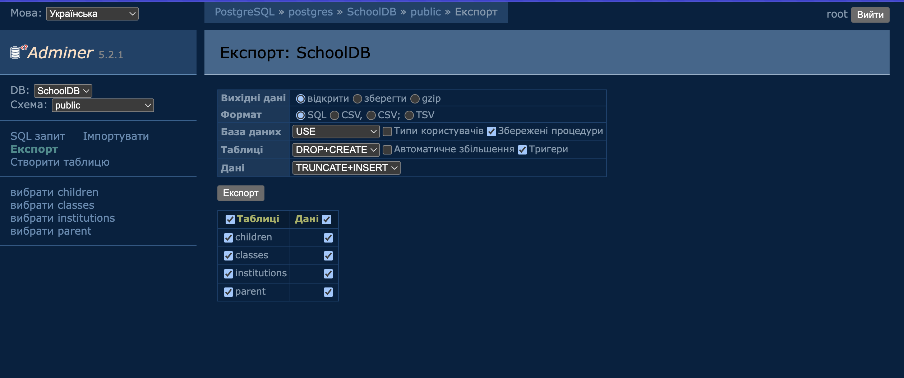
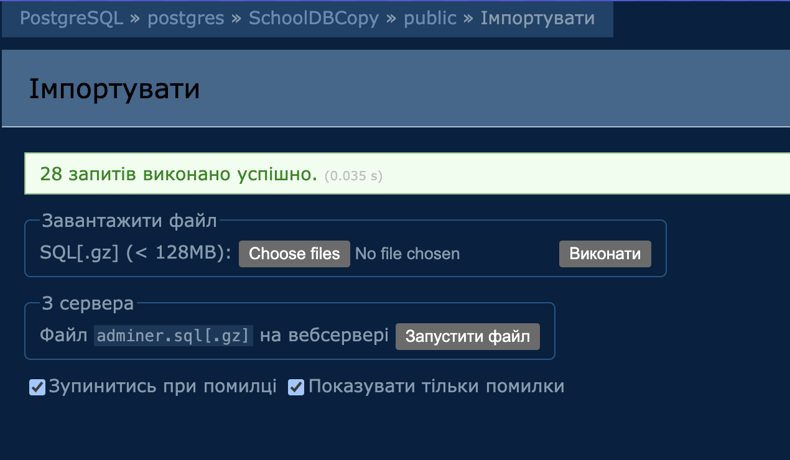

# Домашнє завдання - SQL

```textmate
Завдання було виконано на Postgres, гадаю це не є великою проблемою, 
бо ніколи не працював конкретно з Postgres. Тому що синтаксис не так сильно відрізняється.
```

1. Створення бази даних:


2. Таблиця Institutions:
  * Створіть таблицю Institutions, яка зберігатиме інформацію про школи та дитячі садочки

    Поля таблиці:

    * institution_id — первинний ключ, автоінкремент
    * institution_name — назва закладу
    * institution_type — тип закладу (вибір між 'School' та 'Kindergarten')
    * address — адреса закладу

```postgresql
    CREATE TYPE INSTITUTION_TYPE AS ENUM ('School', 'Kindergarten');
    
    CREATE TABLE Institutions (
        institution_id SERIAL PRIMARY KEY,
        institution_name VARCHAR(100) NOT NULL,
        institution_type INSTITUTION_TYPE NOT NULL,
        address VARCHAR(255) NOT NULL
    );
```

3. Таблиця Classes:
* Створіть таблицю Classes, яка зберігатиме інформацію про навчальні класи та напрями

  Поля таблиці:

    * class_id — первинний ключ, автоінкремент
    * class_name — назва класу
    * institution_id — зовнішній ключ на таблицю
    * Institutions direction — напрям навчання, вибір між: "Mathematics", "Biology and Chemistry", "Language Studies"

```postgresql
    CREATE TYPE INSTITUTION_DIRECTION AS ENUM('Mathematics', 'Biology and Chemistry', 'Language Studies');

    CREATE TABLE Classes (
        class_id SERIAL PRIMARY KEY,
        class_name VARCHAR(100) NOT NULL,
        institution_id INT NOT NULL REFERENCES Institutions(institution_id) ON DELETE CASCADE,
        institution_direction INSTITUTION_DIRECTION NOT NULL
    );
```

```postgresql
    DROP TABLE Classes;
```

4. Таблиця Children:
  * Створіть таблицю Children, яка зберігатиме інформацію про дітей

    Поля таблиці:

    * child_id — первинний ключ, автоінкремент
    * first_name — ім’я дитини
    * last_name — прізвище дитини
    * birth_date — дата народження
    * year_of_entry — рік вступу
    * age — вік дитини (тип INT)
    * institution_id — зовнішній ключ на таблицю Institutions
    * class_id — зовнішній ключ на таблицю Classes

```postgresql
    CREATE TABLE Children (
      child_id SERIAL PRIMARY KEY,
      first_name VARCHAR(50) NOT NULL,
      last_name VARCHAR(50) NOT NULL,
      birth_date DATE NOT NULL,
      year_of_entry DATE,
      age INT,
      class_id INT NOT NULL REFERENCES Classes(class_id) ON DELETE CASCADE,
      institution_id INT NOT NULL REFERENCES Institutions(institution_id) ON DELETE CASCADE
    )
```

5. Таблиця Parents:
* Створіть таблицю Parents, яка зберігатиме інформацію про батьків

  Поля таблиці:

    * parent_id — первинний ключ, автоінкремент
    * first_name — ім’я батька/матері
    * last_name — прізвище батька/матері
    * child_id — зовнішній ключ на таблицю Children
    * tuition_fee — вартість навчання

```postgresql
    CREATE TABLE Parent (
        parent_id SERIAL PRIMARY KEY,
        first_name VARCHAR(50) NOT NULL,
        last_name VARCHAR(50) NOT NULL,
        child_id INT NOT NULL REFERENCES Children(child_id) ON DELETE CASCADE,
        tuition_fee REAL
    );
```

1. Операції з даними (Дані було згенеровано за допомогою ChatGPT):
* Вставте принаймні 3 записи в кожну таблицю з реалістичними даними (імітація реальних закладів, класів, дітей, батьків та навчальних напрямів).

### Institutions
```postgresql
    INSERT INTO institutions (
        institution_name,
        institution_type,
        address
    ) VALUES 
    (
        'Massachusetts Institute of Technology',
        'School',
        '77 Massachusetts Ave, Cambridge, MA 02139, United States'
    ),
    (
        'Harvard University',
        'Kindergarten',
        'Cambridge, MA 02138, United States'
    ),
    (
        'Stanford University',
        'School',
        '450 Serra Mall, Stanford, CA 94305, United States'
    ),
    (
        'New York Public Library',
        'School',
        '476 5th Ave, New York, NY 10018, United States'
    ),
    (
        'Boston Public High School',
        'Kindergarten',
        '1010 Commonwealth Avenue, Boston, MA 02215, United States'
    );
```

### Classes
```postgresql
    INSERT INTO Classes (
        class_name,
        institution_id,
        institution_direction
    ) VALUES
    -- MIT
    ('Linear Algebra and Applications', 1, 'Mathematics'),
    ('Molecular Biology Techniques', 1, 'Biology and Chemistry'),
    
    -- Harvard
    ('Advanced Calculus', 2, 'Mathematics'),
    ('Organic Chemistry Lab', 2, 'Biology and Chemistry'),
    ('French Language and Literature', 2, 'Language Studies'),
    
    -- Stanford
    ('Statistics and Probability', 3, 'Mathematics'),
    ('Genetics and Evolution', 3, 'Biology and Chemistry'),
    ('German for Beginners', 3, 'Language Studies'),
    
    -- New York Public Library (maybe offering community education classes)
    ('Everyday Math for Adults', 4, 'Mathematics'),
    ('Basic Spanish Conversation', 4, 'Language Studies'),
    
    -- Boston Public High School
    ('High School Chemistry', 5, 'Biology and Chemistry'),
    ('English Composition', 5, 'Language Studies'),
    ('Geometry Fundamentals', 5, 'Mathematics');
```

```postgresql
    INSERT INTO Children (
    first_name,
    last_name,
    birth_date,
    year_of_entry,
    age,
    institution_id,
    class_id
) VALUES
      ('Alice', 'Johnson', '2010-05-14', '2021-09-01', 14, 1, 1),
      ('Liam', 'Smith', '2009-08-22', '2020-09-01', 15, 1, 2),
      ('Emma', 'Brown', '2011-02-11', '2022-09-01', 13, 2, 3),
      ('Noah', 'Davis', '2008-11-30', '2019-09-01', 16, 2, 4),
      ('Olivia', 'Wilson', '2012-07-07', '2023-09-01', 12, 2, 5),
      ('William', 'Anderson', '2009-01-20', '2020-09-01', 15, 3, 6),
      ('Sophia', 'Thomas', '2010-09-18', '2021-09-01', 14, 3, 7),
      ('James', 'Moore', '2011-12-12', '2022-09-01', 13, 3, 8),
      ('Mia', 'Taylor', '2012-03-23', '2023-09-01', 12, 4, 9),
      ('Benjamin', 'Lee', '2010-10-10', '2021-09-01', 14, 4, 10),
      ('Charlotte', 'Martinez', '2011-04-16', '2022-09-01', 13, 5, 11),
      ('Daniel', 'White', '2010-06-30', '2021-09-01', 14, 5, 12),
      ('Ella', 'Walker', '2011-08-08', '2022-09-01', 13, 5, 13);
```

```postgresql
    INSERT INTO Parent (
        first_name,
        last_name,
        child_id,
        tuition_fee
    ) VALUES 
    ('Michael', 'Johnson', 1, 5000.00),
    ('Sarah', 'Smith', 2, 5200.00),
    ('David', 'Brown', 3, 4900.00),
    ('Emily', 'Davis', 4, 5300.00),
    ('John', 'Wilson', 5, 5100.00),
    ('Laura', 'Anderson', 6, 5050.00),
    ('Mark', 'Thomas', 7, 4950.00),
    ('Rachel', 'Moore', 8, 4700.00),
    ('Brian', 'Taylor', 9, 4600.00),
    ('Anna', 'Lee', 10, 4800.00);
```

## Виконайте наступні запити:
```textmate
1. Отримайте список всіх дітей разом із закладом, в якому вони навчаються, 
та напрямом навчання в класі
```

```postgresql
    SELECT
        CONCAT(children.first_name, ' ', children.last_name) AS full_name,
        classes.class_name,
        classes.institution_direction,
        institutions.institution_name
    FROM children
             INNER JOIN classes ON classes.class_id = children.class_id
             INNER JOIN institutions ON institutions.institution_id = children.institution_id
    ORDER BY classes.institution_direction ASC;
```

```
full_name	class_name	institution_direction	institution_name
Alice Johnson	Linear Algebra and Applications	Mathematics	Massachusetts Institute of Technology
Emma Brown	Advanced Calculus	Mathematics	Harvard University
William Anderson	Statistics and Probability	Mathematics	Stanford University
Mia Taylor	Everyday Math for Adults	Mathematics	New York Public Library
Ella Walker	Geometry Fundamentals	Mathematics	Boston Public High School
Charlotte Martinez	High School Chemistry	Biology and Chemistry	Boston Public High School
Sophia Thomas	Genetics and Evolution	Biology and Chemistry	Stanford University
Liam Smith	Molecular Biology Techniques	Biology and Chemistry	Massachusetts Institute of Technology
Noah Davis	Organic Chemistry Lab	Biology and Chemistry	Harvard University
Olivia Wilson	French Language and Literature	Language Studies	Harvard University
Benjamin Lee	Basic Spanish Conversation	Language Studies	New York Public Library
James Moore	German for Beginners	Language Studies	Stanford University
Daniel White	English Composition	Language Studies	Boston Public High School
```

```textmate
2. Отримайте інформацію про батьків і їхніх дітей разом із вартістю навчання
```

```postgresql
    SELECT 
        CONCAT(parent.first_name, ' ', parent.last_name) AS parent_full_name,
        CONCAT(children.first_name, ' ', children.last_name) AS children_full_name,
        children.birth_date AS children_birth_date,
        institutions.institution_name,
        parent.tuition_fee
    FROM parent
        LEFT JOIN children ON children.child_id = parent.child_id
        INNER JOIN institutions ON institutions.institution_id = children.institution_id
    ORDER BY parent.tuition_fee DESC;
```

```textmate
parent_full_name	children_full_name	children_birth_date	institution_name	tuition_fee
Emily Davis	Noah Davis	2008-11-30	Harvard University	5300
Sarah Smith	Liam Smith	2009-08-22	Massachusetts Institute of Technology	5200
John Wilson	Olivia Wilson	2012-07-07	Harvard University	5100
Laura Anderson	William Anderson	2009-01-20	Stanford University	5050
Michael Johnson	Alice Johnson	2010-05-14	Massachusetts Institute of Technology	5000
Mark Thomas	Sophia Thomas	2010-09-18	Stanford University	4950
David Brown	Emma Brown	2011-02-11	Harvard University	4900
Anna Lee	Benjamin Lee	2010-10-10	New York Public Library	4800
Rachel Moore	James Moore	2011-12-12	Stanford University	4700
Brian Taylor	Mia Taylor	2012-03-23	New York Public Library	4600
```

```textmate
1. Отримайте список всіх закладів з адресами та кількістю дітей, які навчаються в кожному закладі
```
```postgresql
SELECT 
    institutions.institution_name, 
    institutions.address,
    COUNT(children.institution_id)
FROM institutions
    INNER JOIN children ON institutions.institution_id = children.institution_id
    GROUP BY institutions.institution_id;
```

```textmate
institution_id	institution_name	address	count
1	Massachusetts Institute of Technology	"77 Massachusetts Ave, Cambridge, MA 02139, United States"	2
2	Harvard University	"Cambridge, MA 02138, United States"	3
3	Stanford University	"450 Serra Mall, Stanford, CA 94305, United States"	3
4	New York Public Library	"476 5th Ave, New York, NY 10018, United States"	2
5	Boston Public High School	"1010 Commonwealth Avenue, Boston, MA 02215, United States"	3
```

```textmate
child_id	first_name	last_name	birth_date	year_of_entry	age	class_id	institution_id
1	Alice	Johnson	2010-05-14	2021-09-01	14	1	1
2	Liam	Smith	2009-08-22	2020-09-01	15	2	1
3	Emma	Brown	2011-02-11	2022-09-01	13	3	2
4	Noah	Davis	2008-11-30	2019-09-01	16	4	2
5	Olivia	Wilson	2012-07-07	2023-09-01	12	5	2
6	William	Anderson	2009-01-20	2020-09-01	15	6	3
7	Sophia	Thomas	2010-09-18	2021-09-01	14	7	3
8	James	Moore	2011-12-12	2022-09-01	13	8	3
9	Mia	Taylor	2012-03-23	2023-09-01	12	9	4
10	Benjamin	Lee	2010-10-10	2021-09-01	14	10	4
11	Charlotte	Martinez	2011-04-16	2022-09-01	13	11	5
12	Daniel	White	2010-06-30	2021-09-01	14	12	5
13	Ella	Walker	2011-08-08	2022-09-01	13	13	5
```

```textmate
📍Зробіть бекап бази та застосуйте його для нової бази даних і перевірте, що цілісність даних не порушено.
```

```textmate
Це завдання було виконане за допомогою графічного інтерфейсу який надає adminer

Під час експортування данних було використано такі параметри:
```



```textmate
Перед імпортуванням данних файл створений за дпомогою adminer потребував кілька змін,
 щоб можна було заімпортувати за допомгою графічного інтерфейсу. Тому було додано декілька файлів до PR, 
 де adminer_backup.sql це результат праці adminer, а backup.sql це вже змінений файл для спрощенного імпортування данних.

Імпортуванням теж було виконано за допомогою графічного інтерфейсу. 
```


## Source (Origin):
```postgresql
-- Adminer 5.2.1 PostgreSQL 17.4 dump

\connect "SchoolDB";

INSERT INTO "children" ("child_id", "first_name", "last_name", "birth_date", "year_of_entry", "age", "class_id", "institution_id") VALUES
(1,	'Alice',	'Johnson',	'2010-05-14',	'2021-09-01',	14,	1,	1),
(2,	'Liam',	'Smith',	'2009-08-22',	'2020-09-01',	15,	2,	1),
(3,	'Emma',	'Brown',	'2011-02-11',	'2022-09-01',	13,	3,	2),
(4,	'Noah',	'Davis',	'2008-11-30',	'2019-09-01',	16,	4,	2),
(5,	'Olivia',	'Wilson',	'2012-07-07',	'2023-09-01',	12,	5,	2),
(6,	'William',	'Anderson',	'2009-01-20',	'2020-09-01',	15,	6,	3),
(7,	'Sophia',	'Thomas',	'2010-09-18',	'2021-09-01',	14,	7,	3),
(8,	'James',	'Moore',	'2011-12-12',	'2022-09-01',	13,	8,	3),
(9,	'Mia',	'Taylor',	'2012-03-23',	'2023-09-01',	12,	9,	4),
(10,	'Benjamin',	'Lee',	'2010-10-10',	'2021-09-01',	14,	10,	4),
(11,	'Charlotte',	'Martinez',	'2011-04-16',	'2022-09-01',	13,	11,	5),
(12,	'Daniel',	'White',	'2010-06-30',	'2021-09-01',	14,	12,	5),
(13,	'Ella',	'Walker',	'2011-08-08',	'2022-09-01',	13,	13,	5);

INSERT INTO "classes" ("class_id", "class_name", "institution_id", "institution_direction") VALUES
(1,	'Linear Algebra and Applications',	1,	'Mathematics'),
(2,	'Molecular Biology Techniques',	1,	'Biology and Chemistry'),
(3,	'Advanced Calculus',	2,	'Mathematics'),
(4,	'Organic Chemistry Lab',	2,	'Biology and Chemistry'),
(5,	'French Language and Literature',	2,	'Language Studies'),
(6,	'Statistics and Probability',	3,	'Mathematics'),
(7,	'Genetics and Evolution',	3,	'Biology and Chemistry'),
(8,	'German for Beginners',	3,	'Language Studies'),
(9,	'Everyday Math for Adults',	4,	'Mathematics'),
(10,	'Basic Spanish Conversation',	4,	'Language Studies'),
(11,	'High School Chemistry',	5,	'Biology and Chemistry'),
(12,	'English Composition',	5,	'Language Studies'),
(13,	'Geometry Fundamentals',	5,	'Mathematics');

INSERT INTO "institutions" ("institution_id", "institution_name", "institution_type", "address") VALUES
(1,	'Massachusetts Institute of Technology',	'School',	'77 Massachusetts Ave, Cambridge, MA 02139, United States'),
(2,	'Harvard University',	'Kindergarten',	'Cambridge, MA 02138, United States'),
(3,	'Stanford University',	'School',	'450 Serra Mall, Stanford, CA 94305, United States'),
(4,	'New York Public Library',	'School',	'476 5th Ave, New York, NY 10018, United States'),
(5,	'Boston Public High School',	'Kindergarten',	'1010 Commonwealth Avenue, Boston, MA 02215, United States');

INSERT INTO "parent" ("parent_id", "first_name", "last_name", "child_id", "tuition_fee") VALUES
(1,	'Michael',	'Johnson',	1,	5000),
(2,	'Sarah',	'Smith',	2,	5200),
(3,	'David',	'Brown',	3,	4900),
(4,	'Emily',	'Davis',	4,	5300),
(5,	'John',	'Wilson',	5,	5100),
(6,	'Laura',	'Anderson',	6,	5050),
(7,	'Mark',	'Thomas',	7,	4950),
(8,	'Rachel',	'Moore',	8,	4700),
(9,	'Brian',	'Taylor',	9,	4600),
(10,	'Anna',	'Lee',	10,	4800);
```

## Source (Restored Back-up):
```postgresql
-- Adminer 5.2.1 PostgreSQL 17.4 dump

\connect "SchoolDBCopy";

INSERT INTO "children" ("child_id", "first_name", "last_name", "birth_date", "year_of_entry", "age", "class_id", "institution_id") VALUES
(1,	'Alice',	'Johnson',	'2010-05-14',	'2021-09-01',	14,	1,	1),
(2,	'Liam',	'Smith',	'2009-08-22',	'2020-09-01',	15,	2,	1),
(3,	'Emma',	'Brown',	'2011-02-11',	'2022-09-01',	13,	3,	2),
(4,	'Noah',	'Davis',	'2008-11-30',	'2019-09-01',	16,	4,	2),
(5,	'Olivia',	'Wilson',	'2012-07-07',	'2023-09-01',	12,	5,	2),
(6,	'William',	'Anderson',	'2009-01-20',	'2020-09-01',	15,	6,	3),
(7,	'Sophia',	'Thomas',	'2010-09-18',	'2021-09-01',	14,	7,	3),
(8,	'James',	'Moore',	'2011-12-12',	'2022-09-01',	13,	8,	3),
(9,	'Mia',	'Taylor',	'2012-03-23',	'2023-09-01',	12,	9,	4),
(10,	'Benjamin',	'Lee',	'2010-10-10',	'2021-09-01',	14,	10,	4),
(11,	'Charlotte',	'Martinez',	'2011-04-16',	'2022-09-01',	13,	11,	5),
(12,	'Daniel',	'White',	'2010-06-30',	'2021-09-01',	14,	12,	5),
(13,	'Ella',	'Walker',	'2011-08-08',	'2022-09-01',	13,	13,	5);

INSERT INTO "classes" ("class_id", "class_name", "institution_id", "institution_direction") VALUES
(1,	'Linear Algebra and Applications',	1,	'Mathematics'),
(2,	'Molecular Biology Techniques',	1,	'Biology and Chemistry'),
(3,	'Advanced Calculus',	2,	'Mathematics'),
(4,	'Organic Chemistry Lab',	2,	'Biology and Chemistry'),
(5,	'French Language and Literature',	2,	'Language Studies'),
(6,	'Statistics and Probability',	3,	'Mathematics'),
(7,	'Genetics and Evolution',	3,	'Biology and Chemistry'),
(8,	'German for Beginners',	3,	'Language Studies'),
(9,	'Everyday Math for Adults',	4,	'Mathematics'),
(10,	'Basic Spanish Conversation',	4,	'Language Studies'),
(11,	'High School Chemistry',	5,	'Biology and Chemistry'),
(12,	'English Composition',	5,	'Language Studies'),
(13,	'Geometry Fundamentals',	5,	'Mathematics');

INSERT INTO "institutions" ("institution_id", "institution_name", "institution_type", "address") VALUES
(1,	'Massachusetts Institute of Technology',	'School',	'77 Massachusetts Ave, Cambridge, MA 02139, United States'),
(2,	'Harvard University',	'Kindergarten',	'Cambridge, MA 02138, United States'),
(3,	'Stanford University',	'School',	'450 Serra Mall, Stanford, CA 94305, United States'),
(4,	'New York Public Library',	'School',	'476 5th Ave, New York, NY 10018, United States'),
(5,	'Boston Public High School',	'Kindergarten',	'1010 Commonwealth Avenue, Boston, MA 02215, United States');

INSERT INTO "parent" ("parent_id", "first_name", "last_name", "child_id", "tuition_fee") VALUES
(1,	'Michael',	'Johnson',	1,	5000),
(2,	'Sarah',	'Smith',	2,	5200),
(3,	'David',	'Brown',	3,	4900),
(4,	'Emily',	'Davis',	4,	5300),
(5,	'John',	'Wilson',	5,	5100),
(6,	'Laura',	'Anderson',	6,	5050),
(7,	'Mark',	'Thomas',	7,	4950),
(8,	'Rachel',	'Moore',	8,	4700),
(9,	'Brian',	'Taylor',	9,	4600),
(10,	'Anna',	'Lee',	10,	4800);
```


## Додаткове завдання (Анонімізація):

1. 1. Анонімізація таблиці Children:
* Виконайте анонімізацію даних дітей у таблиці Children, замінивши їхні імена та прізвища випадковими або узагальненими значеннями.
    * Наприклад, замініть всі імена на "Child", а прізвища — на "Anonymous".

```postgresql
UPDATE children  
SET first_name = 'Child', last_name = 'Anonymous';
```

```textmate
child_id	first_name	last_name	birth_date	year_of_entry	age	class_id	institution_id
1	Child	Anonymous	2010-05-14	2021-09-01	14	1	1
2	Child	Anonymous	2009-08-22	2020-09-01	15	2	1
3	Child	Anonymous	2011-02-11	2022-09-01	13	3	2
4	Child	Anonymous	2008-11-30	2019-09-01	16	4	2
5	Child	Anonymous	2012-07-07	2023-09-01	12	5	2
6	Child	Anonymous	2009-01-20	2020-09-01	15	6	3
7	Child	Anonymous	2010-09-18	2021-09-01	14	7	3
8	Child	Anonymous	2011-12-12	2022-09-01	13	8	3
9	Child	Anonymous	2012-03-23	2023-09-01	12	9	4
10	Child	Anonymous	2010-10-10	2021-09-01	14	10	4
11	Child	Anonymous	2011-04-16	2022-09-01	13	11	5
12	Child	Anonymous	2010-06-30	2021-09-01	14	12	5
13	Child	Anonymous	2011-08-08	2022-09-01	13	13	5
```

2. Анонімізація таблиці Parents:
* Замініть імена та прізвища батьків на псевдоніми (наприклад, Parent1, Parent2 тощо), а електронну пошту або іншу контактну інформацію — на випадкові значення.

```postgresql
UPDATE parent
SET first_name = 'Parent' || parent_id,
    last_name = 'ParentSurname' || parent_id;
```

```textmate
parent_id	first_name	last_name	child_id	tuition_fee
1	Parent1	ParentSurname1	1	5000
2	Parent2	ParentSurname2	2	5200
3	Parent3	ParentSurname3	3	4900
4	Parent4	ParentSurname4	4	5300
5	Parent5	ParentSurname5	5	5100
6	Parent6	ParentSurname6	6	5050
7	Parent7	ParentSurname7	7	4950
8	Parent8	ParentSurname8	8	4700
9	Parent9	ParentSurname9	9	4600
10	Parent10	ParentSurname10	10	4800
```

3. Анонімізація таблиці Institutions: ([usefult source](https://stackoverflow.com/questions/56007299/convert-a-bytea-into-a-binary-string))
* Для забезпечення конфіденційності замініть реальні назви закладів на умовні, наприклад, "Institution1", "Institution2" тощо.

```postgresql
UPDATE institutions 
SET institution_name = 'Institution' || institution_id,
    address = substr(md5(random()::text), 0, 33);
```

```textmate
institution_id	institution_name	institution_type	address
1	Institution1	School	9f5975542ecc323be4c39c5ba34268eb
2	Institution2	Kindergarten	d1d466df28a7acf4f908ce33da40110a
3	Institution3	School	909e409bfb69e24ac3fee1ae9b00b410
4	Institution4	School	6675c4453c92a9adfc4f62cde4713332
5	Institution5	Kindergarten	96c9076662691c2b3713971887fb9e12
```

4. Анонімізація фінансових даних:
* Для збереження конфіденційності змініть вартість навчання (tuition_fee) на усереднені або випадкові значення в межах розумного діапазону.

```postgresql
UPDATE parent SET tuition_fee = atan(tuition_fee);
```

```textmate
parent_id	first_name	last_name	child_id	tuition_fee
1	Michael	Johnson	1	1.5705963
2	Sarah	Smith	2	1.570604
3	David	Brown	3	1.5705923
4	Emily	Davis	4	1.5706077
5	John	Wilson	5	1.5706003
6	Laura	Anderson	6	1.5705984
7	Mark	Thomas	7	1.5705943
8	Rachel	Moore	8	1.5705836
9	Brian	Taylor	9	1.5705789
10	Anna	Lee	10	1.570588
```

1. Запит на перевірку анонімізації:
* Виконайте запит, щоб переглянути результати анонімізації.

```textmate
Всі операції зі зміненими данними було додатково додано в описі, одразу по виконанню команди по зміненню данних.
```