# HM-22 -> AWS Basics

```textmate
Усі створені скріни були зроблені на основі хронології оперцій, 
для спрощеної взаємодії під час переглядання домашнього завдання.

В випадку якщо потребуєш викладення під завданнями, 
то можеш написати і постараюсь погрупувати краще.
```

```textmate
Питання:

Повертаючись до теми з billing і всіми пов'язанами витратами, 
чи можна налаштувати Amazon для певного моніторингу витратами, 
щось типу статистики, умовно якщо instance продовжить працювати X часу ти заплатиш Y гривень.

Тому що єдина опція яку вдалось знайти, це налаштування CloudWatch billing щось там,
але не знаю наскільки це useful штука(

Тому що навіть під час виконання завдання, після виконання такої кількості кроків,
може виникнути проблема з тим, що саме може спровокувати витрати коштів.

Навіть під час виконання завдання спочатку забув усунути Elastic IP,
але добре що вирішив загуглити в інтернеті, бо згадав, 
що нам мережах ми говорили про платні IPv4.

Прошу вибачення що знову набридаю з цим питанням, але в мене 
є трошки параноя пов'язана з цією темою.
```

📌 Опис завдання

1. Створення та налаштування VPC

* Створіть нову VPC:
    * Використайте консоль AWS для створення VPC.
    * Виберіть CIDR-блок
* Створіть дві підмережі в VPC:
    * Створіть одну публічну підмережу з CIDR-блоком.
    * Створіть одну приватну підмережу з CIDR-блоком.
* Створіть та налаштуйте інтернет-шлюз (Internet Gateway):
    * Прив'яжіть інтернет-шлюз до вашої VPC.
    * Налаштуйте таблиці маршрутизації для забезпечення доступу до інтернету з публічної підмережі.
2. Налаштування груп безпеки (Security Groups) та списків контролю доступу (ACL)
* Додайте правила для дозволу вхідного HTTP та SSH трафіку з будь-якої IP-адреси.
3. Запуск інстансу EC2
* Запустіть новий інстанс EC2:
    * Використайте Amazon Linux 2 AMI.
    * Виберіть тип інстансу, наприклад, t2.micro. Оскільки він безкоштовний.
    * Прив'яжіть інстанс до публічної підмережі.
    * Використайте Security Group, створену на попередньому кроці.
    * Завантажте та використайте SSH-ключ для доступу до інстансу.

4. Призначення еластичної IP-адреси (EIP)
* Створіть та призначте EIP до вашого інстансу:
    * Створіть нову EIP в AWS консолі.
    * Прив'яжіть EIP до запущеного інстансу EC2.

## VPC & Subnets
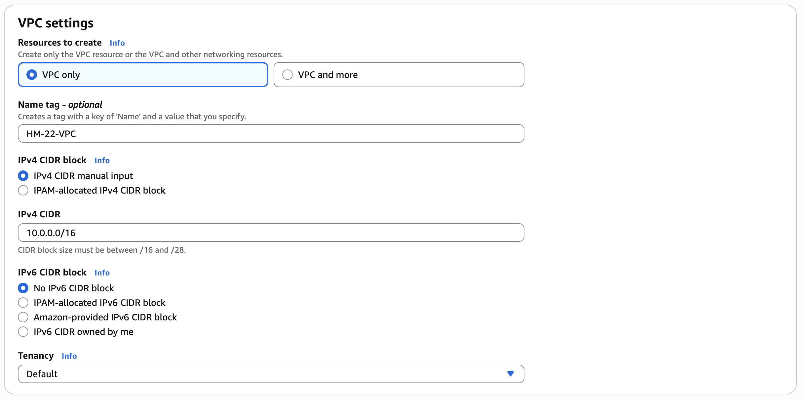
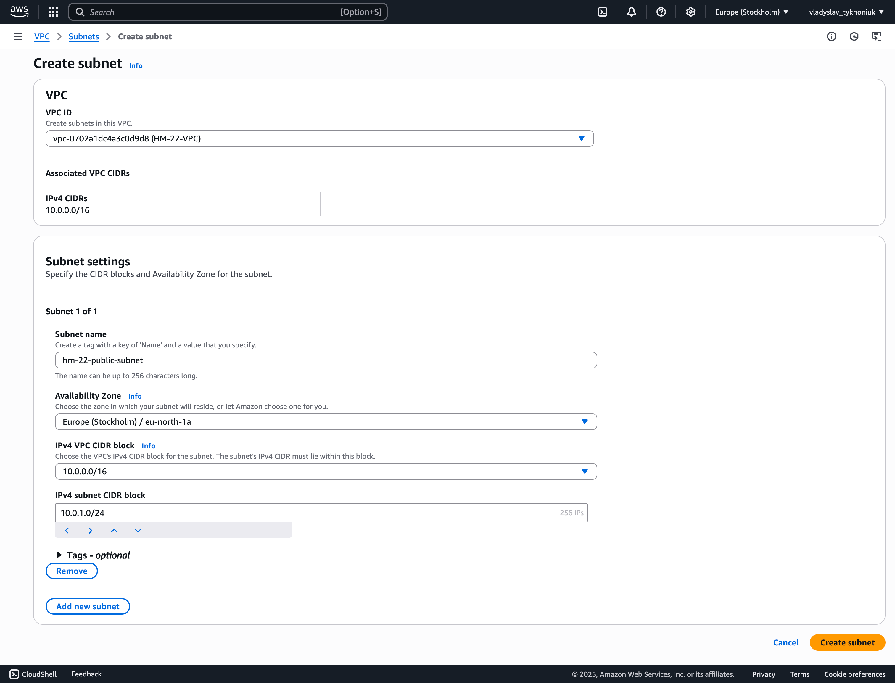
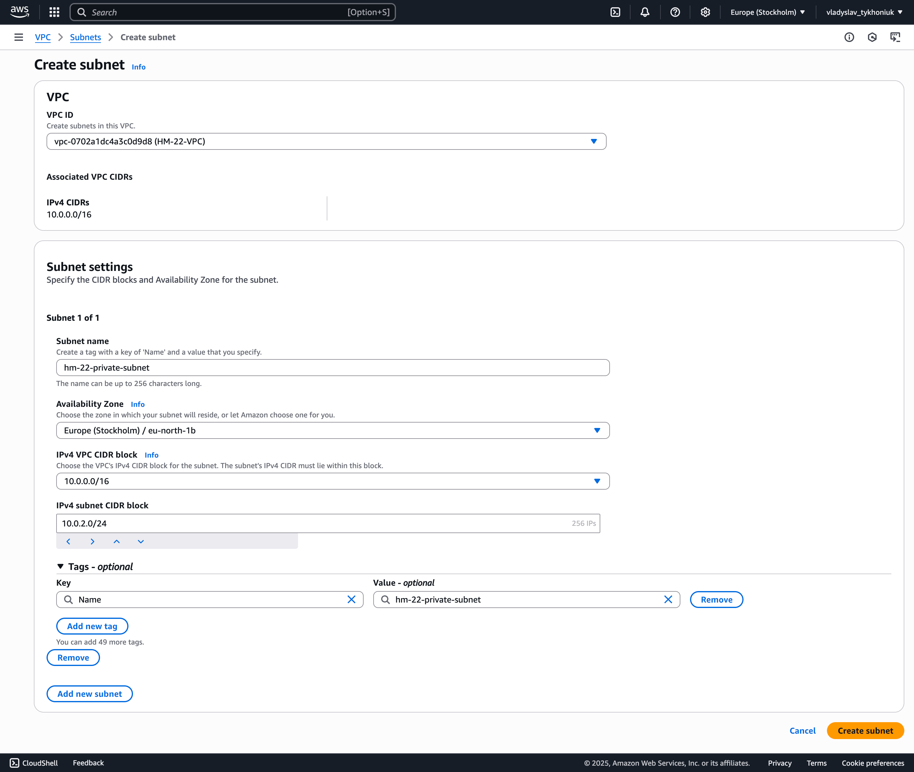

## Gateway
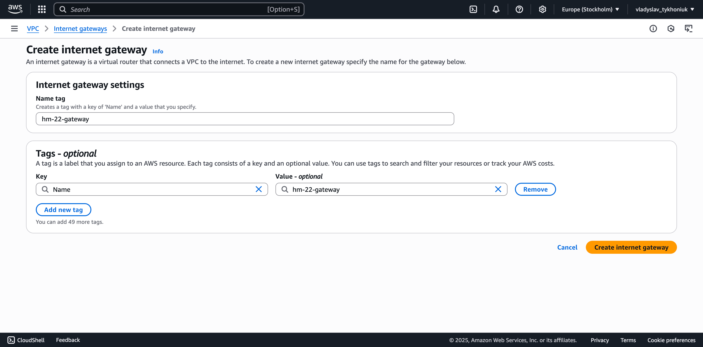
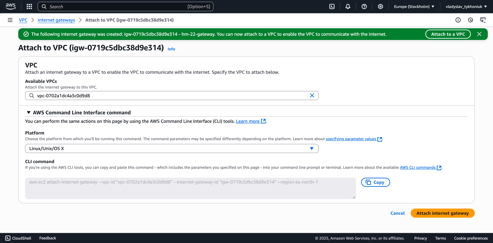
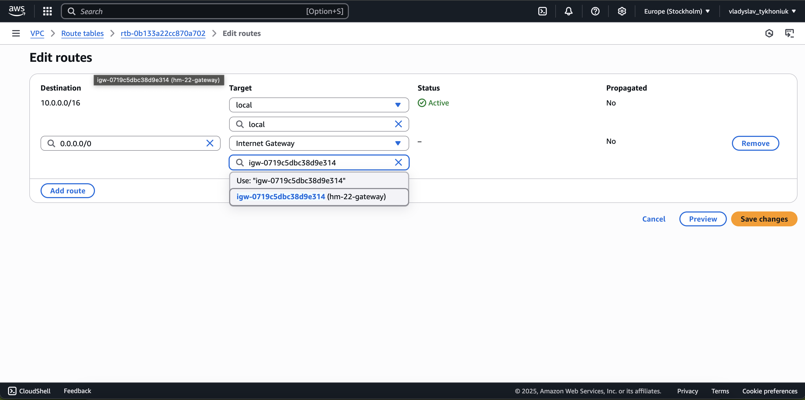
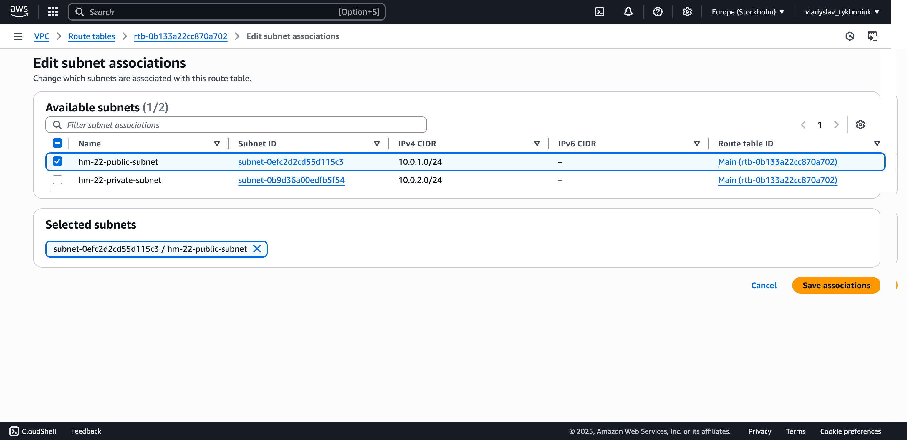
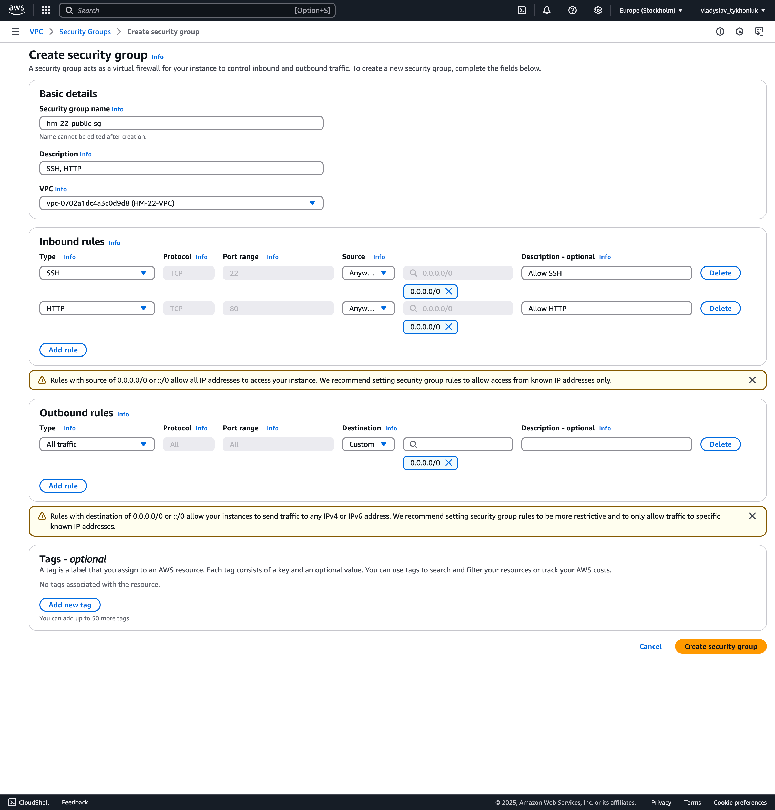

## EC2 -> Instances
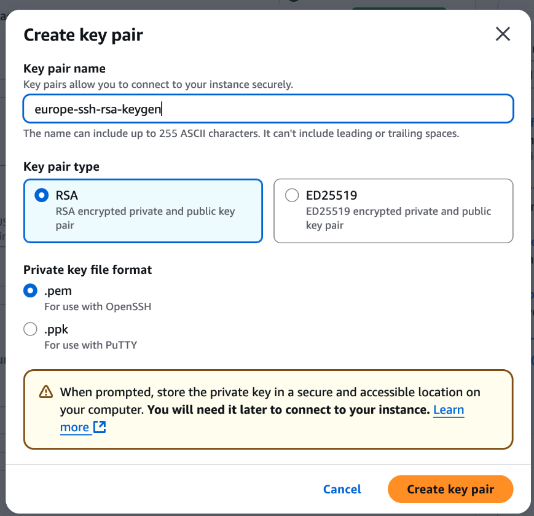
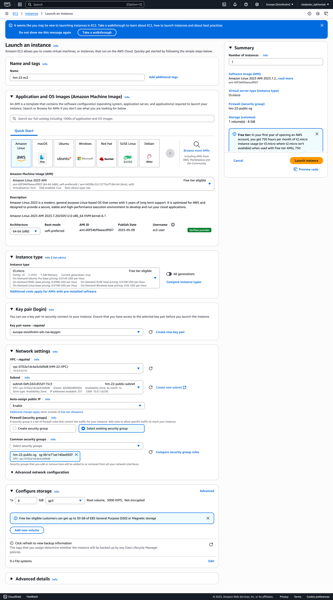

## SSH -> post-creation run
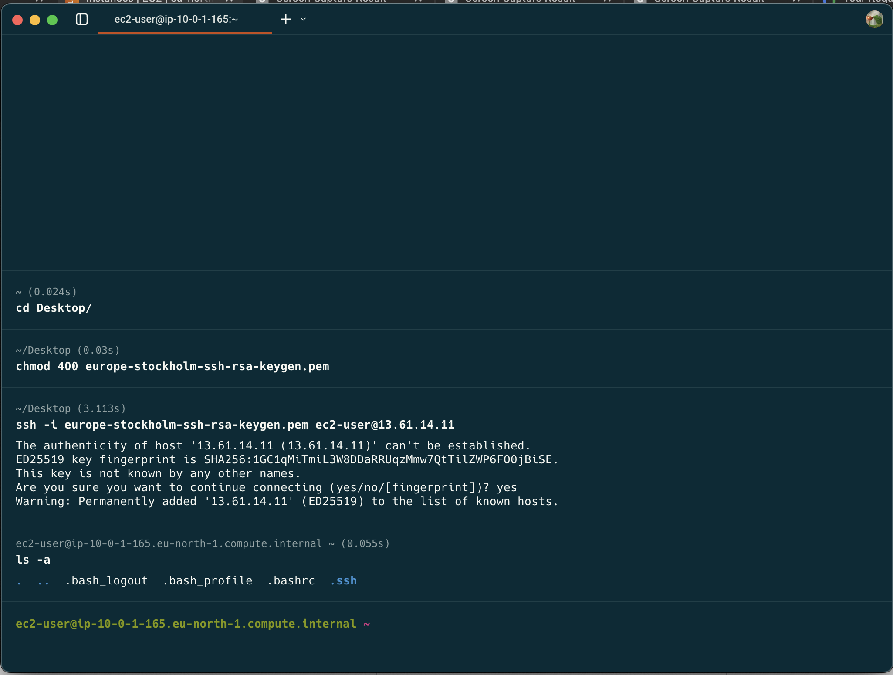

## EC2 -> ElasticIP associations
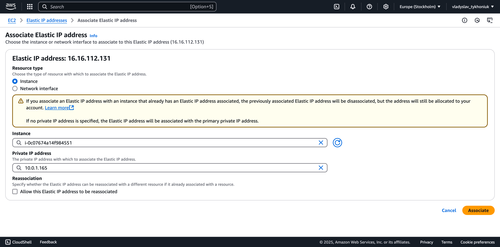

## SSH -> ElasticIP instance run
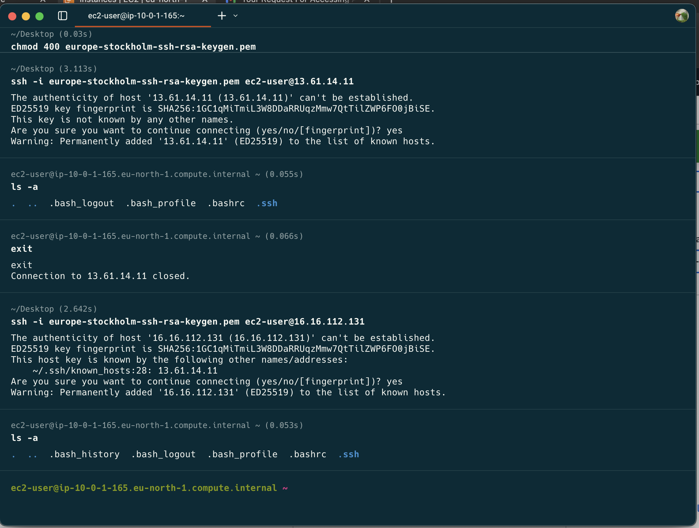

## Post HM actions -> Release Elastic IP and ec2 instance termination
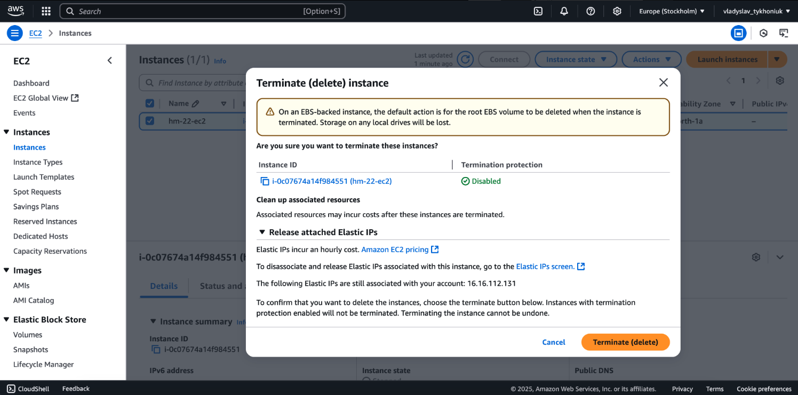
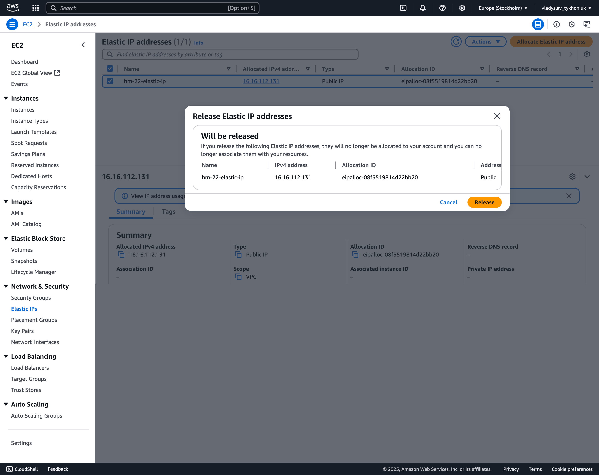
