# HM -> 25

Опис завдання

1. Створити кластер EKS
* Використовуючи AWS Management Console або CLI, створіть кластер EKS
* Кластер повинен складатися щонайменше з двох воркер-нод (Node Groups) у публічній підмережі
* Застосовуйте EC2 інстанси типу t3.medium
2. Налаштувати kubectl для доступу до кластера
* Підключіть локальний kubectl до вашого кластера
* Переконайтеся, що команда kubectl get nodes показує воркер-ноди кластера
3. Розгорнути статичний вебсайт
* Створіть Deployment, який розгортає статичний вебсайт на основі образу nginx
* Використовуйте ConfigMap для передачі файлів вебсайту (наприклад, index.html)
* Розгорніть Service типу LoadBalancer, щоб зробити вебсайт доступним через публічний IP
4. Створити PersistentVolumeClaim для збереження даних
* Використовуйте динамічне створення сховища (StorageClass), щоб зробити PersistentVolumeClaim
* Розгорніть Pod, який застосовує цей PVC, щоб зберігати дані на EBS-диску
5. Запуск завдання за допомогою Job
* Створіть Job, який виконує просту команду, наприклад, echo "Hello from EKS!"
* Переконайтеся, що Job виконується успішно
6. Розгорнути тестовий застосунок
* Розгорніть застосунок з образу httpd (Apache HTTP Server) або nginx
* Використовуйте Deployment для створення двох реплік
* Налаштуйте Service типу ClusterIP для доступу до застосунку всередині кластера
7. Робота з неймспейсами
* Створіть окремий namespace dev і розгорніть у ньому застосунок з 5 репліками на основі образу busybox. Контейнер повинен виконувати команду sleep 3600.
8. Очистити ресурси
* Deployment, Pod, Service, PVC тощо після завершення роботи

## Pre-requirements before create EKS:
Всі кроки скріни пов'язані зі створенням EKS, можуть бути виконані в довільній послідовності
тому зображення насправді не мають дотримуватись конкретної послідовності,
але все ж постараюсь викласти так як я це виконував під час спроб підключення EKS кластера

### Networking:
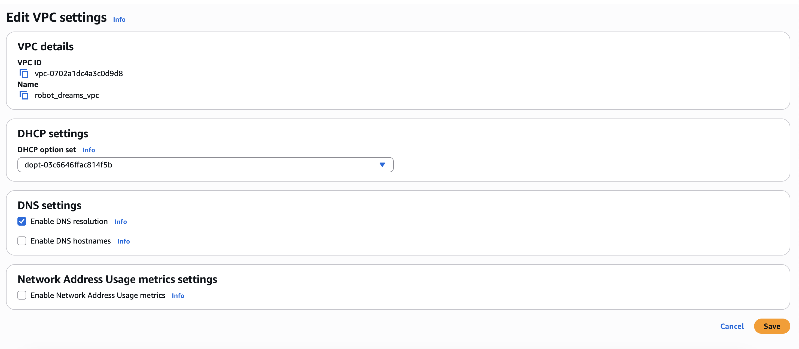
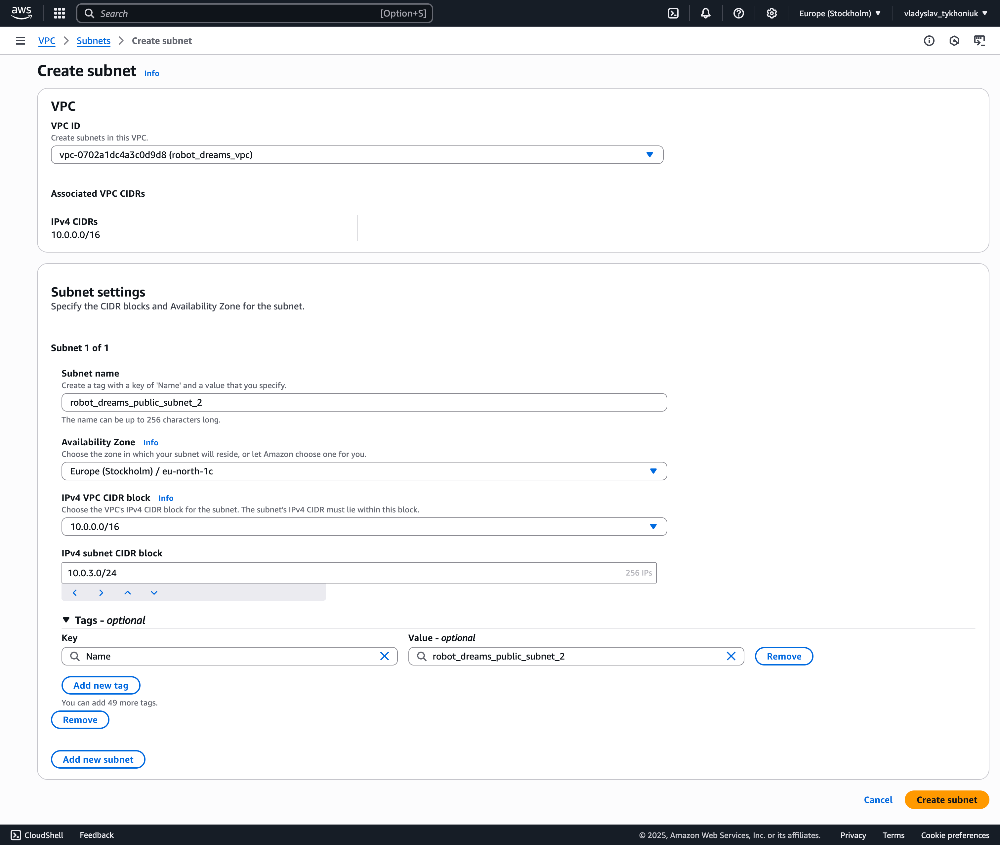
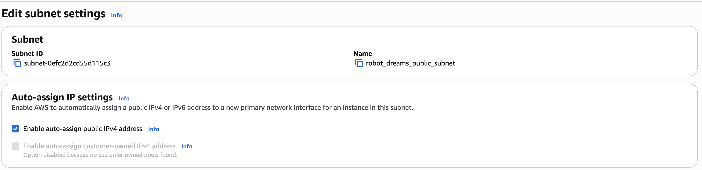

### IAM policy
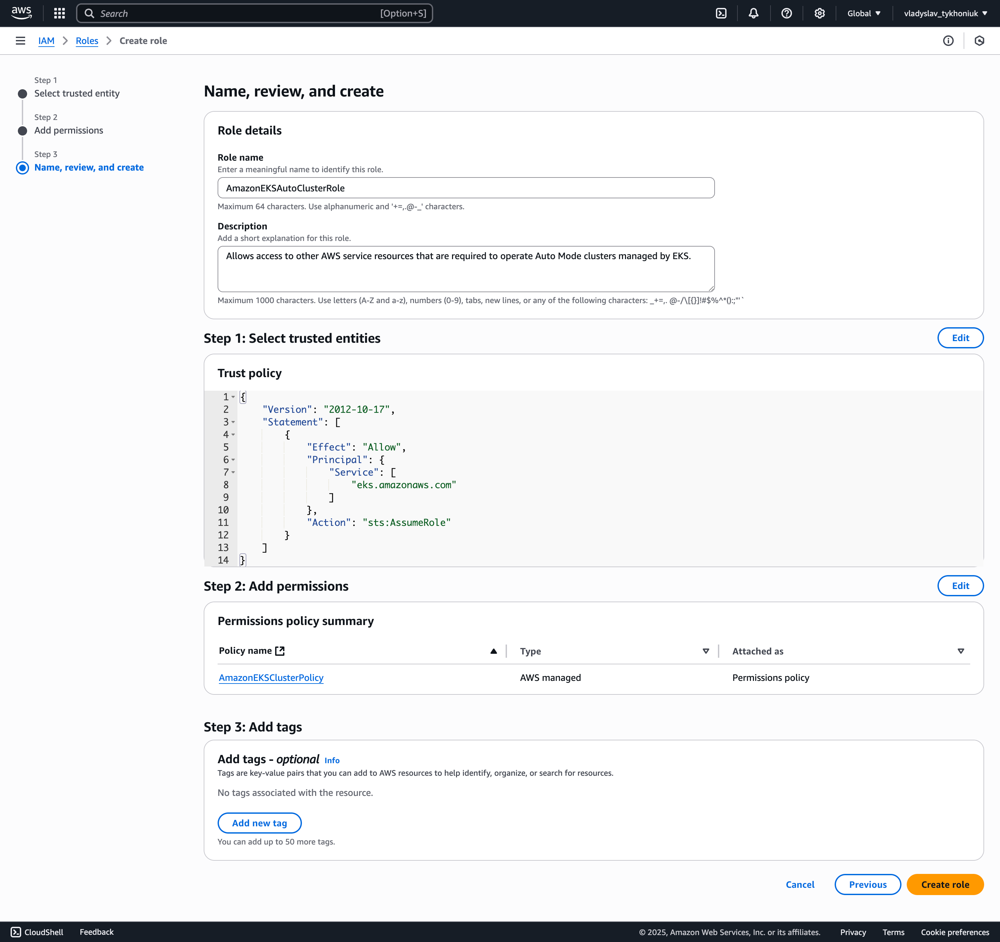
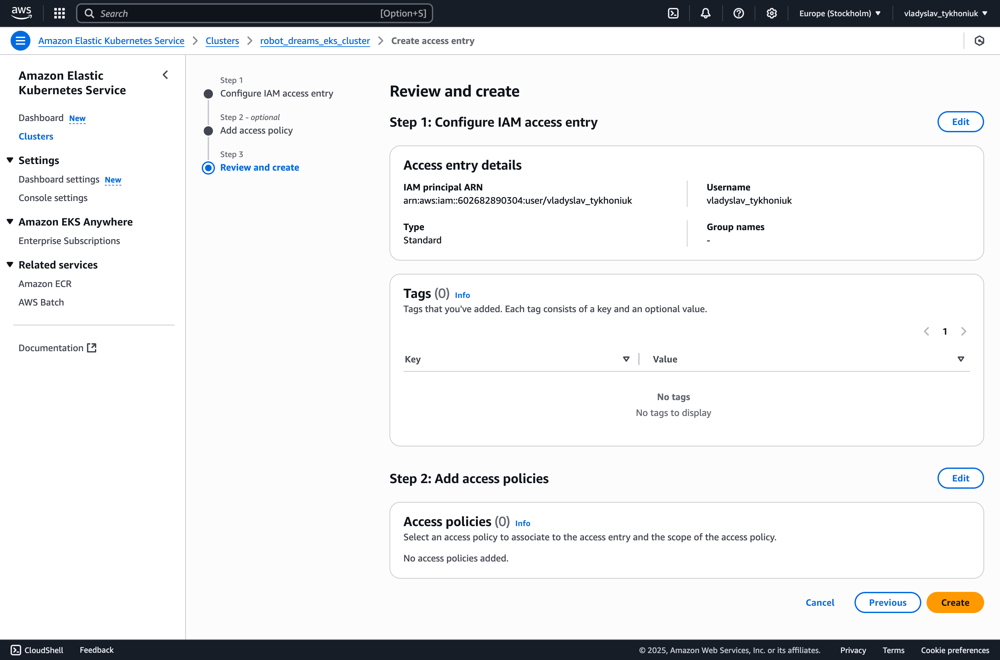
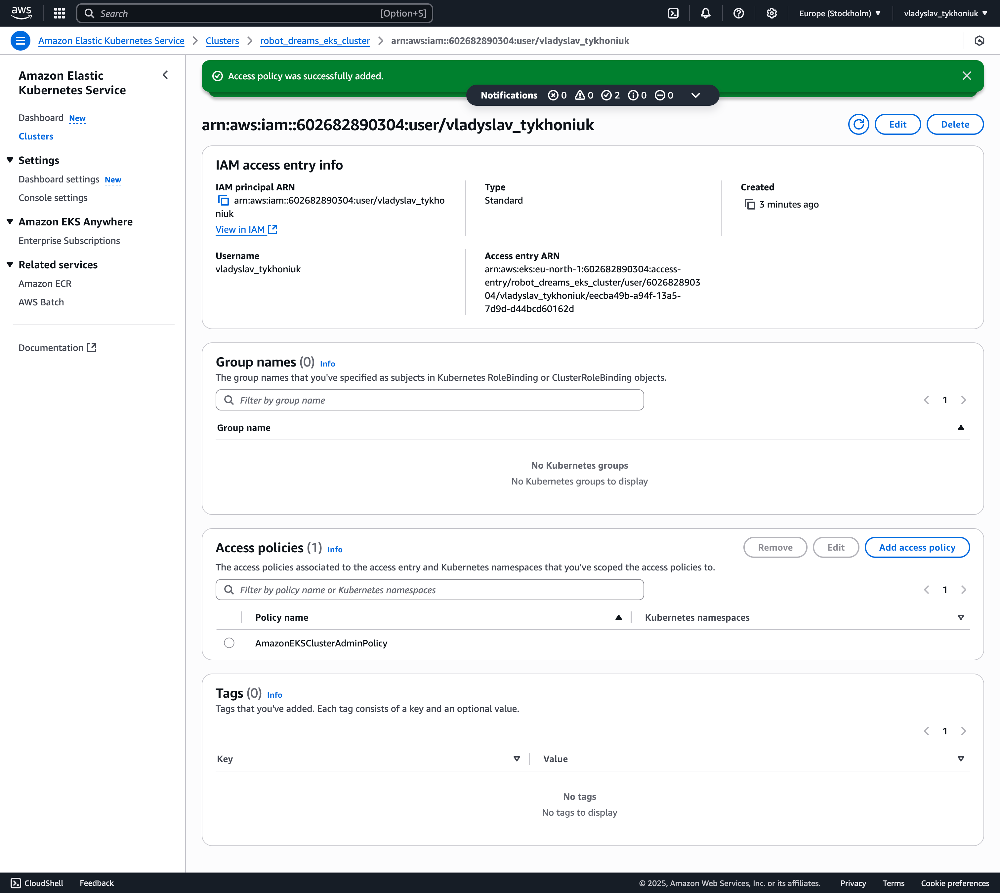
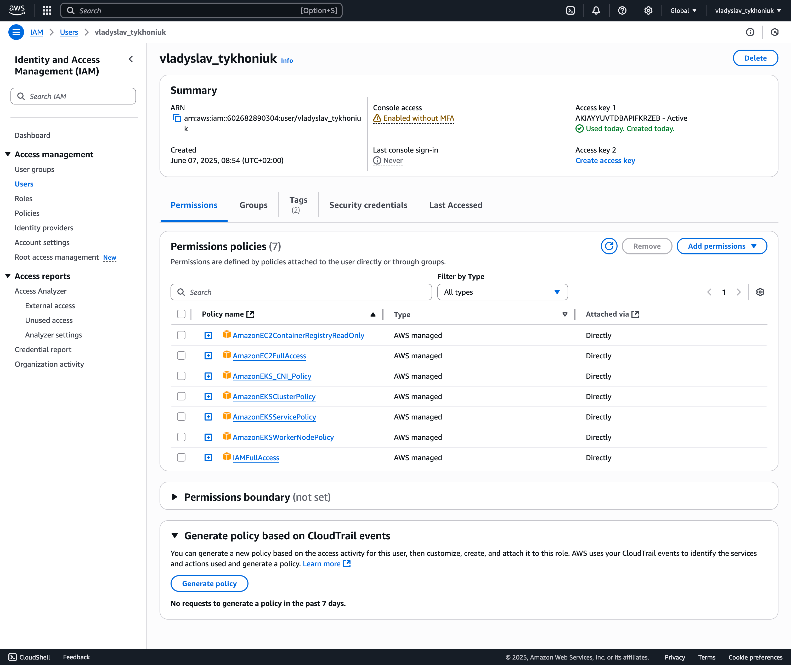

### EKS
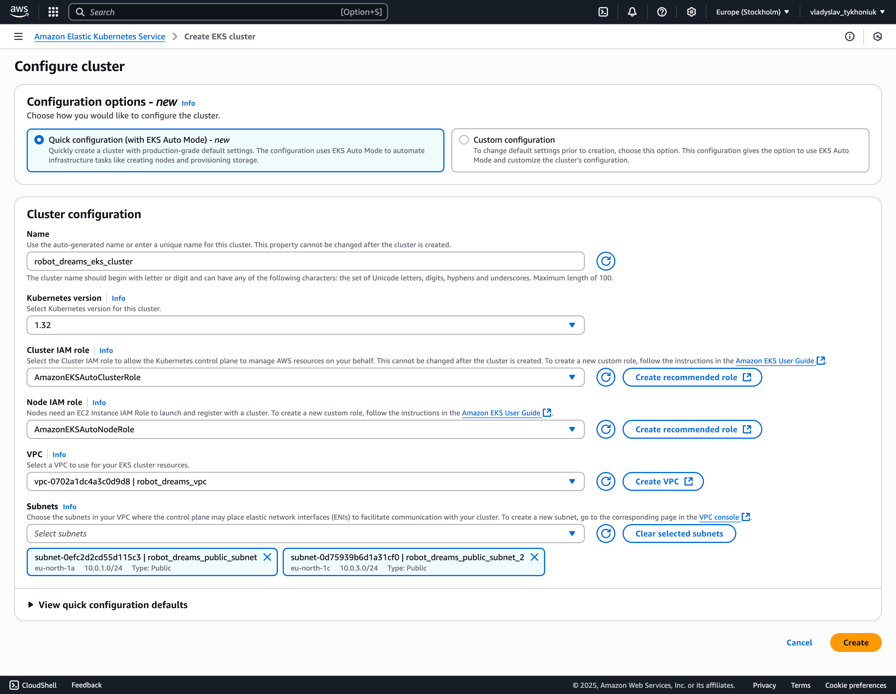
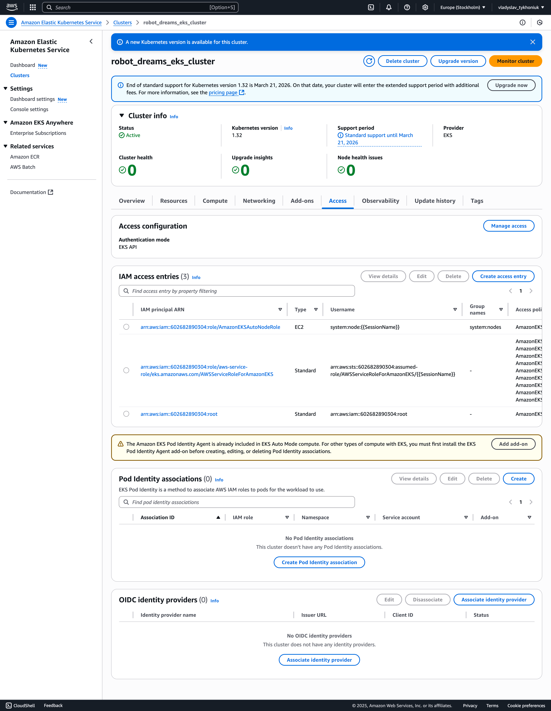


### CMD:


```textmate
hibana@mac robot_dreams_petclinic % kubectl apply -f nginx-deployment.yaml    
deployment.apps/nginx-deployment created

hibana@mac robot_dreams_petclinic % kubectl expose deployment nginx-deployment --type=LoadBalancer --port=80 
service/nginx-deployment exposed

hibana@mac robot_dreams_petclinic % kubectl get service
NAME               TYPE           CLUSTER-IP      EXTERNAL-IP   PORT(S)        AGE
kubernetes         ClusterIP      172.20.0.1      <none>        443/TCP        34m
nginx-deployment   LoadBalancer   172.20.21.219   <pending>     80:32223/TCP   43s
    
hibana@mac robot_dreams_petclinic % kubectl get pods -l app=nginx
NAME                                READY   STATUS              RESTARTS   AGE
nginx-deployment-569cdb9c8d-lrrnt   0/1     ContainerCreating   0          9m
hibana@mac robot_dreams_petclinic % kubectl describe pod nginx-deployment-569cdb9c8d-lrrnt
Name:             nginx-deployment-569cdb9c8d-lrrnt
Namespace:        default
Priority:         0
Service Account:  default
Node:             i-06b3e0e5a7fbe49ed/10.0.1.51
Start Time:       Sat, 07 Jun 2025 09:25:22 +0200
Labels:           app=nginx
                  pod-template-hash=569cdb9c8d
Annotations:      <none>
Status:           Pending
IP:               
IPs:              <none>
Controlled By:    ReplicaSet/nginx-deployment-569cdb9c8d
Containers:
  nginx:
    Container ID:   
    Image:          nginx
    Image ID:       
    Port:           80/TCP
    Host Port:      0/TCP
    State:          Waiting
      Reason:       ContainerCreating
    Ready:          False
    Restart Count:  0
    Environment:    <none>
    Mounts:
      /usr/share/nginx/html/index.html from html (rw,path="index.html")
      /var/run/secrets/kubernetes.io/serviceaccount from kube-api-access-c9bhj (ro)
Conditions:
  Type                        Status
  PodReadyToStartContainers   False 
  Initialized                 True 
  Ready                       False 
  ContainersReady             False 
  PodScheduled                True 
Volumes:
  html:
    Type:      ConfigMap (a volume populated by a ConfigMap)
    Name:      nginx-index
    Optional:  false
  kube-api-access-c9bhj:
    Type:                    Projected (a volume that contains injected data from multiple sources)
    TokenExpirationSeconds:  3607
    ConfigMapName:           kube-root-ca.crt
    Optional:                false
    DownwardAPI:             true
QoS Class:                   BestEffort
Node-Selectors:              <none>
Tolerations:                 node.kubernetes.io/not-ready:NoExecute op=Exists for 300s
                             node.kubernetes.io/unreachable:NoExecute op=Exists for 300s
Events:
  Type     Reason            Age                   From               Message
  ----     ------            ----                  ----               -------
  Warning  FailedScheduling  9m19s                 default-scheduler  0/2 nodes are available: 2 node(s) had untolerated taint {CriticalAddonsOnly: }. preemption: 0/2 nodes are available: 2 Preemption is not helpful for scheduling.
  Normal   Nominated         9m18s                 karpenter          Pod should schedule on: nodeclaim/general-purpose-trvk2
  Normal   Scheduled         8m45s                 default-scheduler  Successfully assigned default/nginx-deployment-569cdb9c8d-lrrnt to i-06b3e0e5a7fbe49ed
  Warning  FailedMount       31s (x12 over 8m45s)  kubelet            MountVolume.SetUp failed for volume "html" : configmap "nginx-index" not found
hibana@mac robot_dreams_petclinic % kubectl get configmap
NAME               DATA   AGE
kube-root-ca.crt   1      42m
nginx              1      15m
hibana@mac robot_dreams_petclinic % kubectl create configmap nginx-index --from-file=index.html
configmap/nginx-index created
hibana@mac robot_dreams_petclinic % kubectl describe configmap nginx-index
Name:         nginx-index
Namespace:    default
Labels:       <none>
Annotations:  <none>

Data
====
index.html:
----
<html lang="en">
<head>
    <meta charset="UTF-8">
    <meta name="viewport" content="width=device-width, initial-scale=1">
    <title>Deployment</title>
</head>
<body>
    <h1>Hello from EKS</h1>
</body>
</html>


BinaryData
====

Events:  <none>
hibana@mac robot_dreams_petclinic % kubectl delete pod -l app=nginx
pod "nginx-deployment-569cdb9c8d-lrrnt" deleted
hibana@mac robot_dreams_petclinic % kubectl get pods
NAME                                READY   STATUS              RESTARTS   AGE
nginx-deployment-569cdb9c8d-pdbwm   0/1     ContainerCreating   0          5s
hibana@mac robot_dreams_petclinic % kubectl expose deployment nginx-deployment --type=LoadBalancer --port=80
service/nginx-deployment exposed
hibana@mac robot_dreams_petclinic % kubectl get svc nginx-deployment
NAME               TYPE           CLUSTER-IP       EXTERNAL-IP   PORT(S)        AGE
nginx-deployment   LoadBalancer   172.20.198.225   <pending>     80:30309/TCP   4s
hibana@mac robot_dreams_petclinic % kubectl describe configmap nginx-deployment                      
Error from server (NotFound): configmaps "nginx-deployment" not found
hibana@mac robot_dreams_petclinic % kubectl get svc nginx-deployment
NAME               TYPE           CLUSTER-IP       EXTERNAL-IP   PORT(S)        AGE
nginx-deployment   LoadBalancer   172.20.198.225   <pending>     80:30309/TCP   38s
hibana@mac robot_dreams_petclinic % kubectl describe configmap nginx-index
Name:         nginx-index
Namespace:    default
Labels:       <none>
Annotations:  <none>

Data
====
index.html:
----
<html lang="en">
<head>
    <meta charset="UTF-8">
    <meta name="viewport" content="width=device-width, initial-scale=1">
    <title>Deployment</title>
</head>
<body>
    <h1>Hello from EKS</h1>
</body>
</html>


BinaryData
====

Events:  <none>
hibana@mac robot_dreams_petclinic % kubectl get svc nginx-deployment           
NAME               TYPE           CLUSTER-IP       EXTERNAL-IP   PORT(S)        AGE
nginx-deployment   LoadBalancer   172.20.198.225   <pending>     80:30309/TCP   75s
hibana@mac robot_dreams_petclinic % kubectl get nodes
NAME                  STATUS   ROLES    AGE   VERSION
i-01fa90160cd39f046   Ready    <none>   40m   v1.32.3-eks-156189c
i-021b8fb2c8247a729   Ready    <none>   40m   v1.32.3-eks-156189c
hibana@mac robot_dreams_petclinic % kubectl get svc nginx-deployment      
NAME               TYPE           CLUSTER-IP       EXTERNAL-IP   PORT(S)        AGE
nginx-deployment   LoadBalancer   172.20.198.225   <pending>     80:30309/TCP   2m20s
hibana@mac robot_dreams_petclinic % kubectl get svc nginx-deployment
NAME               TYPE           CLUSTER-IP       EXTERNAL-IP   PORT(S)        AGE
nginx-deployment   LoadBalancer   172.20.198.225   <pending>     80:30309/TCP   3m29s
hibana@mac robot_dreams_petclinic % kubectl delete svc nginx-deployment
service "nginx-deployment" deleted
hibana@mac robot_dreams_petclinic % kubectl get svc nginx-deployment
Error from server (NotFound): services "nginx-deployment" not found
hibana@mac robot_dreams_petclinic % kubectl expose deployment nginx-deployment --type=LoadBalancer --port=80
service/nginx-deployment exposed
```

Між цими кроками була година дебагу де при створенні external-ip який видавав помилк під час створення,
з цим я грався досить довго і не міг зрозуміти що конкретно було погано налаштовано, але за допомогою
розумних людей в інтернеті і методом спроб і помилок знайшов рішення за допомогою змін в subnets tags

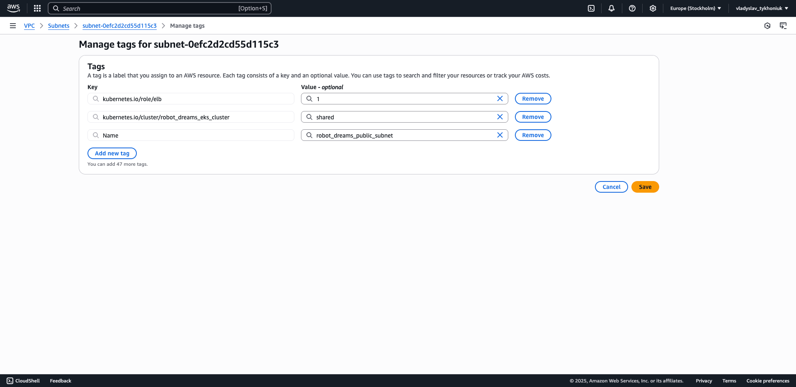
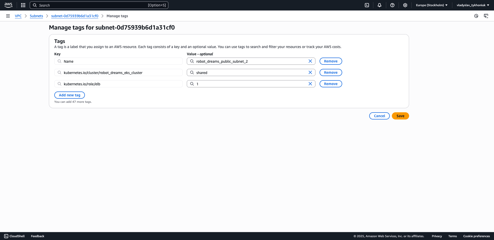


Тільки при додаванні цих тагів EKS вдалось коректно зробити expose external-api

```yaml
# STEP 1: Deployment of NGINX serving from the ConfigMap
apiVersion: apps/v1
kind: Deployment
metadata:
  name: nginx-deployment
  labels:
    app: nginx
spec:
  replicas: 1
  selector:
    matchLabels:
      app: nginx
  template:
    metadata:
      labels:
        app: nginx
    spec:
      containers:
        - name: nginx
          image: nginx:latest
          ports:
            - containerPort: 80
          volumeMounts:
            - name: html
              mountPath: /usr/share/nginx/html/index.html
              subPath: index.html
      volumes:
        - name: html
          configMap:
            name: nginx-index
            items:
              - key: index.html
                path: index.html

---
# STEP 2: LoadBalancer Service to expose externally
apiVersion: v1
kind: Service
metadata:
  name: nginx-deployment
  annotations:
    service.beta.kubernetes.io/aws-load-balancer-scheme: internet-facing
  labels:
    app: nginx
spec:
  selector:
    app: nginx
  type: LoadBalancer
  ports:
    - name: http
      port: 80
      targetPort: 80
```

```textmate
Events:
  Type     Reason            Age   From     Message
  ----     ------            ----  ----     -------
  Warning  FailedBuildModel  11s   service  Failed build model due to unable to resolve at least one subnet (0 match VPC and tags: [kubernetes.io/role/internal-elb])
```

```textmate
hibana@mac robot_dreams_petclinic % kubectl apply -f configuration.yaml
configmap/nginx-index created
deployment.apps/nginx-deployment created
service/nginx-deployment created

hibana@mac robot_dreams_petclinic % kubectl get svc nginx-deployment
NAME               TYPE           CLUSTER-IP      EXTERNAL-IP                                                                     PORT(S)        AGE
nginx-deployment   LoadBalancer   172.20.139.45   k8s-default-nginxdep-f77afdf2cd-e18b0f4636d5f5a1.elb.eu-north-1.amazonaws.com   80:30652/TCP   25s

hibana@mac robot_dreams_petclinic % kubectl get pods -l app=nginx
NAME                                READY   STATUS    RESTARTS   AGE
nginx-deployment-6f94695d85-wshnz   1/1     Running   0          30s

hibana@mac robot_dreams_petclinic % kubectl describe pod nginx-deployment-6f94695d85-wshnz
Name:             nginx-deployment-6f94695d85-wshnz
Namespace:        default
Priority:         0
Service Account:  default
Node:             i-06b3e0e5a7fbe49ed/10.0.1.51
Start Time:       Sat, 07 Jun 2025 10:27:32 +0200
Labels:           app=nginx
                  pod-template-hash=6f94695d85
Annotations:      <none>
Status:           Running
IP:               10.0.1.161
IPs:
  IP:           10.0.1.161
Controlled By:  ReplicaSet/nginx-deployment-6f94695d85
Containers:
  nginx:
    Container ID:   containerd://47aaf9766a5d0b6a96f821812bc3e88cb3f3c5ebde733d96c5e459fe9df2115b
    Image:          nginx:latest
    Image ID:       docker.io/library/nginx@sha256:fb39280b7b9eba5727c884a3c7810002e69e8f961cc373b89c92f14961d903a0
    Port:           80/TCP
    Host Port:      0/TCP
    State:          Running
      Started:      Sat, 07 Jun 2025 10:27:34 +0200
    Ready:          True
    Restart Count:  0
    Environment:    <none>
    Mounts:
      /usr/share/nginx/html/index.html from html (rw,path="index.html")
      /var/run/secrets/kubernetes.io/serviceaccount from kube-api-access-425gh (ro)
Conditions:
  Type                        Status
  PodReadyToStartContainers   True 
  Initialized                 True 
  Ready                       True 
  ContainersReady             True 
  PodScheduled                True 
Volumes:
  html:
    Type:      ConfigMap (a volume populated by a ConfigMap)
    Name:      nginx-index
    Optional:  false
  kube-api-access-425gh:
    Type:                    Projected (a volume that contains injected data from multiple sources)
    TokenExpirationSeconds:  3607
    ConfigMapName:           kube-root-ca.crt
    Optional:                false
    DownwardAPI:             true
QoS Class:                   BestEffort
Node-Selectors:              <none>
Tolerations:                 node.kubernetes.io/not-ready:NoExecute op=Exists for 300s
                             node.kubernetes.io/unreachable:NoExecute op=Exists for 300s
Events:
  Type    Reason     Age   From               Message
  ----    ------     ----  ----               -------
  Normal  Scheduled  51s   default-scheduler  Successfully assigned default/nginx-deployment-6f94695d85-wshnz to i-06b3e0e5a7fbe49ed
  Normal  Pulling    50s   kubelet            Pulling image "nginx:latest"
  Normal  Pulled     49s   kubelet            Successfully pulled image "nginx:latest" in 885ms (885ms including waiting). Image size: 72402122 bytes.
  Normal  Created    49s   kubelet            Created container: nginx
  Normal  Started    49s   kubelet            Started container nginx
  
  
hibana@mac robot_dreams_petclinic % nslookup k8s-default-nginxdep-754c34815e-8401f6061fb08233.elb.eu-north-1.amazonaws.com

Server:         192.168.1.1
Address:        192.168.1.1#53

Non-authoritative answer:
Name:   k8s-default-nginxdep-754c34815e-8401f6061fb08233.elb.eu-north-1.amazonaws.com
Address: 13.49.30.42
Name:   k8s-default-nginxdep-754c34815e-8401f6061fb08233.elb.eu-north-1.amazonaws.com
Address: 16.16.111.63

hibana@mac robot_dreams_petclinic % curl http://k8s-default-nginxdep-754c34815e-8401f6061fb08233.elb.eu-north-1.amazonaws.com
<html lang="en">
<head>
    <meta charset="UTF-8">
    <meta name="viewport" content="width=device-width, initial-scale=1">
    <title>Deployment</title>
</head>
<body>
    <h1>Hello from EKS</h1>
</body>
</html>%                                                                                                                                                                        hibana@mac robot_dreams_petclinic % 


hibana@mac robot_dreams_petclinic % touch ngix-pvc.yaml
hibana@mac robot_dreams_petclinic % kubectl get storageclass
NAME   PROVISIONER             RECLAIMPOLICY   VOLUMEBINDINGMODE      ALLOWVOLUMEEXPANSION   AGE
gp2    kubernetes.io/aws-ebs   Delete          WaitForFirstConsumer   false                  108m
hibana@mac robot_dreams_petclinic % kubectl apply -f nginx-pvc.yaml
error: the path "nginx-pvc.yaml" does not exist
hibana@mac robot_dreams_petclinic % kubectl apply -f nginx-pvc.yaml
persistentvolumeclaim/nginx-pvc created
hibana@mac robot_dreams_petclinic % kubectl get pvc
NAME        STATUS    VOLUME   CAPACITY   ACCESS MODES   STORAGECLASS   VOLUMEATTRIBUTESCLASS   AGE
nginx-pvc   Pending                                      gp2            <unset>                 107s
    
    
hibana@mac robot_dreams_petclinic % kubectl apply -f job-eks.yaml
job.batch/hello-job created
hibana@mac robot_dreams_petclinic % kubectl get pods
NAME                                READY   STATUS      RESTARTS   AGE
hello-job-mxdld                     0/1     Completed   0          4s
nginx-deployment-6f94695d85-q72rc   1/1     Running     0          12m
```

```yaml
---
# STEP 1: Deployment of Apache HTTPD Server
apiVersion: apps/v1
kind: Deployment
metadata:
  name: httpd-deployment
  labels:
    app: httpd
spec:
  replicas: 2
  selector:
    matchLabels:
      app: httpd
  template:
    metadata:
      labels:
        app: httpd
    spec:
      containers:
        - name: apache
          image: httpd:latest
          ports:
            - containerPort: 80

---
# STEP 2: ClusterIP Service for internal access
apiVersion: v1
kind: Service
metadata:
  name: httpd-service
  labels:
    app: httpd
spec:
  selector:
    app: httpd
  type: ClusterIP
  ports:
    - name: http
      port: 80
      targetPort: 80
```

```textmate
hibana@mac robot_dreams_petclinic % touch configuration-2.yaml
hibana@mac robot_dreams_petclinic % kubectl apply -f configuration-2.yaml
deployment.apps/httpd-deployment created
service/httpd-service created
hibana@mac robot_dreams_petclinic % kubectl get pods -l app=nginx        
NAME                                READY   STATUS    RESTARTS   AGE
nginx-deployment-6f94695d85-q72rc   1/1     Running   0          18m
nginx-deployment-6f94695d85-vf9fq   1/1     Running   0          2m44s
hibana@mac robot_dreams_petclinic % kubectl get pods -l app=httpd
NAME                                READY   STATUS    RESTARTS   AGE
httpd-deployment-84b96d5879-cgdkx   1/1     Running   0          24s
httpd-deployment-84b96d5879-hn7h9   1/1     Running   0          24s

hibana@mac robot_dreams_petclinic % kubectl describe service httpd-service 
Name:                     httpd-service
Namespace:                default
Labels:                   app=httpd
Annotations:              <none>
Selector:                 app=httpd
Type:                     ClusterIP
IP Family Policy:         SingleStack
IP Families:              IPv4
IP:                       172.20.206.203
IPs:                      172.20.206.203
Port:                     http  80/TCP
TargetPort:               80/TCP
Endpoints:                10.0.1.163:80,10.0.1.162:80
Session Affinity:         None
Internal Traffic Policy:  Cluster
Events:                   <none>


hibana@mac robot_dreams_petclinic % kubectl port-forward svc/httpd-service 8080:80
Forwarding from 127.0.0.1:8080 -> 80
Forwarding from [::1]:8080 -> 80

hibana@mac robot_dreams_petclinic % curl http://localhost:8080
<html><body><h1>It works!</h1></body></html>
```


```yaml
# STEP 1: Create namespace
apiVersion: v1
kind: Namespace
metadata:
  name: dev
---
# STEP 2: Create replicates with busybox
apiVersion: apps/v1
kind: Deployment
metadata:
  name: busybox
  namespace: dev
  labels:
    app: busybox
spec:
  replicas: 5
  selector:
    matchLabels:
      app: busybox
  template:
    metadata:
      labels:
        app: busybox
    spec:
      containers:
        - name: busybox
          image: busybox
          command: ["sleep", "3600"]
```

```textmate
hibana@mac robot_dreams_petclinic % kubectl apply -f busybox-configuration.yaml
namespace/dev created
deployment.apps/busybox created

hibana@mac robot_dreams_petclinic % kubectl get pods -n dev
NAME                       READY   STATUS    RESTARTS   AGE
busybox-5c684d4858-2r7sq   1/1     Running   0          56s
busybox-5c684d4858-5gwh2   1/1     Running   0          56s
busybox-5c684d4858-5zfpc   1/1     Running   0          56s
busybox-5c684d4858-8r9bl   1/1     Running   0          56s
busybox-5c684d4858-zcbjd   1/1     Running   0          56s

hibana@mac robot_dreams_petclinic % kubectl exec -it busybox-5c684d4858-2r7sq -n dev -- sh
/ # ps
PID   USER     TIME  COMMAND
    1 root      0:00 sleep 3600
    7 root      0:00 sh
   12 root      0:00 ps
/ # exit
```

```makefile
delete-all:
	kubectl delete all --all --ignore-not-found
	kubectl delete pvc --all --ignore-not-found
	kubectl delete configmap --all --ignore-not-found
```

```textmate
hibana@mac robot_dreams_petclinic % make delete-all
kubectl delete all --all --ignore-not-found
pod "hello-job-mxdld" deleted
pod "httpd-deployment-84b96d5879-cgdkx" deleted
pod "httpd-deployment-84b96d5879-hn7h9" deleted
pod "nginx-deployment-6f94695d85-q72rc" deleted
pod "nginx-deployment-6f94695d85-vf9fq" deleted
service "httpd-service" deleted
service "kubernetes" deleted
service "nginx-deployment" deleted
deployment.apps "httpd-deployment" deleted
deployment.apps "nginx-deployment" deleted
job.batch "hello-job" deleted
kubectl delete pvc --all --ignore-not-found
persistentvolumeclaim "nginx-pvc" deleted
kubectl delete configmap --all --ignore-not-found
configmap "kube-root-ca.crt" deleted
configmap "nginx" deleted
configmap "nginx-index" deleted
```
