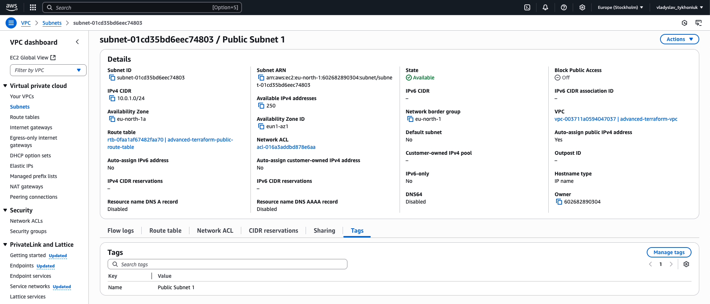
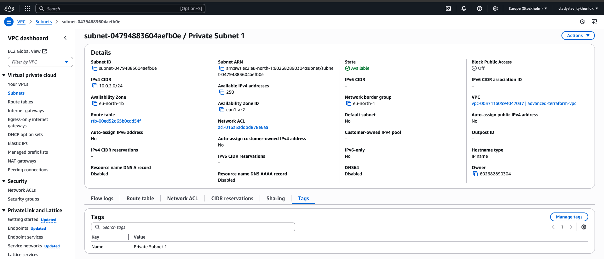
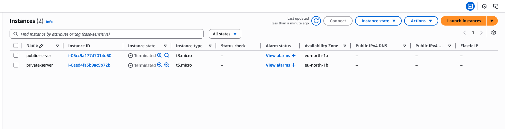
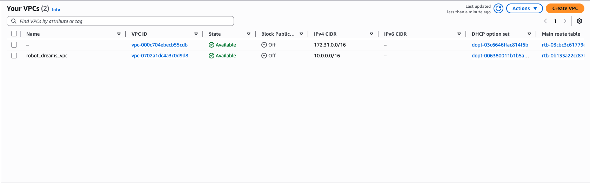

## HM-30-1 -> Advanced terraform (reverse creation via terraform import)

```text
* * Імпортувати наявні ресурси в Terraform-конфігурації
  * Створіть кілька ресурсів вручну за допомогою AWS Management Console
  * Імпортуйте ці ресурси у Terraform конфігураційні файли за допомогою команди terraform import
  * Переконайтеся, що Terraform створює ідентичну інфраструктуру
```

```
Тут я вже не розділяв на модулі, бо типу це не було тим поінтом, чого саме хотів досягти
але щось такого, певно би було б корисно зробити. Але це вже пишу в самому кінці
і спочатку не міг зрозуміти в чому прикол import, а потім як зрозумів, ну це сильно.
```

```textmate
imports.tf
```
```terraform
import {
  to = aws_vpc.imported_vpc
  id = "vpc-003711a0594047037"
}

import {
  to = aws_subnet.imported_public_subnet_1
  id = "subnet-01cd35bd6eec74803"
}

import {
  to = aws_subnet.imported_private_subnet_1
  id = "subnet-04794883604aefb0e"
}

import {
  to = aws_route_table.imported_route_table
  id = "rtb-0faa1af67482faa70"
}

import {
  to = aws_internet_gateway.imported_internet_gateway
  id = "igw-0dac3f29edcfd93b5"
}

import {
  to = aws_instance.imported_public_server
  id = "i-06cc9a177d7014d60"
}

import {
  to = aws_instance.imported_private_server
  id = "i-0eed4fa5b9ac9b72b"
}

import {
  to = aws_security_group.public_ec2_security_group
  id = "sg-00d693700f1191ae6"
}

import {
  to = aws_security_group.private_ec2_security_group
  id = "sg-03021a7986b37261c"
}
```

```main.tf```
```terraform
provider "aws" {
  region = "eu-north-1"
}

resource "aws_vpc" "imported_vpc" {
  tags = {
    Name = "advanced-terraform-vpc"
  }
}

resource "aws_subnet" "imported_public_subnet_1" {
  vpc_id = aws_vpc.imported_vpc.id
  cidr_block = "10.0.1.0/24"
  map_public_ip_on_launch = true

  tags = {
    Name = "Public Subnet 1"
  }
}
resource "aws_subnet" "imported_private_subnet_1" {
  vpc_id = aws_vpc.imported_vpc.id
  cidr_block = "10.0.2.0/24"

  tags = {
    Name = "Private Subnet 1"
  }
}

resource "aws_route_table" "imported_route_table" {
  vpc_id = aws_vpc.imported_vpc.id
  tags = {
    Name = "advanced-terraform-public-route-table"
  }
}

resource "aws_internet_gateway" "imported_internet_gateway" {
  tags = {
    Name = "advanced-terraform-gateway"
  }
}

resource "aws_instance" "imported_public_server" {
  ami = "ami-05fcfb9614772f051"
  instance_type = "t3.micro"
  key_name = "europe-stockholm-ssh-rsa-keygen"
  tags = {
    Name = "public-server"
  }
}

resource "aws_instance" "imported_private_server" {
  ami = "ami-05fcfb9614772f051"
  instance_type = "t3.micro"
  key_name = "europe-stockholm-ssh-rsa-keygen"
  tags = {
    Name = "private-server"
  }
}

resource "aws_security_group" "public_ec2_security_group" {
  vpc_id = aws_vpc.imported_vpc.id
}

resource "aws_security_group" "private_ec2_security_group" {
  vpc_id = aws_vpc.imported_vpc.id
}
```

## terraform plan
```textmate
hibana@mac terraform % terraform plan
aws_internet_gateway.imported_internet_gateway: Preparing import... [id=igw-0dac3f29edcfd93b5]
aws_vpc.imported_vpc: Preparing import... [id=vpc-003711a0594047037]
aws_instance.imported_public_server: Preparing import... [id=i-06cc9a177d7014d60]
aws_instance.imported_private_server: Preparing import... [id=i-0eed4fa5b9ac9b72b]
aws_instance.imported_private_server: Refreshing state... [id=i-0eed4fa5b9ac9b72b]
aws_vpc.imported_vpc: Refreshing state... [id=vpc-003711a0594047037]
aws_instance.imported_public_server: Refreshing state... [id=i-06cc9a177d7014d60]
aws_internet_gateway.imported_internet_gateway: Refreshing state... [id=igw-0dac3f29edcfd93b5]
aws_route_table.imported_route_table: Preparing import... [id=rtb-0faa1af67482faa70]
aws_security_group.private_ec2_security_group: Preparing import... [id=sg-03021a7986b37261c]
aws_security_group.public_ec2_security_group: Preparing import... [id=sg-00d693700f1191ae6]
aws_subnet.imported_public_subnet_1: Preparing import... [id=subnet-01cd35bd6eec74803]
aws_subnet.imported_private_subnet_1: Preparing import... [id=subnet-04794883604aefb0e]
aws_route_table.imported_route_table: Refreshing state... [id=rtb-0faa1af67482faa70]
aws_subnet.imported_private_subnet_1: Refreshing state... [id=subnet-04794883604aefb0e]
aws_subnet.imported_public_subnet_1: Refreshing state... [id=subnet-01cd35bd6eec74803]
aws_security_group.private_ec2_security_group: Refreshing state... [id=sg-03021a7986b37261c]
aws_security_group.public_ec2_security_group: Refreshing state... [id=sg-00d693700f1191ae6]

Terraform will perform the following actions:

  # aws_instance.imported_private_server will be imported
    resource "aws_instance" "imported_private_server" {
        ami                                  = "ami-05fcfb9614772f051"
        arn                                  = "arn:aws:ec2:eu-north-1:602682890304:instance/i-0eed4fa5b9ac9b72b"
        associate_public_ip_address          = false
        availability_zone                    = "eu-north-1b"
        disable_api_stop                     = false
        disable_api_termination              = false
        ebs_optimized                        = false
        get_password_data                    = false
        hibernation                          = false
        host_id                              = null
        iam_instance_profile                 = null
        id                                   = "i-0eed4fa5b9ac9b72b"
        instance_initiated_shutdown_behavior = "stop"
        instance_lifecycle                   = null
        instance_state                       = "running"
        instance_type                        = "t3.micro"
        ipv6_address_count                   = 0
        ipv6_addresses                       = []
        key_name                             = "europe-stockholm-ssh-rsa-keygen"
        monitoring                           = false
        outpost_arn                          = null
        password_data                        = null
        placement_group                      = null
        placement_partition_number           = 0
        primary_network_interface_id         = "eni-0ff232cce918e384c"
        private_dns                          = "ip-10-0-2-36.eu-north-1.compute.internal"
        private_ip                           = "10.0.2.36"
        public_dns                           = null
        public_ip                            = null
        region                               = "eu-north-1"
        secondary_private_ips                = []
        security_groups                      = []
        source_dest_check                    = true
        spot_instance_request_id             = null
        subnet_id                            = "subnet-04794883604aefb0e"
        tags                                 = {
            "Name" = "private-server"
        }
        tags_all                             = {
            "Name" = "private-server"
        }
        tenancy                              = "default"
        vpc_security_group_ids               = [
            "sg-03021a7986b37261c",
        ]

        capacity_reservation_specification {
            capacity_reservation_preference = "open"
        }

        cpu_options {
            amd_sev_snp      = null
            core_count       = 1
            threads_per_core = 2
        }

        credit_specification {
            cpu_credits = "unlimited"
        }

        enclave_options {
            enabled = false
        }

        maintenance_options {
            auto_recovery = "default"
        }

        metadata_options {
            http_endpoint               = "enabled"
            http_protocol_ipv6          = "disabled"
            http_put_response_hop_limit = 2
            http_tokens                 = "required"
            instance_metadata_tags      = "disabled"
        }

        private_dns_name_options {
            enable_resource_name_dns_a_record    = false
            enable_resource_name_dns_aaaa_record = false
            hostname_type                        = "ip-name"
        }

        root_block_device {
            delete_on_termination = true
            device_name           = "/dev/xvda"
            encrypted             = false
            iops                  = 3000
            kms_key_id            = null
            tags                  = {}
            tags_all              = {}
            throughput            = 125
            volume_id             = "vol-001c543fccf8ce37a"
            volume_size           = 8
            volume_type           = "gp3"
        }
    }

  # aws_instance.imported_public_server will be imported
    resource "aws_instance" "imported_public_server" {
        ami                                  = "ami-05fcfb9614772f051"
        arn                                  = "arn:aws:ec2:eu-north-1:602682890304:instance/i-06cc9a177d7014d60"
        associate_public_ip_address          = true
        availability_zone                    = "eu-north-1a"
        disable_api_stop                     = false
        disable_api_termination              = false
        ebs_optimized                        = false
        get_password_data                    = false
        hibernation                          = false
        host_id                              = null
        iam_instance_profile                 = "EC2S3AccessRole"
        id                                   = "i-06cc9a177d7014d60"
        instance_initiated_shutdown_behavior = "stop"
        instance_lifecycle                   = null
        instance_state                       = "running"
        instance_type                        = "t3.micro"
        ipv6_address_count                   = 0
        ipv6_addresses                       = []
        key_name                             = "europe-stockholm-ssh-rsa-keygen"
        monitoring                           = false
        outpost_arn                          = null
        password_data                        = null
        placement_group                      = null
        placement_partition_number           = 0
        primary_network_interface_id         = "eni-0b35e5ef97dd3c294"
        private_dns                          = "ip-10-0-1-198.eu-north-1.compute.internal"
        private_ip                           = "10.0.1.198"
        public_dns                           = "ec2-13-51-237-94.eu-north-1.compute.amazonaws.com"
        public_ip                            = "13.51.237.94"
        region                               = "eu-north-1"
        secondary_private_ips                = []
        security_groups                      = []
        source_dest_check                    = true
        spot_instance_request_id             = null
        subnet_id                            = "subnet-01cd35bd6eec74803"
        tags                                 = {
            "Name" = "public-server"
        }
        tags_all                             = {
            "Name" = "public-server"
        }
        tenancy                              = "default"
        vpc_security_group_ids               = [
            "sg-00d693700f1191ae6",
        ]

        capacity_reservation_specification {
            capacity_reservation_preference = "open"
        }

        cpu_options {
            amd_sev_snp      = null
            core_count       = 1
            threads_per_core = 2
        }

        credit_specification {
            cpu_credits = "unlimited"
        }

        enclave_options {
            enabled = false
        }

        maintenance_options {
            auto_recovery = "default"
        }

        metadata_options {
            http_endpoint               = "enabled"
            http_protocol_ipv6          = "disabled"
            http_put_response_hop_limit = 2
            http_tokens                 = "required"
            instance_metadata_tags      = "disabled"
        }

        private_dns_name_options {
            enable_resource_name_dns_a_record    = false
            enable_resource_name_dns_aaaa_record = false
            hostname_type                        = "ip-name"
        }

        root_block_device {
            delete_on_termination = true
            device_name           = "/dev/xvda"
            encrypted             = false
            iops                  = 3000
            kms_key_id            = null
            tags                  = {}
            tags_all              = {}
            throughput            = 125
            volume_id             = "vol-0a3f3baadf40a1935"
            volume_size           = 8
            volume_type           = "gp3"
        }
    }

  # aws_internet_gateway.imported_internet_gateway will be imported
    resource "aws_internet_gateway" "imported_internet_gateway" {
        arn      = "arn:aws:ec2:eu-north-1:602682890304:internet-gateway/igw-0dac3f29edcfd93b5"
        id       = "igw-0dac3f29edcfd93b5"
        owner_id = "602682890304"
        region   = "eu-north-1"
        tags     = {
            "Name" = "advanced-terraform-gateway"
        }
        tags_all = {
            "Name" = "advanced-terraform-gateway"
        }
        vpc_id   = "vpc-003711a0594047037"
    }

  # aws_route_table.imported_route_table will be imported
    resource "aws_route_table" "imported_route_table" {
        arn              = "arn:aws:ec2:eu-north-1:602682890304:route-table/rtb-0faa1af67482faa70"
        id               = "rtb-0faa1af67482faa70"
        owner_id         = "602682890304"
        propagating_vgws = []
        region           = "eu-north-1"
        route            = [
            {
                carrier_gateway_id         = null
                cidr_block                 = "0.0.0.0/0"
                core_network_arn           = null
                destination_prefix_list_id = null
                egress_only_gateway_id     = null
                gateway_id                 = "igw-0dac3f29edcfd93b5"
                ipv6_cidr_block            = null
                local_gateway_id           = null
                nat_gateway_id             = null
                network_interface_id       = null
                transit_gateway_id         = null
                vpc_endpoint_id            = null
                vpc_peering_connection_id  = null
            },
        ]
        tags             = {
            "Name" = "advanced-terraform-public-route-table"
        }
        tags_all         = {
            "Name" = "advanced-terraform-public-route-table"
        }
        vpc_id           = "vpc-003711a0594047037"
    }

  # aws_security_group.private_ec2_security_group will be imported
    resource "aws_security_group" "private_ec2_security_group" {
        arn         = "arn:aws:ec2:eu-north-1:602682890304:security-group/sg-03021a7986b37261c"
        description = "Managed by Terraform"
        egress      = [
            {
                cidr_blocks      = [
                    "0.0.0.0/0",
                ]
                description      = null
                from_port        = 0
                ipv6_cidr_blocks = []
                prefix_list_ids  = []
                protocol         = "-1"
                security_groups  = []
                self             = false
                to_port          = 0
            },
        ]
        id          = "sg-03021a7986b37261c"
        ingress     = []
        name        = "advanced-terraform-private-ec2-security-group"
        name_prefix = null
        owner_id    = "602682890304"
        region      = "eu-north-1"
        tags        = {}
        tags_all    = {}
        vpc_id      = "vpc-003711a0594047037"
    }

  # aws_security_group.public_ec2_security_group will be imported
    resource "aws_security_group" "public_ec2_security_group" {
        arn         = "arn:aws:ec2:eu-north-1:602682890304:security-group/sg-00d693700f1191ae6"
        description = "Managed by Terraform"
        egress      = [
            {
                cidr_blocks      = [
                    "0.0.0.0/0",
                ]
                description      = null
                from_port        = 0
                ipv6_cidr_blocks = []
                prefix_list_ids  = []
                protocol         = "-1"
                security_groups  = []
                self             = false
                to_port          = 0
            },
        ]
        id          = "sg-00d693700f1191ae6"
        ingress     = [
            {
                cidr_blocks      = [
                    "0.0.0.0/0",
                ]
                description      = null
                from_port        = 22
                ipv6_cidr_blocks = []
                prefix_list_ids  = []
                protocol         = "tcp"
                security_groups  = []
                self             = false
                to_port          = 22
            },
        ]
        name        = "advanced-terraform-public-ec2-security-group"
        name_prefix = null
        owner_id    = "602682890304"
        region      = "eu-north-1"
        tags        = {}
        tags_all    = {}
        vpc_id      = "vpc-003711a0594047037"
    }

  # aws_subnet.imported_private_subnet_1 will be imported
    resource "aws_subnet" "imported_private_subnet_1" {
        arn                                            = "arn:aws:ec2:eu-north-1:602682890304:subnet/subnet-04794883604aefb0e"
        assign_ipv6_address_on_creation                = false
        availability_zone                              = "eu-north-1b"
        availability_zone_id                           = "eun1-az2"
        cidr_block                                     = "10.0.2.0/24"
        customer_owned_ipv4_pool                       = null
        enable_dns64                                   = false
        enable_lni_at_device_index                     = 0
        enable_resource_name_dns_a_record_on_launch    = false
        enable_resource_name_dns_aaaa_record_on_launch = false
        id                                             = "subnet-04794883604aefb0e"
        ipv6_cidr_block                                = null
        ipv6_cidr_block_association_id                 = null
        ipv6_native                                    = false
        map_customer_owned_ip_on_launch                = false
        map_public_ip_on_launch                        = false
        outpost_arn                                    = null
        owner_id                                       = "602682890304"
        private_dns_hostname_type_on_launch            = "ip-name"
        region                                         = "eu-north-1"
        tags                                           = {}
        tags_all                                       = {}
        vpc_id                                         = "vpc-003711a0594047037"
    }

  # aws_subnet.imported_public_subnet_1 will be imported
    resource "aws_subnet" "imported_public_subnet_1" {
        arn                                            = "arn:aws:ec2:eu-north-1:602682890304:subnet/subnet-01cd35bd6eec74803"
        assign_ipv6_address_on_creation                = false
        availability_zone                              = "eu-north-1a"
        availability_zone_id                           = "eun1-az1"
        cidr_block                                     = "10.0.1.0/24"
        customer_owned_ipv4_pool                       = null
        enable_dns64                                   = false
        enable_lni_at_device_index                     = 0
        enable_resource_name_dns_a_record_on_launch    = false
        enable_resource_name_dns_aaaa_record_on_launch = false
        id                                             = "subnet-01cd35bd6eec74803"
        ipv6_cidr_block                                = null
        ipv6_cidr_block_association_id                 = null
        ipv6_native                                    = false
        map_customer_owned_ip_on_launch                = false
        map_public_ip_on_launch                        = true
        outpost_arn                                    = null
        owner_id                                       = "602682890304"
        private_dns_hostname_type_on_launch            = "ip-name"
        region                                         = "eu-north-1"
        tags                                           = {}
        tags_all                                       = {}
        vpc_id                                         = "vpc-003711a0594047037"
    }

  # aws_vpc.imported_vpc will be imported
    resource "aws_vpc" "imported_vpc" {
        arn                                  = "arn:aws:ec2:eu-north-1:602682890304:vpc/vpc-003711a0594047037"
        assign_generated_ipv6_cidr_block     = false
        cidr_block                           = "10.0.0.0/16"
        default_network_acl_id               = "acl-016a3addbd878e6aa"
        default_route_table_id               = "rtb-00ed52d65b0cdd54f"
        default_security_group_id            = "sg-00b4aebc043a1fc8d"
        dhcp_options_id                      = "dopt-03c6646ffac814f5b"
        enable_dns_hostnames                 = true
        enable_dns_support                   = true
        enable_network_address_usage_metrics = false
        id                                   = "vpc-003711a0594047037"
        instance_tenancy                     = "default"
        ipv6_association_id                  = null
        ipv6_cidr_block                      = null
        ipv6_cidr_block_network_border_group = null
        ipv6_ipam_pool_id                    = null
        ipv6_netmask_length                  = 0
        main_route_table_id                  = "rtb-00ed52d65b0cdd54f"
        owner_id                             = "602682890304"
        region                               = "eu-north-1"
        tags                                 = {
            "Name" = "advanced-terraform-vpc"
        }
        tags_all                             = {
            "Name" = "advanced-terraform-vpc"
        }
    }

Plan: 9 to import, 0 to add, 0 to change, 0 to destroy.

───────────────────────────────────────────────────────────────────────────────────────────────────────────────────────────────────────────────────────────────────────────────

Note: You didn't use the -out option to save this plan, so Terraform can't guarantee to take exactly these actions if you run "terraform apply" now.
```

### terraform apply
```textmate
Do you want to perform these actions?
  Terraform will perform the actions described above.
  Only 'yes' will be accepted to approve.

  Enter a value: yes

aws_internet_gateway.imported_internet_gateway: Importing... [id=igw-0dac3f29edcfd93b5]
aws_internet_gateway.imported_internet_gateway: Import complete [id=igw-0dac3f29edcfd93b5]
aws_vpc.imported_vpc: Importing... [id=vpc-003711a0594047037]
aws_vpc.imported_vpc: Import complete [id=vpc-003711a0594047037]
aws_security_group.private_ec2_security_group: Importing... [id=sg-03021a7986b37261c]
aws_security_group.private_ec2_security_group: Import complete [id=sg-03021a7986b37261c]
aws_security_group.public_ec2_security_group: Importing... [id=sg-00d693700f1191ae6]
aws_security_group.public_ec2_security_group: Import complete [id=sg-00d693700f1191ae6]
aws_subnet.imported_private_subnet_1: Importing... [id=subnet-04794883604aefb0e]
aws_subnet.imported_private_subnet_1: Import complete [id=subnet-04794883604aefb0e]
aws_route_table.imported_route_table: Importing... [id=rtb-0faa1af67482faa70]
aws_route_table.imported_route_table: Import complete [id=rtb-0faa1af67482faa70]
aws_subnet.imported_public_subnet_1: Importing... [id=subnet-01cd35bd6eec74803]
aws_subnet.imported_public_subnet_1: Import complete [id=subnet-01cd35bd6eec74803]
aws_instance.imported_public_server: Importing... [id=i-06cc9a177d7014d60]
aws_instance.imported_public_server: Import complete [id=i-06cc9a177d7014d60]
aws_instance.imported_private_server: Importing... [id=i-0eed4fa5b9ac9b72b]
aws_instance.imported_private_server: Import complete [id=i-0eed4fa5b9ac9b72b]

Apply complete! Resources: 9 imported, 0 added, 0 changed, 0 destroyed.
```

### terraform plan
```textmate
hibana@mac terraform % terraform plan 
aws_internet_gateway.imported_internet_gateway: Refreshing state... [id=igw-0dac3f29edcfd93b5]
aws_vpc.imported_vpc: Refreshing state... [id=vpc-003711a0594047037]
aws_instance.imported_private_server: Refreshing state... [id=i-0eed4fa5b9ac9b72b]
aws_instance.imported_public_server: Refreshing state... [id=i-06cc9a177d7014d60]
aws_security_group.private_ec2_security_group: Refreshing state... [id=sg-03021a7986b37261c]
aws_subnet.imported_public_subnet_1: Refreshing state... [id=subnet-01cd35bd6eec74803]
aws_route_table.imported_route_table: Refreshing state... [id=rtb-0faa1af67482faa70]
aws_subnet.imported_private_subnet_1: Refreshing state... [id=subnet-04794883604aefb0e]
aws_security_group.public_ec2_security_group: Refreshing state... [id=sg-00d693700f1191ae6]

No changes. Your infrastructure matches the configuration.

Terraform has compared your real infrastructure against your configuration and found no differences, so no changes are needed.
```

### Provide minor changes into configuration to verify apply changes

```textmate
hibana@mac terraform % terraform plan 
aws_internet_gateway.imported_internet_gateway: Refreshing state... [id=igw-0dac3f29edcfd93b5]
aws_vpc.imported_vpc: Refreshing state... [id=vpc-003711a0594047037]
aws_instance.imported_private_server: Refreshing state... [id=i-0eed4fa5b9ac9b72b]
aws_instance.imported_public_server: Refreshing state... [id=i-06cc9a177d7014d60]
aws_subnet.imported_public_subnet_1: Refreshing state... [id=subnet-01cd35bd6eec74803]
aws_route_table.imported_route_table: Refreshing state... [id=rtb-0faa1af67482faa70]
aws_subnet.imported_private_subnet_1: Refreshing state... [id=subnet-04794883604aefb0e]
aws_security_group.private_ec2_security_group: Refreshing state... [id=sg-03021a7986b37261c]
aws_security_group.public_ec2_security_group: Refreshing state... [id=sg-00d693700f1191ae6]

Terraform used the selected providers to generate the following execution plan. Resource actions are indicated with the following symbols:
  ~ update in-place

Terraform will perform the following actions:

  # aws_subnet.imported_private_subnet_1 will be updated in-place
  ~ resource "aws_subnet" "imported_private_subnet_1" {
        id                                             = "subnet-04794883604aefb0e"
      ~ tags                                           = {
          + "Name" = "Private Subnet 1"
        }
      ~ tags_all                                       = {
          + "Name" = "Private Subnet 1"
        }
        # (20 unchanged attributes hidden)
    }

  # aws_subnet.imported_public_subnet_1 will be updated in-place
  ~ resource "aws_subnet" "imported_public_subnet_1" {
        id                                             = "subnet-01cd35bd6eec74803"
      ~ tags                                           = {
          + "Name" = "Public Subnet 1"
        }
      ~ tags_all                                       = {
          + "Name" = "Public Subnet 1"
        }
        # (20 unchanged attributes hidden)
    }

Plan: 0 to add, 2 to change, 0 to destroy.

───────────────────────────────────────────────────────────────────────────────────────────────────────────────────────────────────────────────────────────────────────────────

Note: You didn't use the -out option to save this plan, so Terraform can't guarantee to take exactly these actions if you run "terraform apply" now.
```

```textmate

aws_subnet.imported_private_subnet_1: Modifying... [id=subnet-04794883604aefb0e]
aws_subnet.imported_public_subnet_1: Modifying... [id=subnet-01cd35bd6eec74803]
aws_subnet.imported_public_subnet_1: Modifications complete after 1s [id=subnet-01cd35bd6eec74803]
aws_subnet.imported_private_subnet_1: Modifications complete after 1s [id=subnet-04794883604aefb0e]

Apply complete! Resources: 0 added, 2 changed, 0 destroyed.
```





```textmate
hibana@mac terraform % ssh -i europe-stockholm-ssh-rsa-keygen.pem ec2-user@13.51.237.94
Warning: Identity file europe-stockholm-ssh-rsa-keygen.pem not accessible: No such file or directory.
   ,     #_
   ~\_  ####_        Amazon Linux 2023
  ~~  \_#####\
  ~~     \###|
  ~~       \#/ ___   https://aws.amazon.com/linux/amazon-linux-2023
   ~~       V~' '->
    ~~~         /
      ~~._.   _/
         _/ _/
       _/m/'
Last login: Fri Jun 20 09:39:38 2025 from 83.24.236.82
[ec2-user@ip-10-0-1-198 ~]$ ls -a
.  ..  .bash_history  .bash_logout  .bash_profile  .bashrc  .ssh
```

## Clean-up
```textmate
Plan: 0 to add, 0 to change, 9 to destroy.

Do you really want to destroy all resources?
  Terraform will destroy all your managed infrastructure, as shown above.
  There is no undo. Only 'yes' will be accepted to confirm.

  Enter a value: yes

aws_internet_gateway.imported_internet_gateway: Destroying... [id=igw-0dac3f29edcfd93b5]
aws_route_table.imported_route_table: Destroying... [id=rtb-0faa1af67482faa70]
aws_subnet.imported_private_subnet_1: Destroying... [id=subnet-04794883604aefb0e]
aws_security_group.public_ec2_security_group: Destroying... [id=sg-00d693700f1191ae6]
aws_security_group.private_ec2_security_group: Destroying... [id=sg-03021a7986b37261c]
aws_subnet.imported_public_subnet_1: Destroying... [id=subnet-01cd35bd6eec74803]
aws_instance.imported_private_server: Destroying... [id=i-0eed4fa5b9ac9b72b]
aws_instance.imported_public_server: Destroying... [id=i-06cc9a177d7014d60]
aws_route_table.imported_route_table: Destruction complete after 1s
aws_internet_gateway.imported_internet_gateway: Still destroying... [id=igw-0dac3f29edcfd93b5, 10s elapsed]
aws_subnet.imported_public_subnet_1: Still destroying... [id=subnet-01cd35bd6eec74803, 10s elapsed]
aws_instance.imported_private_server: Still destroying... [id=i-0eed4fa5b9ac9b72b, 10s elapsed]
aws_instance.imported_public_server: Still destroying... [id=i-06cc9a177d7014d60, 10s elapsed]
aws_security_group.private_ec2_security_group: Still destroying... [id=sg-03021a7986b37261c, 10s elapsed]
aws_security_group.public_ec2_security_group: Still destroying... [id=sg-00d693700f1191ae6, 10s elapsed]
aws_subnet.imported_private_subnet_1: Still destroying... [id=subnet-04794883604aefb0e, 10s elapsed]
aws_subnet.imported_private_subnet_1: Still destroying... [id=subnet-04794883604aefb0e, 20s elapsed]
aws_security_group.private_ec2_security_group: Still destroying... [id=sg-03021a7986b37261c, 20s elapsed]
aws_security_group.public_ec2_security_group: Still destroying... [id=sg-00d693700f1191ae6, 20s elapsed]
aws_subnet.imported_public_subnet_1: Still destroying... [id=subnet-01cd35bd6eec74803, 20s elapsed]
aws_instance.imported_private_server: Still destroying... [id=i-0eed4fa5b9ac9b72b, 20s elapsed]
aws_instance.imported_public_server: Still destroying... [id=i-06cc9a177d7014d60, 20s elapsed]
aws_internet_gateway.imported_internet_gateway: Still destroying... [id=igw-0dac3f29edcfd93b5, 20s elapsed]
aws_security_group.private_ec2_security_group: Destruction complete after 28s
aws_subnet.imported_private_subnet_1: Destruction complete after 28s
aws_internet_gateway.imported_internet_gateway: Still destroying... [id=igw-0dac3f29edcfd93b5, 30s elapsed]
aws_subnet.imported_public_subnet_1: Still destroying... [id=subnet-01cd35bd6eec74803, 30s elapsed]
aws_security_group.public_ec2_security_group: Still destroying... [id=sg-00d693700f1191ae6, 30s elapsed]
aws_instance.imported_public_server: Still destroying... [id=i-06cc9a177d7014d60, 30s elapsed]
aws_instance.imported_private_server: Still destroying... [id=i-0eed4fa5b9ac9b72b, 30s elapsed]
aws_instance.imported_private_server: Destruction complete after 31s
aws_internet_gateway.imported_internet_gateway: Destruction complete after 38s
aws_instance.imported_public_server: Still destroying... [id=i-06cc9a177d7014d60, 40s elapsed]
aws_subnet.imported_public_subnet_1: Still destroying... [id=subnet-01cd35bd6eec74803, 40s elapsed]
aws_security_group.public_ec2_security_group: Still destroying... [id=sg-00d693700f1191ae6, 40s elapsed]
aws_security_group.public_ec2_security_group: Destruction complete after 49s
aws_subnet.imported_public_subnet_1: Destruction complete after 49s
aws_vpc.imported_vpc: Destroying... [id=vpc-003711a0594047037]
aws_vpc.imported_vpc: Destruction complete after 1s
aws_instance.imported_public_server: Still destroying... [id=i-06cc9a177d7014d60, 50s elapsed]
aws_instance.imported_public_server: Destruction complete after 51s

Destroy complete! Resources: 9 destroyed.
```


