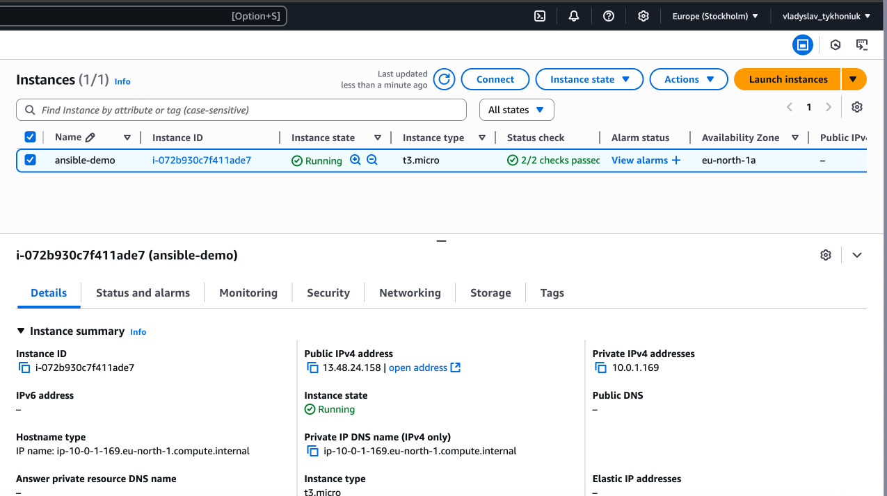
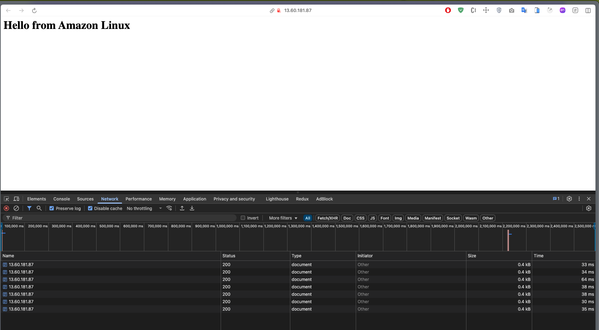

# HM-32

## Terraform IaC for Ansible config
```textmate
hibana@mac robot_dreams_petclinic % cd ansible 
hibana@mac ansible % ansible-vault encrypt ansible/group_vars/all/vault.yml
[WARNING]: Error getting vault password file (default): The vault password file /Users/hibana/PhpstormProjects/robot_dreams_petclinic/ansible/vault_pass.txt was not found
ERROR! The vault password file /Users/hibana/PhpstormProjects/robot_dreams_petclinic/ansible/vault_pass.txt was not found
hibana@mac robot_dreams_petclinic % ansible-vault encrypt ansible/group_vars/all/vault.yml
New Vault password: 
Confirm New Vault password: 
Encryption successful

hibana@mac ansible % ansible-inventory -i inventory/aws_ec2.yml --graph
@all:
  |--@ungrouped:
  |--@aws_ec2:
hibana@mac ansible % ansible-inventory -i inventory/aws_ec2.yml --list
{
    "_meta": {
        "hostvars": {}
    },
    "all": {
        "children": [
            "ungrouped",
            "aws_ec2"
        ]
    }
}
```

Terraform
```textmate
hibana@mac terraform % terraform validate

Success! The configuration is valid.

hibana@mac terraform %   terraform plan


Terraform used the selected providers to generate the following execution plan. Resource actions are indicated with the following symbols:
  + create

Terraform will perform the following actions:

  # aws_instance.web will be created
  + resource "aws_instance" "web" {
      + ami                                  = "ami-00c8ac9147e19828e"
      + arn                                  = (known after apply)
      + associate_public_ip_address          = (known after apply)
      + availability_zone                    = (known after apply)
      + disable_api_stop                     = (known after apply)
      + disable_api_termination              = (known after apply)
      + ebs_optimized                        = (known after apply)
      + enable_primary_ipv6                  = (known after apply)
      + get_password_data                    = false
      + host_id                              = (known after apply)
      + host_resource_group_arn              = (known after apply)
      + iam_instance_profile                 = (known after apply)
      + id                                   = (known after apply)
      + instance_initiated_shutdown_behavior = (known after apply)
      + instance_lifecycle                   = (known after apply)
      + instance_state                       = (known after apply)
      + instance_type                        = "t3.micro"
      + ipv6_address_count                   = (known after apply)
      + ipv6_addresses                       = (known after apply)
      + key_name                             = "europe-stockholm-ssh-rsa-keygen"
      + monitoring                           = (known after apply)
      + outpost_arn                          = (known after apply)
      + password_data                        = (known after apply)
      + placement_group                      = (known after apply)
      + placement_partition_number           = (known after apply)
      + primary_network_interface_id         = (known after apply)
      + private_dns                          = (known after apply)
      + private_ip                           = (known after apply)
      + public_dns                           = (known after apply)
      + public_ip                            = (known after apply)
      + region                               = "eu-north-1"
      + secondary_private_ips                = (known after apply)
      + security_groups                      = (known after apply)
      + source_dest_check                    = true
      + spot_instance_request_id             = (known after apply)
      + subnet_id                            = (known after apply)
      + tags                                 = {
          + "Environment" = "development"
          + "Name"        = "ansible-demo"
        }
      + tags_all                             = {
          + "Environment" = "development"
          + "Name"        = "ansible-demo"
        }
      + tenancy                              = (known after apply)
      + user_data_base64                     = (known after apply)
      + user_data_replace_on_change          = false
      + vpc_security_group_ids               = (known after apply)

      + capacity_reservation_specification (known after apply)

      + cpu_options (known after apply)

      + ebs_block_device (known after apply)

      + enclave_options (known after apply)

      + ephemeral_block_device (known after apply)

      + instance_market_options (known after apply)

      + maintenance_options (known after apply)

      + metadata_options (known after apply)

      + network_interface (known after apply)

      + private_dns_name_options (known after apply)

      + root_block_device (known after apply)
    }

  # aws_internet_gateway.ansible_gateway will be created
  + resource "aws_internet_gateway" "ansible_gateway" {
      + arn      = (known after apply)
      + id       = (known after apply)
      + owner_id = (known after apply)
      + region   = "eu-north-1"
      + tags     = {
          + "Name" = "ansible-gateway"
        }
      + tags_all = {
          + "Name" = "ansible-gateway"
        }
      + vpc_id   = (known after apply)
    }

  # aws_route_table.public_route_table will be created
  + resource "aws_route_table" "public_route_table" {
      + arn              = (known after apply)
      + id               = (known after apply)
      + owner_id         = (known after apply)
      + propagating_vgws = (known after apply)
      + region           = "eu-north-1"
      + route            = [
          + {
              + cidr_block                 = "0.0.0.0/0"
              + gateway_id                 = (known after apply)
                # (11 unchanged attributes hidden)
            },
        ]
      + tags             = {
          + "Name" = "ansible-public-route-table"
        }
      + tags_all         = {
          + "Name" = "ansible-public-route-table"
        }
      + vpc_id           = (known after apply)
    }

  # aws_route_table_association.public_route_association will be created
  + resource "aws_route_table_association" "public_route_association" {
      + id             = (known after apply)
      + region         = "eu-north-1"
      + route_table_id = (known after apply)
      + subnet_id      = (known after apply)
    }

  # aws_security_group.ansible_access will be created
  + resource "aws_security_group" "ansible_access" {
      + arn                    = (known after apply)
      + description            = "Allow SSH and HTTP"
      + egress                 = [
          + {
              + cidr_blocks      = [
                  + "0.0.0.0/0",
                ]
              + from_port        = 0
              + ipv6_cidr_blocks = []
              + prefix_list_ids  = []
              + protocol         = "-1"
              + security_groups  = []
              + self             = false
              + to_port          = 0
                # (1 unchanged attribute hidden)
            },
        ]
      + id                     = (known after apply)
      + ingress                = [
          + {
              + cidr_blocks      = [
                  + "0.0.0.0/0",
                ]
              + from_port        = 22
              + ipv6_cidr_blocks = []
              + prefix_list_ids  = []
              + protocol         = "tcp"
              + security_groups  = []
              + self             = false
              + to_port          = 22
                # (1 unchanged attribute hidden)
            },
          + {
              + cidr_blocks      = [
                  + "0.0.0.0/0",
                ]
              + from_port        = 80
              + ipv6_cidr_blocks = []
              + prefix_list_ids  = []
              + protocol         = "tcp"
              + security_groups  = []
              + self             = false
              + to_port          = 80
                # (1 unchanged attribute hidden)
            },
        ]
      + name                   = "allow_ssh_http"
      + name_prefix            = (known after apply)
      + owner_id               = (known after apply)
      + region                 = "eu-north-1"
      + revoke_rules_on_delete = false
      + tags                   = {
          + "Name" = "ansible-access"
        }
      + tags_all               = {
          + "Name" = "ansible-access"
        }
      + vpc_id                 = (known after apply)
    }

  # aws_subnet.public_subnet will be created
  + resource "aws_subnet" "public_subnet" {
      + arn                                            = (known after apply)
      + assign_ipv6_address_on_creation                = false
      + availability_zone                              = (known after apply)
      + availability_zone_id                           = (known after apply)
      + cidr_block                                     = "10.0.1.0/24"
      + enable_dns64                                   = false
      + enable_resource_name_dns_a_record_on_launch    = false
      + enable_resource_name_dns_aaaa_record_on_launch = false
      + id                                             = (known after apply)
      + ipv6_cidr_block_association_id                 = (known after apply)
      + ipv6_native                                    = false
      + map_public_ip_on_launch                        = true
      + owner_id                                       = (known after apply)
      + private_dns_hostname_type_on_launch            = (known after apply)
      + region                                         = "eu-north-1"
      + tags                                           = {
          + "Name" = "ansible-public-subnet"
        }
      + tags_all                                       = {
          + "Name" = "ansible-public-subnet"
        }
      + vpc_id                                         = (known after apply)
    }

  # aws_vpc.ansible_vpc will be created
  + resource "aws_vpc" "ansible_vpc" {
      + arn                                  = (known after apply)
      + cidr_block                           = "10.0.0.0/16"
      + default_network_acl_id               = (known after apply)
      + default_route_table_id               = (known after apply)
      + default_security_group_id            = (known after apply)
      + dhcp_options_id                      = (known after apply)
      + enable_dns_hostnames                 = (known after apply)
      + enable_dns_support                   = true
      + enable_network_address_usage_metrics = (known after apply)
      + id                                   = (known after apply)
      + instance_tenancy                     = "default"
      + ipv6_association_id                  = (known after apply)
      + ipv6_cidr_block                      = (known after apply)
      + ipv6_cidr_block_network_border_group = (known after apply)
      + main_route_table_id                  = (known after apply)
      + owner_id                             = (known after apply)
      + region                               = "eu-north-1"
      + tags                                 = {
          + "Name" = "ansible-demo-vpc"
        }
      + tags_all                             = {
          + "Name" = "ansible-demo-vpc"
        }
    }

Plan: 7 to add, 0 to change, 0 to destroy.

Changes to Outputs:
  + aws_vpc_id    = (known after apply)
  + web_public_ip = (known after apply)

───────────────────────────────────────────────────────────────────────────────────────────────────────────────────────────────────────────────────────────────────────────────

Note: You didn't use the -out option to save this plan, so Terraform can't guarantee to take exactly these actions if you run "terraform apply" now.

...


Apply complete! Resources: 8 added, 0 changed, 0 destroyed.

Outputs:

aws_vpc_id = "vpc-021808d9282513ca0"
web_public_ip = "13.60.181.87"
```



```textmate
hibana@mac ansible % ansible-playbook -i inventory.ini playbooks/playbook.yml --vault-password-file vault-pass.txt

PLAY [Test connection to EC2 instance] *****************************************************************************************************************************************

TASK [Gathering Facts] *********************************************************************************************************************************************************
[WARNING]: Platform linux on host 13.60.181.87 is using the discovered Python interpreter at /usr/bin/python3.9, but future installation of another Python interpreter could
change the meaning of that path. See https://docs.ansible.com/ansible-core/2.18/reference_appendices/interpreter_discovery.html for more information.
ok: [13.60.181.87]

TASK [Ping EC2] ****************************************************************************************************************************************************************
ok: [13.60.181.87]

PLAY RECAP *********************************************************************************************************************************************************************
13.60.181.87               : ok=2    changed=0    unreachable=0    failed=0    skipped=0    rescued=0    ignored=0   

hibana@mac ansible % 
```

## Vo. 1 -> First version of ansible, with single playbook
```textmate
hibana@mac ansible % ANSIBLE_INVENTORY_ENABLED=amazon.aws.aws_ec2 \
ansible-playbook -i inventory/aws_ec2.yml playbooks/setup_firewall.yml \
--vault-password-file vault-pass.txt \
--private-key ssh-keys/europe-stockholm-ssh-rsa-keygen

PLAY [all] *********************************************************************************************************************************************************************
[WARNING]: Found variable using reserved name: tags

TASK [Gathering Facts] *********************************************************************************************************************************************************
[WARNING]: Platform linux on host 13.60.181.87 is using the discovered Python interpreter at /usr/bin/python3.9, but future installation of another Python interpreter could
change the meaning of that path. See https://docs.ansible.com/ansible-core/2.18/reference_appendices/interpreter_discovery.html for more information.
ok: [13.60.181.87]

TASK [firewalld : Ensure firewalld is installed] *******************************************************************************************************************************
ok: [13.60.181.87]

TASK [firewalld : Ensure firewalld is started and enabled] *********************************************************************************************************************
ok: [13.60.181.87]

TASK [firewalld : Allow SSH] ***************************************************************************************************************************************************
ok: [13.60.181.87]

TASK [firewalld : Allow HTTP] **************************************************************************************************************************************************
ok: [13.60.181.87]

TASK [firewalld : Allow HTTPS] *************************************************************************************************************************************************
ok: [13.60.181.87]

TASK [firewalld : Reload firewalld to apply rules] *****************************************************************************************************************************
changed: [13.60.181.87]

PLAY RECAP *********************************************************************************************************************************************************************
13.60.181.87               : ok=7    changed=1    unreachable=0    failed=0    skipped=0    rescued=0    ignored=0   
```

```textmate
PLAY [all] *********************************************************************************************************************************************************************
[WARNING]: Found variable using reserved name: tags

TASK [Gathering Facts] *********************************************************************************************************************************************************
[WARNING]: Platform linux on host 13.60.181.87 is using the discovered Python interpreter at /usr/bin/python3.9, but future installation of another Python interpreter could
change the meaning of that path. See https://docs.ansible.com/ansible-core/2.18/reference_appendices/interpreter_discovery.html for more information.
ok: [13.60.181.87]

TASK [baseline : Add SSH key] **************************************************************************************************************************************************
ok: [13.60.181.87]

TASK [baseline : Install baseline packages (Amazon Linux)] *********************************************************************************************************************
ok: [13.60.181.87]

TASK [firewalld : Ensure firewalld is installed] *******************************************************************************************************************************
ok: [13.60.181.87]

TASK [firewalld : Ensure firewalld is started and enabled] *********************************************************************************************************************
ok: [13.60.181.87]

TASK [firewalld : Allow SSH] ***************************************************************************************************************************************************
ok: [13.60.181.87]

TASK [firewalld : Allow HTTP] **************************************************************************************************************************************************
ok: [13.60.181.87]

TASK [firewalld : Allow HTTPS] *************************************************************************************************************************************************
ok: [13.60.181.87]

TASK [firewalld : Reload firewalld to apply rules] *****************************************************************************************************************************
changed: [13.60.181.87]

TASK [nginx : Install Nginx] ***************************************************************************************************************************************************
ok: [13.60.181.87]

TASK [nginx : Copy index.html using template] **********************************************************************************************************************************
ok: [13.60.181.87]

TASK [nginx : Ensure Nginx is running and enabled] *****************************************************************************************************************************
ok: [13.60.181.87]

PLAY RECAP *********************************************************************************************************************************************************************
13.60.181.87               : ok=12   changed=1    unreachable=0    failed=0    skipped=0    rescued=0    ignored=0   

hibana@mac ansible % curl http://13.60.181.87
<!DOCTYPE html>
<html>
<head>
    <title>Ansible Website</title>
</head>
<body>
    <h1>Welcome to Ansible Website</h1>
</body>
</html>                

[ec2-user@ip-10-0-1-63 ~]$ rpm -q vim-enhanced git mc firewalld
vim-enhanced-9.1.1202-1.amzn2023.0.1.x86_64
git-2.47.1-1.amzn2023.0.3.x86_64
mc-4.8.28-2.amzn2023.0.3.x86_64
firewalld-1.2.3-1.amzn2023.noarch                                                              
```

## Vo. 2 -> Final Version
```textmate
hibana@mac ansible % ansible-playbook playbooks/site.yml

PLAY [all] *********************************************************************************************************************************************************************
[WARNING]: Found variable using reserved name: tags

TASK [Gathering Facts] *********************************************************************************************************************************************************
[WARNING]: Platform linux on host 13.60.181.87 is using the discovered Python interpreter at /usr/bin/python3.9, but future installation of another Python interpreter could
change the meaning of that path. See https://docs.ansible.com/ansible-core/2.18/reference_appendices/interpreter_discovery.html for more information.
ok: [13.60.181.87]

TASK [baseline : Add SSH key] **************************************************************************************************************************************************
ok: [13.60.181.87]

TASK [baseline : Install baseline packages (Amazon Linux)] *********************************************************************************************************************
ok: [13.60.181.87]

TASK [firewalld : Ensure firewalld is installed] *******************************************************************************************************************************
ok: [13.60.181.87]

TASK [firewalld : Ensure firewalld is started and enabled] *********************************************************************************************************************
ok: [13.60.181.87]

TASK [firewalld : Allow SSH] ***************************************************************************************************************************************************
ok: [13.60.181.87]

TASK [firewalld : Allow HTTP] **************************************************************************************************************************************************
ok: [13.60.181.87]

TASK [firewalld : Allow HTTPS] *************************************************************************************************************************************************
ok: [13.60.181.87]

TASK [firewalld : Reload firewalld to apply rules] *****************************************************************************************************************************
changed: [13.60.181.87]

TASK [nginx : Install Nginx] ***************************************************************************************************************************************************
ok: [13.60.181.87]

TASK [nginx : Copy index.html using template] **********************************************************************************************************************************
ok: [13.60.181.87]

TASK [nginx : Deploy main nginx.conf] ******************************************************************************************************************************************
changed: [13.60.181.87]

TASK [nginx : Ensure Nginx is running and enabled] *****************************************************************************************************************************
changed: [13.60.181.87]

RUNNING HANDLER [nginx : Reload Nginx] *****************************************************************************************************************************************
changed: [13.60.181.87]

PLAY RECAP *********************************************************************************************************************************************************************
13.60.181.87               : ok=14   changed=4    unreachable=0    failed=0    skipped=0    rescued=0    ignored=0   


[ec2-user@ip-10-0-1-63 ~]$ sudo nginx -t
nginx: [warn] could not build optimal types_hash, you should increase either types_hash_max_size: 1024 or types_hash_bucket_size: 64; ignoring types_hash_bucket_size
nginx: the configuration file /etc/nginx/nginx.conf syntax is ok
nginx: configuration file /etc/nginx/nginx.conf test is successful
```



## Ansible
```textmate
ansible/group_vars/all/main.yml
```
```yml
site_title: "Ansible Website"
welcome_message: "Hello from Amazon Linux"
```

```textmate
ansible/group_vars/all/vault.yml
```
```yml
$ANSIBLE_VAULT;1.1;AES256
62653161633632323531616261386264316266626338316564386361653433313938336665326238
3434616433623862626135333938343833343863623863660a616333343063663164313465306435 ...
```

```textmate
ansible/inventory/aws_ec2.yml
```
```yml
plugin: amazon.aws.aws_ec2
regions:
  - eu-north-1
filters:
  tag:Environment: development
keyed_groups:
  - prefix: tag
    key: tags
hostnames:
  - ip-address
compose:
  ansible_host: public_ip_address
```

```textmate
ansible/playbooks/playbook.yml
```
```textmate
Цей плейбук ніде не використовується і був створений тільки в тестових цілях,
тому що досить довго не вдавалось налаштувати щоб вони спілкувались між собою
```
```textmate
- name: Test connection to EC2 instance
  hosts: web
  tasks:
    - name: Ping EC2
      ansible.builtin.ping:
```

```textmate
ansible/playbooks/setup_firewall.yml
```
```yaml
- hosts: all
  become: true
  roles:
    - firewalld
```

```textmate
ansible/playbooks/setup_nginx.yml
```
```yaml
- name: Setup Nginx web server
  hosts: web
  become: true
  vars_files:
    - ../group_vars/main.yml
  roles:
    - nginx
```

```textmate
ansible/playbooks/setup_baseline.yml
```
```yaml
- name: Baseline configuration for all servers
  hosts: all
  become: true
  roles:
    - baseline
```

```textmate
ansible/playbooks/site.yml
```
```yaml
- hosts: all
  become: yes
  vars_files:
    - ../group_vars/all/vault.yml
    - ../group_vars/all/main.yml
  roles:
    - baseline
    - firewalld
    - nginx
```


```textmate
ansible/roles/baseline/tasks/main.yml
```
```yaml
- name: Add SSH key
  authorized_key:
    user: ec2-user
    state: present
    key: "{{ ssh_public_key }}"

- name: Install baseline packages (Amazon Linux)
  when: ansible_os_family == "RedHat"
  dnf:
    name:
      - vim-enhanced
      - git
      - mc
      - firewalld
    state: present
    update_cache: yes
```

```textmate
ansible/roles/baseline/vars/main.yml
```
```yaml
ssh_public_key: "{{ vault_ssh_public_key }}"
```

```textmate
ansible/roles/firewalld/tasks/main.yml
```
```yaml
- name: Ensure firewalld is installed
  ansible.builtin.dnf:
    name: firewalld
    state: present
    update_cache: yes

- name: Ensure firewalld is started and enabled
  ansible.builtin.service:
    name: firewalld
    state: started
    enabled: true

- name: Allow SSH
  ansible.posix.firewalld:
    service: ssh
    permanent: yes
    state: enabled
    immediate: yes

- name: Allow HTTP
  ansible.posix.firewalld:
    service: http
    permanent: yes
    state: enabled
    immediate: yes

- name: Allow HTTPS
  ansible.posix.firewalld:
    service: https
    permanent: yes
    state: enabled
    immediate: yes

- name: Reload firewalld to apply rules
  ansible.builtin.command: firewall-cmd --reload
```

```textmate
ansible/roles/nginx/handlers/main.yml
```
```yaml
- name: Reload Nginx
  ansible.builtin.service:
    name: nginx
    state: reloaded
```

```textmate
ansible/roles/nginx/tasks/main.yml
```
```yaml
- name: Install Nginx
  ansible.builtin.package:
    name: nginx
    state: present
    update_cache: yes

- name: Copy index.html using template
  ansible.builtin.template:
    src: index.html.j2
    dest: /usr/share/nginx/html/index.html
    mode: '0644'

- name: Deploy main nginx.conf
  ansible.builtin.template:
    src: nginx.conf.j2
    dest: /etc/nginx/nginx.conf
    owner: root
    group: root
    mode: '0644'
  notify: Reload Nginx

- name: Ensure Nginx is running and enabled
  ansible.builtin.service:
    name: nginx
    state: started
    enabled: true
```

```textmate
ansible/roles/nginx/templates/index.html.j2
```
```html
<html>
  <head><title>{{ site_title }}</title></head>
  <body>
    <h1>{{ welcome_message }}</h1>
  </body>
</html>

```

```textmate
ansible/roles/nginx/templates/nginx.conf.j2
```

```textmate
user nginx;
worker_processes auto;
error_log /var/log/nginx/error.log;
pid /run/nginx.pid;

events {
    worker_connections 1024;
}

http {
    include       /etc/nginx/mime.types;
    default_type  application/octet-stream;

    sendfile        on;
    keepalive_timeout 65;

    server {
        listen 80;
        server_name _;
        root /usr/share/nginx/html;
        index index.html;

        location / {
            try_files $uri $uri/ =404;
        }
    }
}
```

```textmate
ansible/ansible.cfg
```
```textmate
[defaults]
inventory = inventory/aws_ec2.yml
private_key_file = ssh-keys/europe-stockholm-ssh-rsa-keygen.pem
host_key_checking = False
remote_user = ec2-user
roles_path = ./roles
vault_password_file = vault-pass.txt
interpreter_python = auto
enable_plugins = amazon.aws.aws_ec2
```

```textmate
ansible/inventory.ini
```
```ini
[web]
13.60.181.87 ansible_user=ec2-user ansible_ssh_private_key_file=ssh-keys/europe-stockholm-ssh-rsa-keygen
```

```textmate
ansible/vault-pass.txt
```
```textmate
SOME SUPER SECRET VALUE KEY
```