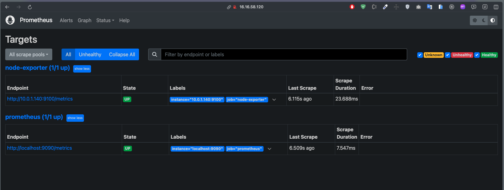
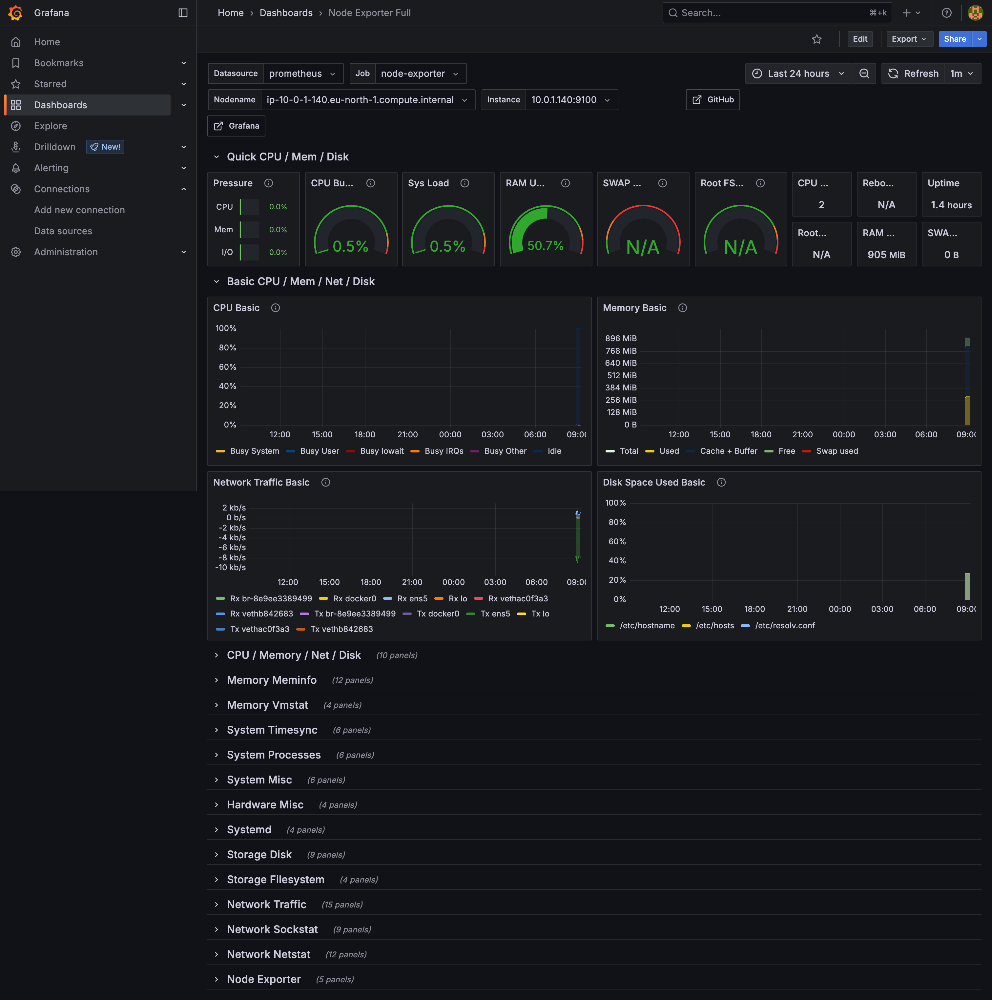
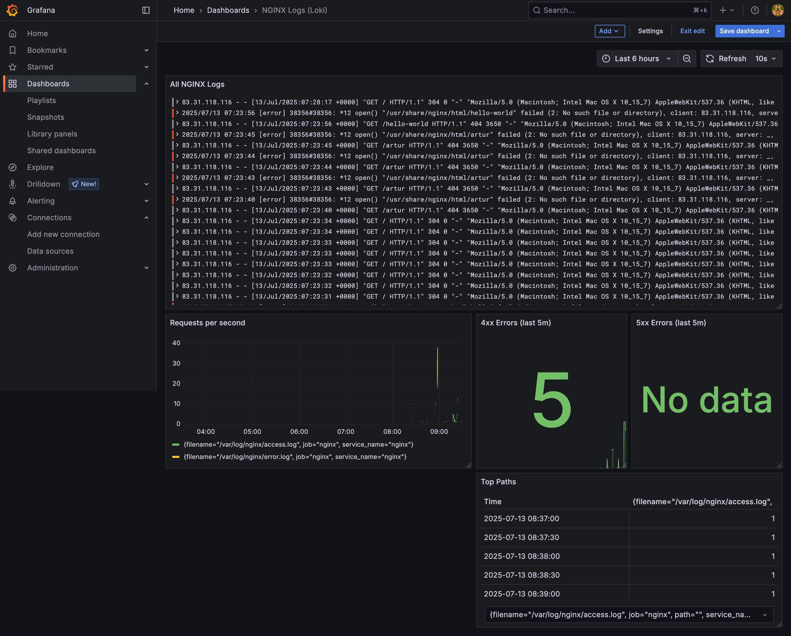
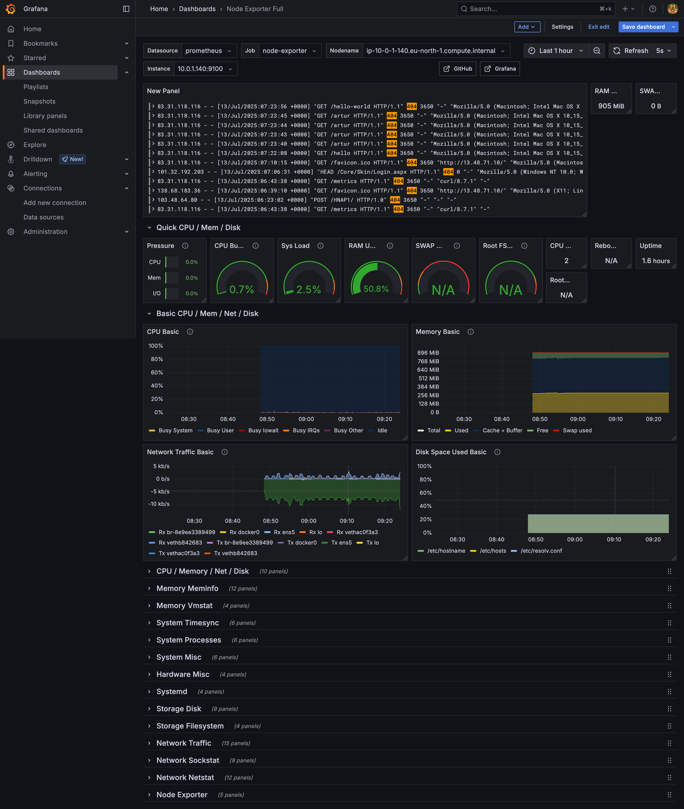
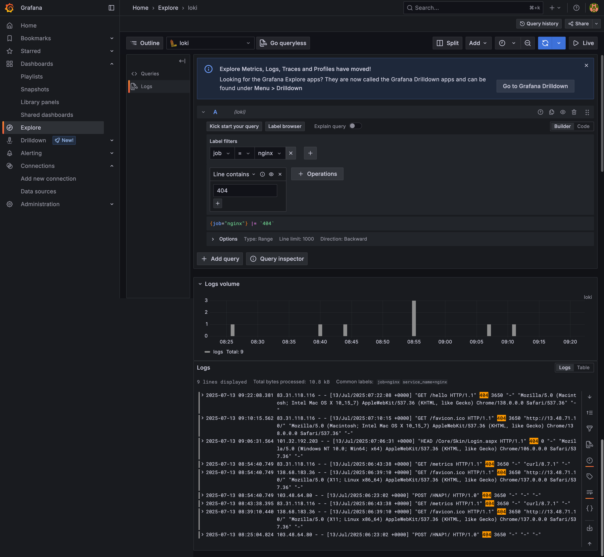

# HM-35 -> Monitoring

```textmate
 Умови виконання

1. Інфраструктура:

  * У вас є доступ до AWS для створення EC2-серверів
  * Вам потрібно створити:
    * Моніторинг-сервер для Prometheus, Grafana та Loki
    * Вебсервер або сервер бази даних, який треба моніторити
  * Сервери повинні розташовуватися в одній VPC

2. Вимоги до серверів:

  * Моніторинг-сервер:
    * Тип інстансу: t3.small.
    * Відкриті порти:
      * 22 (SSH)
      * 9090 (Prometheus)
      * 3000 (Grafana)
      * 3100 (Loki)
  * Вебсервер або сервер бази даних:
    * Тип інстансу: t3.micro
    * Розгорнути:
      * Nginx або MySQL
    * Відкриті порти:
      * 22 (SSH)
      * 80 (для Nginx) або 3306 (для MySQL)
      * 9100 (Node Exporter)

📌 Завдання

1. Розгорнути інфраструктуру

* Моніторинг-сервер:
  * Встановіть Docker і Docker Compose
  * Запустіть такі сервіси:
    * Prometheus: для збору метрик
    * Grafana: для візуалізації метрик і логів
    * Loki: для зберігання логів
    * Promtail: для збору логів
* Вебсервер або сервер бази даних:
  * Встановіть Nginx або MySQL
  * Встановіть Node Exporter для збору метрик
  * Налаштуйте Promtail для збору системних логів або логів сервісу (наприклад, Nginx або MySQL)

2. Налаштувати Prometheus

На моніторинг-сервері:

* Конфігурація для збору метрик із Node Exporter та інших джерел

3. Налаштувати Loki

На моніторинг-сервері:

* Налаштуйте loki-config.yml для зберігання логів

На вебсервері або сервері бази даних:

* Налаштуйте promtail-config.yml для збору логів

4. Налаштувати Grafana

1. Відкрийте Grafana: http://<Monitoring_Server_IP>:3000.
2. Додайте джерела даних:
  * Prometheus: http://prometheus:9090
  * Loki: http://loki:3100
3. Імпортуйте дашборди:
  * Node Exporter Dashboard (ID: 1860)
  * Nginx Dashboard (для вебсервера)
  * MySQL Dashboard (для сервера бази даних)
  * Loki Logs Explorer
```

## Iac
```textmate
terraform/modules/ec2
```
```textmate
main.tf
```
```textmate
resource "aws_instance" "ec2_monitoring" {
  ami = var.aws_ec2_ami
  instance_type = var.aws_ec2_monitoring_instance_type

  subnet_id = var.aws_subnet_id

  vpc_security_group_ids = [
    var.monitoring_security_group_id
  ]
  associate_public_ip_address = true

  key_name = "rsa-keygen-north"

  tags = {
    Name = "monitoring-server"
  }
}

resource "aws_instance" "ec2_web" {
  ami = var.aws_ec2_ami
  instance_type = var.aws_ec2_web_instance_type

  subnet_id = var.aws_subnet_id

  vpc_security_group_ids = [
    var.web_security_group_id
  ]

  associate_public_ip_address = true

  key_name = "rsa-keygen-north"


  tags = {
    Name = "web-server"
  }
}
```
```textmate
outputs.tf
```
```textmate
output "monitoring_server_public_ip" {
  value = aws_instance.ec2_monitoring.public_ip
}

output "web_server_server_ip" {
  value = aws_instance.ec2_web.public_ip
}
```
```textmate
variables.tf
```
```textmate
variable "aws_ec2_ami" {
  type = string
}

variable "aws_ec2_monitoring_instance_type" {
  type = string
}

variable "aws_ec2_web_instance_type" {
  type = string
}

variable "aws_subnet_id" {
  type = string
}

variable "web_security_group_id" {
  type = string
}

variable "monitoring_security_group_id" {
  type = string
}
```

```textmate
terraform/modules/rds
```
```textmate
main.tf
```
```textmate
resource "aws_db_parameter_group" "mysql_logging" {
  name        = "${var.name}-param-group"
  family      = "mysql8.0"
  description = "Custom MySQL 8.0 parameter group with logging enabled"

  parameter {
    name  = "general_log"
    value = "1"
  }

  parameter {
    name  = "slow_query_log"
    value = "1"
  }

  parameter {
    name  = "long_query_time"
    value = "1"
  }

  parameter {
    name  = "log_output"
    value = "FILE"
  }

  tags = {
    Name = "${var.name}-param-group"
  }
}

resource "aws_db_instance" "this" {
  identifier              = var.name
  engine                  = "mysql"
  engine_version          = "8.0.41"
  instance_class          = "db.t4g.micro"
  allocated_storage       = 20
  storage_type            = "gp2"
  username                = "admin"
  password                = "securePass1"
  db_name                 = "monitoring"
  port                    = 3306
  publicly_accessible     = false
  multi_az                = false
  vpc_security_group_ids  = var.vpc_security_group_ids
  db_subnet_group_name    = var.db_subnet_group_name
  skip_final_snapshot     = true
  deletion_protection     = false

  parameter_group_name = aws_db_parameter_group.mysql_logging.name

  enabled_cloudwatch_logs_exports = ["error", "general", "slowquery"]

  tags = {
    Name = var.name
  }
}
```

```textmate
outputs.tf
```
```textmate
output "endpoint" {
  value = aws_db_instance.this.endpoint
}

output "port" {
  value = aws_db_instance.this.port
}

output "identifier" {
  value = aws_db_instance.this.id
}

output "address" {
  value = aws_db_instance.this.address
}

output "arn" {
  value = aws_db_instance.this.arn
}
```

```textmate
variables.tf
```
```textmate
variable "name" {
  type        = string
}

variable "vpc_security_group_ids" {
  type        = list(string)
}

variable "db_subnet_group_name" {
  type        = string
}
```


```textmate
terraform/modules/security_groups
```

```textmate
locals.tf
```
```textmate
locals {
  all_ips = ["0.0.0.0/0"]
  internal_ips = ["10.0.0.0/16"]

  monitoring_ingress_rules = [
    { from = 22,   to = 22,   protocol = "tcp", cidrs = local.all_ips }, // SSH
    { from = 3000, to = 3000, protocol = "tcp", cidrs = local.all_ips }, // Grafana
    { from = 3306, to = 3306, protocol = "tcp", cidrs = local.all_ips }, // MySQL
    { from = 3100, to = 3100, protocol = "tcp", cidrs = local.all_ips }, // Loki
    { from = 9090, to = 9090, protocol = "tcp", cidrs = local.all_ips }, // Prometheus
  ]

  web_ingress_rules = [
    { from = 22,   to = 22,   protocol = "tcp", cidrs = local.all_ips, sg_source = false }, // SSH
    { from = 80,   to = 80,   protocol = "tcp", cidrs = local.all_ips, sg_source = false }, // HTTP
    { from = 9100, to = 9100, protocol = "tcp", cidrs = [], sg_source = true }, // Node Exporter
  ]

  rds_ingress_rules = [
    { from = 3306, to = 3306, protocol = "tcp", cidrs = local.internal_ips } // MySQL
  ]
}
```

```textmate
main.tf
```
```textmate
resource "aws_security_group" "monitoring_security_group" {
  name = "monitoring-security-group"

  vpc_id = var.vpc_id

  dynamic "ingress" {
    for_each = local.monitoring_ingress_rules
    content {
      from_port   = ingress.value.from
      to_port     = ingress.value.to
      protocol    = ingress.value.protocol
      cidr_blocks = ingress.value.cidrs
    }
  }

  egress {
    from_port   = 0
    to_port     = 0
    protocol    = "-1"
    cidr_blocks = local.all_ips
  }
}

resource "aws_security_group" "web_security_group" {
  name   = "web-security-group"
  vpc_id = var.vpc_id

  dynamic "ingress" {
    for_each = local.web_ingress_rules
    content {
      from_port   = ingress.value.from
      to_port     = ingress.value.to
      protocol    = ingress.value.protocol

      cidr_blocks = ingress.value.sg_source ? [] : ingress.value.cidrs
      security_groups = ingress.value.sg_source ? [aws_security_group.monitoring_security_group.id] : null
    }
  }

  egress {
    from_port   = 0
    to_port     = 0
    protocol    = "-1"
    cidr_blocks = local.all_ips
  }
}

resource "aws_security_group" "rds_security_group" {
  name   = "rds-security-group"
  vpc_id = var.vpc_id

  dynamic "ingress" {
    for_each = local.rds_ingress_rules
    content {
      from_port   = ingress.value.from
      to_port     = ingress.value.to
      protocol    = ingress.value.protocol
      cidr_blocks = ingress.value.cidrs
    }
  }

  egress {
    from_port   = 0
    to_port     = 0
    protocol    = "-1"
    cidr_blocks = local.all_ips
  }

  tags = {
    Name = "rds-security-group"
  }
}
```

```textmate
outputs.tf
```
```textmate
output "monitoring_security_group_id" {
  value = aws_security_group.monitoring_security_group.id
}

output "web_security_group_id" {
  value = aws_security_group.web_security_group.id
}

output "rds_security_group_id" {
  value = aws_security_group.rds_security_group.id
}
```

```textmate
variables.tf
```
```textmate
variable "vpc_id" {
  type = string
}
```

```textmate
terraform/modules/vpc
```
```textmate
main.tf
```
```textmate
resource "aws_vpc" "main" {
  cidr_block = "10.0.0.0/16"
}

resource "aws_subnet" "public_subnet" {
  vpc_id = aws_vpc.main.id
  cidr_block = "10.0.1.0/24"
  availability_zone = "${var.aws_region_id}a"

  map_public_ip_on_launch = true
}

resource "aws_subnet" "private_subnet_1" {
  vpc_id            = aws_vpc.main.id
  cidr_block        = "10.0.2.0/24"
  availability_zone = "${var.aws_region_id}a"

  tags = {
    Name = "private-subnet-1"
  }
}

resource "aws_subnet" "private_subnet_2" {
  vpc_id            = aws_vpc.main.id
  cidr_block        = "10.0.3.0/24"
  availability_zone = "${var.aws_region_id}b"

  tags = {
    Name = "private-subnet-2"
  }
}

resource "aws_internet_gateway" "gateway" {
  vpc_id = aws_vpc.main.id

  tags = {
    Name = "monitoring-gateway"
  }
}

resource "aws_route_table" "public_route_table" {
  vpc_id = aws_vpc.main.id

  route {
    cidr_block = "0.0.0.0/0"
    gateway_id = aws_internet_gateway.gateway.id
  }

  tags = {
    Name = "public-route-table"
  }
}

resource "aws_route_table_association" "route_table_association" {
  subnet_id = aws_subnet.public_subnet.id
  route_table_id = aws_route_table.public_route_table.id
}

resource "aws_db_subnet_group" "rds" {
  name = "db-subnet-group"

  subnet_ids = [
    aws_subnet.private_subnet_1.id,
    aws_subnet.private_subnet_2.id,
  ]

  tags = {
    Name = "db-subnet-group"
  }
}
```

```textmate
outputs.tf
```
```textmate
output "vpc_id" {
  value = aws_vpc.main.id
}

output "public_subnet_id" {
  value = aws_subnet.public_subnet.id
}

output "private_subnet_ids" {
  value = [
    aws_subnet.private_subnet_1.id,
    aws_subnet.private_subnet_2.id,
  ]
}

output "rds_subnet_group_name" {
  value = aws_db_subnet_group.rds.name
}
```

```textmate
variables.tf
```
```textmate
variable "aws_region_id" {
  type = string
}
```

```textmate
terraform/main.tf
```
```textmate
provider "aws" {
  region = var.region_id
}

module "vpc" {
  source = "./modules/vpc"
  aws_region_id = var.region_id
}

module "security_groups" {
  source = "./modules/security_groups"
  vpc_id = module.vpc.vpc_id
}

module "rds" {
  source = "./modules/rds"

  name                   = "monitoring-rds"
  vpc_security_group_ids = [module.security_groups.monitoring_security_group_id]
  db_subnet_group_name   = module.vpc.rds_subnet_group_name
}

module "ec2" {
  source = "./modules/ec2"

  aws_ec2_ami             = "ami-00c8ac9147e19828e"

  aws_ec2_web_instance_type   = "t3.micro"
  aws_ec2_monitoring_instance_type = "t3.small"

  aws_subnet_id           = module.vpc.public_subnet_id

  web_security_group_id        = module.security_groups.web_security_group_id
  monitoring_security_group_id = module.security_groups.monitoring_security_group_id
}
```

```textmate
terraform/outputs.tf
```
```textmate
output "region_id" {
  value = var.region_id
}

output "vpc_id" {
  value = module.vpc.vpc_id
}

output "monitoring_ec2_ip" {
  value = module.ec2.monitoring_server_public_ip
}

output "web_ec2_ip" {
  value = module.ec2.web_server_server_ip
}

output "rds_endpoint" {
  value = module.rds.endpoint
}
```

```textmate
terraform/variables.tf
```
```textmate
variable "region_id" {
  type = string
  default = "eu-north-1"
}
```

## Ansible
```textmate
Тут було створено Ansible config, тому що без цього налаштовування інфри було б 
занадто об'єдним, де точно якісь кроки під час імплементації могли бути не виконані
```
```textmate
ansible/inventory.ini
```
```textmate
[monitoring]
monitoring-server ansible_host=16.16.58.120 ansible_user=ec2-user

[web]
web-server ansible_host=13.48.71.10 ansible_user=ec2-user
```

### Playbook -> Monitoring
```textmate
ansible/playbooks/monitoring.yml
```
```yaml
- name: Setup monitoring server (Prometheus, Grafana, Loki)
  hosts: monitoring
  become: yes

  roles:
    - docker
    - prometheus_stack
```

```textmate
ansible/playbooks/roles/docker/tasks/main.yml
```
```yaml
- name: Ensure monitoring and config directories exist
  file:
    path: "{{ item }}"
    state: directory
    mode: '0755'
  loop:
    - /opt/monitoring
    - /opt/monitoring/configs

- name: Upload docker-compose.yml
  copy:
    src: files/monitoring/docker-compose.yml
    dest: /opt/monitoring/docker-compose.yml
    mode: '0644'

- name: Upload Prometheus config
  copy:
    src: files/monitoring/prometheus.yml
    dest: /opt/monitoring/configs/prometheus.yml
    mode: '0644'

- name: Upload Loki config
  copy:
    src: files/monitoring/loki-config.yml
    dest: /opt/monitoring/configs/loki-config.yml
    mode: '0644'

- name: Upload Promtail config
  copy:
    src: files/monitoring/promtail-config.yml
    dest: /opt/monitoring/configs/promtail-config.yml
    mode: '0644'

- name: Start monitoring stack with Docker Compose
  shell: docker compose -f /opt/monitoring/docker-compose.yml up -d
  args:
    chdir: /opt/monitoring
```

```textmate
ansible/playbooks/roles/docker/files/monitoring/docker-compose.yml
```
```yaml
services:
  prometheus:
    image: prom/prometheus
    container_name: prometheus
    volumes:
      - ./configs:/etc/prometheus
    command:
      - '--config.file=/etc/prometheus/prometheus.yml'
    ports:
      - "9090:9090"
    restart: always

  grafana:
    image: grafana/grafana
    container_name: grafana
    ports:
      - "3000:3000"
    restart: always

  loki:
    image: grafana/loki:latest
    container_name: loki
    ports:
      - "3100:3100"
    volumes:
      - ./configs/loki-config.yml:/etc/loki/loki-config.yml
    command: -config.file=/etc/loki/loki-config.yml
    restart: always

  promtail:
    image: grafana/promtail:latest
    container_name: promtail
    volumes:
      - ./configs/promtail-config.yml:/etc/promtail/promtail-config.yml
      - /var/lib/docker/containers:/var/lib/docker/containers:ro
      - /var/run/docker.sock:/var/run/docker.sock
    command: -config.file=/etc/promtail/promtail-config.yml
    restart: always
```

```textmate
ansible/playbooks/roles/docker/files/monitoring/loki-config.yml
```
```yaml
auth_enabled: false

server:
  http_listen_port: 3100
  grpc_listen_port: 9096

common:
  instance_addr: 127.0.0.1
  path_prefix: /tmp/loki
  storage:
    filesystem:
      chunks_directory: /tmp/loki/chunks
      rules_directory: /tmp/loki/rules
  replication_factor: 1
  ring:
    kvstore:
      store: inmemory

limits_config:
  allow_structured_metadata: false

query_range:
  results_cache:
    cache:
      embedded_cache:
        enabled: true
        max_size_mb: 100

schema_config:
  configs:
    - from: 2020-10-24
      store: tsdb
      object_store: filesystem
      schema: v12
      index:
        prefix: index_
        period: 24h

```

```textmate
ansible/playbooks/roles/docker/files/monitoring/prometheus.yml
```
```yaml
global:
  scrape_interval: 15s

scrape_configs:
  - job_name: 'prometheus'
    static_configs:
      - targets: ['localhost:9090']

  - job_name: 'node-exporter'
    static_configs:
      - targets: ['10.0.1.140:9100']
```

```textmate
ansible/playbooks/roles/docker/files/monitoring/promtail-config.yml
```
```yaml
server:
  http_listen_port: 9080
  grpc_listen_port: 0

positions:
  filename: /tmp/positions.yaml

clients:
  - url: http://loki:3100/loki/api/v1/push

scrape_configs:
  - job_name: docker
    docker_sd_configs:
      - host: unix:///var/run/docker.sock
        refresh_interval: 5s
    relabel_configs:
      - source_labels: ['__meta_docker_container_name']
        regex: '/(.*)'
        target_label: 'container'
      - source_labels: ['__meta_docker_container_log_stream']
        target_label: 'logstream'
      - source_labels: ['__meta_docker_container_label_logging_jobname']
        target_label: 'job'
    pipeline_stages:
      - cri: {}
      - multiline:
          firstline: ^\d{4}-\d{2}-\d{2} \d{2}:\d{2}:\d{2},\d{3}
          max_wait_time: 3s
      - json:
          expressions:
            level: level
```

```textmate
ansible/playbooks/roles/prometheus_stack/main.yml
```
```yaml
- name: Copy Docker Compose stack
  copy:
    src: monitoring/docker-compose.yml
    dest: /opt/monitoring/docker-compose.yml

- name: Copy Prometheus config
  copy:
    src: monitoring/configs/prometheus.yml
    dest: /opt/monitoring/prometheus/prometheus.yml

- name: Copy Loki config
  copy:
    src: monitoring/configs/loki-config.yml
    dest: /opt/monitoring/loki/loki-config.yml

- name: Copy Promtail config
  copy:
    src: monitoring/configs/promtail-config.yml
    dest: /opt/monitoring/promtail/promtail-config.yml

- name: Start monitoring stack
  shell: docker-compose up -d
  args:
    chdir: /opt/monitoring

```

## Playbook -> Webserver
```textmate
ansible/playbooks/webserver.yml
```
```yaml
- name: Deploy Promtail and Node Exporter on web server
  hosts: web-server
  become: true

  roles:
    - nginx
    - node_exporter
    - web_monitoring
```

```textmate
ansible/playbooks/roles/nginx/tasks/main.yml
```
```yaml
- name: Install Nginx
  yum:
    name: nginx
    state: present

- name: Enable and start Nginx
  systemd:
    name: nginx
    enabled: yes
    state: started
```

```textmate
ansible/playbooks/roles/node_exporter/tasks/main.yml
```
```yaml
- name: Install dependencies
  yum:
    name: tar
    state: present

- name: Download Node Exporter
  get_url:
    url: https://github.com/prometheus/node_exporter/releases/latest/download/node_exporter-1.9.1.linux-amd64.tar.gz
    dest: /tmp/node_exporter.tar.gz

- name: Extract Node Exporter
  unarchive:
    src: /tmp/node_exporter.tar.gz
    dest: /usr/local/bin/
    remote_src: yes
    extra_opts: [--strip-components=1]

- name: Create Node Exporter service
  copy:
    dest: /etc/systemd/system/node_exporter.service
    content: |
      [Unit]
      Description=Node Exporter
      After=network.target

      [Service]
      ExecStart=/usr/local/bin/node_exporter
      Restart=always

      [Install]
      WantedBy=multi-user.target

- name: Enable and start Node Exporter
  systemd:
    name: node_exporter
    enabled: yes
    state: started
```

```textmate
ansible/playbooks/roles/web_monitoring/tasks/main.yml
```
```yaml
- name: Install Docker
  become: true
  dnf:
    name: docker
    state: present
    update_cache: true

- name: Enable and start Docker
  become: true
  systemd:
    name: docker
    enabled: true
    state: started

- name: Add ec2-user to docker group
  become: true
  user:
    name: ec2-user
    groups: docker
    append: yes

- name: Ensure MySQL log directory exists
  file:
    path: /var/log/mysql
    state: directory
    owner: root
    group: root
    mode: '0755'

- name: Ensure MySQL log files exist
  file:
    path: "{{ item }}"
    state: touch
    owner: root
    group: root
    mode: '0644'
  loop:
    - /var/log/mysql/error.log
    - /var/log/mysql/slow.log

- name: Create Docker CLI plugins directory
  become: true
  file:
    path: /usr/libexec/docker/cli-plugins
    state: directory
    mode: '0755'

- name: Download docker-compose V2 binary
  become: true
  get_url:
    url: https://github.com/docker/compose/releases/download/v2.27.1/docker-compose-linux-x86_64
    dest: /usr/libexec/docker/cli-plugins/docker-compose
    mode: '0755'

- name: Enable and start Docker service
  become: true
  systemd:
    name: docker
    state: started
    enabled: true

- name: Add ec2-user to docker group
  become: true
  user:
    name: ec2-user
    groups: docker
    append: yes

- name: Ensure /opt/monitoring and subdirectories exist
  become: true
  file:
    path: "{{ item }}"
    state: directory
    owner: root
    group: root
    mode: '0755'
  loop:
    - /opt/monitoring
    - /opt/monitoring/configs

- name: Copy docker-compose.yml
  become: true
  copy:
    src: files/docker-compose.yml
    dest: /opt/monitoring/docker-compose.yml
    mode: '0644'

- name: Ensure promtail-config.yml is not a directory
  become: true
  file:
    path: /opt/monitoring/configs/promtail-config.yml
    state: absent

- name: Copy promtail config
  become: true
  copy:
    src: files/promtail-config.yml
    dest: /opt/monitoring/configs/promtail-config.yml
    mode: '0644'

- name: Remove existing promtail container if present
  become: true
  shell: |
    
    if docker ps -a --format '{{.Names}}' | grep -q '^promtail$'; then
      docker rm -f promtail
    fi
    

- name: Start monitoring services via docker-compose
  become: true
  command: docker compose up -d --force-recreate
  args:
    chdir: /opt/monitoring
```

```textmate
ansible/playbooks/roles/web_monitoring/files/docker-compose.yml
```
```yaml
services:
  node-exporter:
    image: prom/node-exporter:latest
    container_name: node-exporter
    ports:
      - "9100:9100"
    restart: always
    network_mode: "host"

  promtail:
    image: grafana/promtail:latest
    container_name: promtail
    volumes:
      - ./configs/promtail-config.yml:/etc/promtail/promtail-config.yml:ro
      - /var/log/nginx:/var/log/nginx:ro
      - /var/lib/docker/containers:/var/lib/docker/containers:ro
      - /var/run/docker.sock:/var/run/docker.sock
    command: -config.file=/etc/promtail/promtail-config.yml
    restart: always
```

```textmate
ansible/playbooks/roles/web_monitoring/files/promtail-config.yml
```
```yaml
server:
  http_listen_port: 9080
  grpc_listen_port: 0
  log_level: info

positions:
  filename: /tmp/positions.yaml

clients:
  - url: http://16.16.58.120:3100/loki/api/v1/push

scrape_configs:
  - job_name: nginx-logs
    static_configs:
      - targets: [localhost]
        labels:
          job: nginx
          __path__: /var/log/nginx/*.log

  - job_name: docker
    docker_sd_configs:
      - host: unix:///var/run/docker.sock
        refresh_interval: 5s
    relabel_configs:
      - source_labels: ['__meta_docker_container_name']
        regex: '/(.*)'
        target_label: 'container'
      - source_labels: ['__meta_docker_container_log_stream']
        target_label: 'logstream'
      - source_labels: ['__meta_docker_container_label_logging_jobname']
        target_label: 'job'
    pipeline_stages:
      - cri: {}

```

```textmate
Звісно ці плейбуки можна було б зробити краще, але для таких цілей цілком могли виконати свою основну роль.
```

### Run Monitoring Playbook
```textmate
hibana@mac robot_dreams_petclinic % ansible-playbook -i ansible/inventory.ini ansible/playbooks/monitoring.yml --private-key rsa-keygen-north.pem

PLAY [Setup monitoring server (Prometheus, Grafana, Loki)] *********************************************************************************************************************

TASK [Gathering Facts] *********************************************************************************************************************************************************
[WARNING]: Platform linux on host monitoring-server is using the discovered Python interpreter at /usr/bin/python3.9, but future installation of another Python interpreter
could change the meaning of that path. See https://docs.ansible.com/ansible-core/2.18/reference_appendices/interpreter_discovery.html for more information.
ok: [monitoring-server]

TASK [docker : Ensure monitoring and config directories exist] *****************************************************************************************************************
ok: [monitoring-server] => (item=/opt/monitoring)
ok: [monitoring-server] => (item=/opt/monitoring/configs)

TASK [docker : Upload docker-compose.yml] **************************************************************************************************************************************
ok: [monitoring-server]

TASK [docker : Upload Prometheus config] ***************************************************************************************************************************************
changed: [monitoring-server]

TASK [docker : Upload Loki config] *********************************************************************************************************************************************
changed: [monitoring-server]

TASK [docker : Upload Promtail config] *****************************************************************************************************************************************
changed: [monitoring-server]

TASK [docker : Start monitoring stack with Docker Compose] *********************************************************************************************************************
changed: [monitoring-server]

PLAY RECAP *********************************************************************************************************************************************************************
monitoring-server          : ok=7    changed=4    unreachable=0    failed=0    skipped=0    rescued=0    ignored=0   

hibana@mac robot_dreams_petclinic % ssh -i rsa-keygen-north.pem ec2-user@16.16.58.120                                                            
   ,     #_
   ~\_  ####_        Amazon Linux 2023
  ~~  \_#####\
  ~~     \###|
  ~~       \#/ ___   https://aws.amazon.com/linux/amazon-linux-2023
   ~~       V~' '->
    ~~~         /
      ~~._.   _/
         _/ _/
       _/m/'
Last login: Sun Jul 13 06:15:01 2025 from 83.31.118.116
[ec2-user@ip-10-0-1-252 ~]$ docker ps
CONTAINER ID   IMAGE                     COMMAND                  CREATED          STATUS          PORTS                                       NAMES
816c70958577   grafana/promtail:latest   "/usr/bin/promtail -…"   10 seconds ago   Up 8 seconds                                                promtail
987b7422f405   grafana/loki:latest       "/usr/bin/loki -conf…"   10 seconds ago   Up 8 seconds    0.0.0.0:3100->3100/tcp, :::3100->3100/tcp   loki
e617fc21c5bb   prom/prometheus           "/bin/prometheus --c…"   10 seconds ago   Up 8 seconds    0.0.0.0:9090->9090/tcp, :::9090->9090/tcp   prometheus
b03e1284c730   grafana/grafana           "/run.sh"                16 minutes ago   Up 16 minutes   0.0.0.0:3000->3000/tcp, :::3000->3000/tcp   grafana
```

## Run WebServer Playbook
```textmate
hibana@mac robot_dreams_petclinic % ansible-playbook -i ansible/inventory.ini ansible/playbooks/webserver.yml --private-key rsa-keygen-north.pem

PLAY [Deploy Promtail and Node Exporter on web server] *************************************************************************************************************************

TASK [Gathering Facts] *********************************************************************************************************************************************************
[WARNING]: Platform linux on host web-server is using the discovered Python interpreter at /usr/bin/python3.9, but future installation of another Python interpreter could
change the meaning of that path. See https://docs.ansible.com/ansible-core/2.18/reference_appendices/interpreter_discovery.html for more information.
ok: [web-server]

TASK [nginx : Install Nginx] ***************************************************************************************************************************************************
ok: [web-server]

TASK [nginx : Enable and start Nginx] ******************************************************************************************************************************************
ok: [web-server]

TASK [mysql : Ensure pip3 is installed] ****************************************************************************************************************************************
ok: [web-server]

TASK [mysql : Install PyMySQL for Ansible MySQL modules] ***********************************************************************************************************************
ok: [web-server]

TASK [mysql : Create database user] ********************************************************************************************************************************************
[WARNING]: Option column_case_sensitive is not provided. The default is now false, so the column's name will be uppercased. The default will be changed to true in
community.mysql 4.0.0.
ok: [web-server]

TASK [node_exporter : Install dependencies] ************************************************************************************************************************************
ok: [web-server]

TASK [node_exporter : Download Node Exporter] **********************************************************************************************************************************
ok: [web-server]

TASK [node_exporter : Extract Node Exporter] ***********************************************************************************************************************************
ok: [web-server]

TASK [node_exporter : Create Node Exporter service] ****************************************************************************************************************************
ok: [web-server]

TASK [node_exporter : Enable and start Node Exporter] **************************************************************************************************************************
ok: [web-server]

TASK [web_monitoring : Install Docker] *****************************************************************************************************************************************
changed: [web-server]

TASK [web_monitoring : Enable and start Docker] ********************************************************************************************************************************
changed: [web-server]

TASK [web_monitoring : Add ec2-user to docker group] ***************************************************************************************************************************
changed: [web-server]

TASK [web_monitoring : Create Docker CLI plugins directory] ********************************************************************************************************************
ok: [web-server]

TASK [web_monitoring : Download docker-compose V2 binary] **********************************************************************************************************************
changed: [web-server]

TASK [web_monitoring : Enable and start Docker service] ************************************************************************************************************************
ok: [web-server]

TASK [web_monitoring : Add ec2-user to docker group] ***************************************************************************************************************************
ok: [web-server]

TASK [web_monitoring : Ensure /opt/monitoring and subdirectories exist] ********************************************************************************************************
ok: [web-server] => (item=/opt/monitoring)
ok: [web-server] => (item=/opt/monitoring/configs)

TASK [web_monitoring : Copy docker-compose.yml] ********************************************************************************************************************************
ok: [web-server]

TASK [web_monitoring : Ensure promtail-config.yml is not a directory] **********************************************************************************************************
changed: [web-server]

TASK [web_monitoring : Copy promtail config] ***********************************************************************************************************************************
changed: [web-server]

TASK [web_monitoring : Start monitoring services via docker-compose] ***********************************************************************************************************
changed: [web-server]

PLAY RECAP *********************************************************************************************************************************************************************
web-server                 : ok=23   changed=7    unreachable=0    failed=0    skipped=0    rescued=0    ignored=0   

[ec2-user@ip-10-0-1-140 ~]$ docker ps
CONTAINER ID   IMAGE                       COMMAND                  CREATED         STATUS              PORTS     NAMES
c9f5eada2b83   prom/node-exporter:latest   "/bin/node_exporter"     5 minutes ago   Up About a minute             node-exporter
66813e942ade   grafana/promtail:latest     "/usr/bin/promtail -…"   5 minutes ago   Up 5 minutes                  promtail
```
```textmate
Тут не впевнений що добре зробив скріни, тому що ці скріни показують що все коректно налаштовано,
але не робив процес налаштовування DataSources або дашбордів, бо щось не спало на думку зробити скріни того,
тому що це були проміжні пункти між тим як шукав, чому воно не дружить.
```






```textmate
UPD: Як додатковий пункт нажаль мені не вдалось налаштувати, щоб графана коретно працювала з логами які летять з CloudWatch.
А іншого способу щоб отримати інформацію, я не знаю(
```

