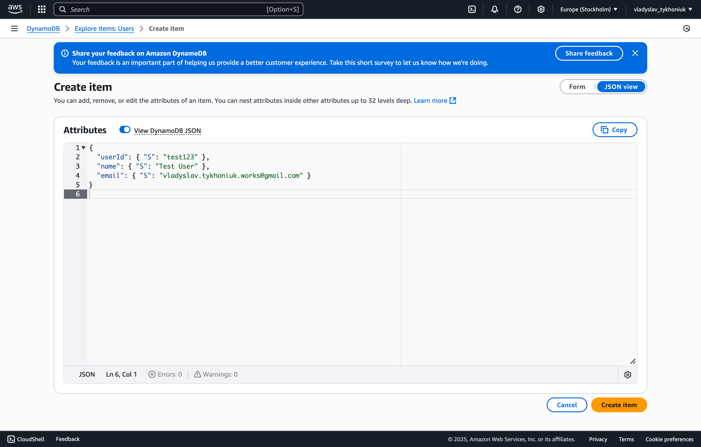
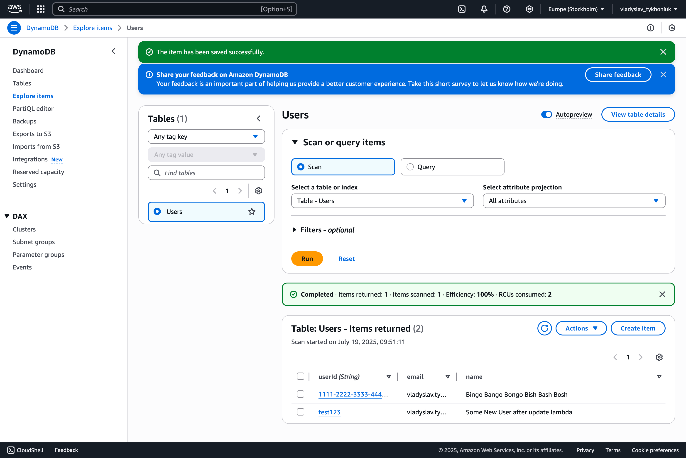
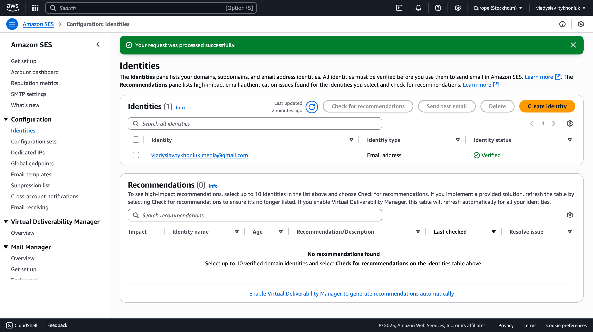
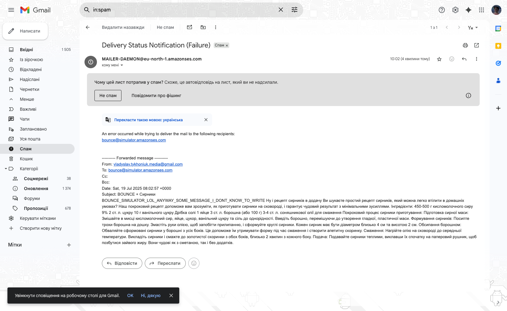
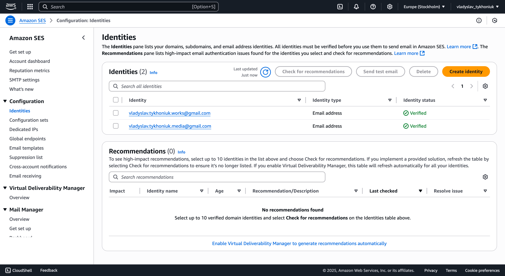
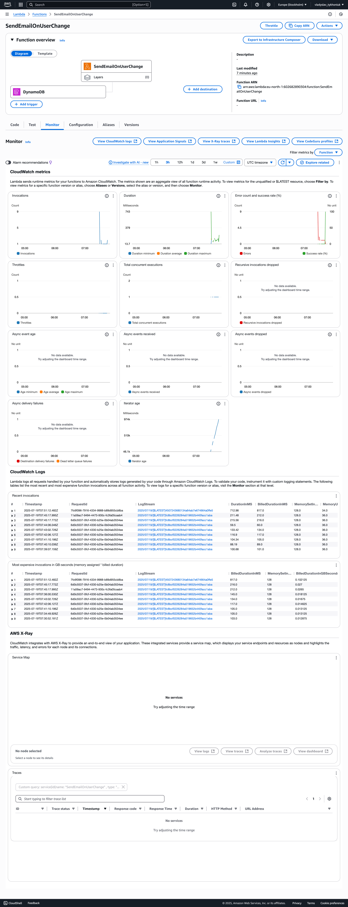
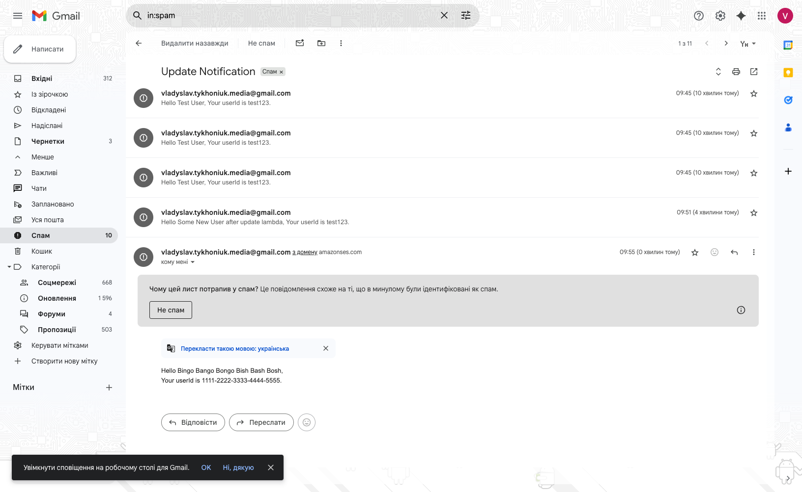
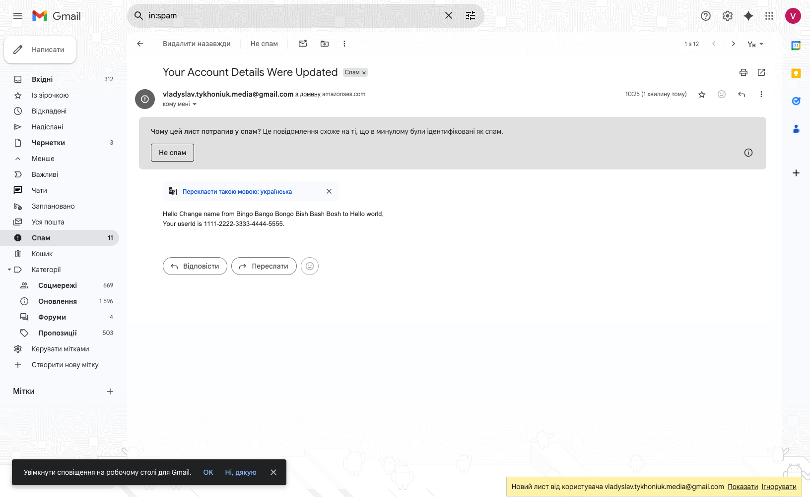
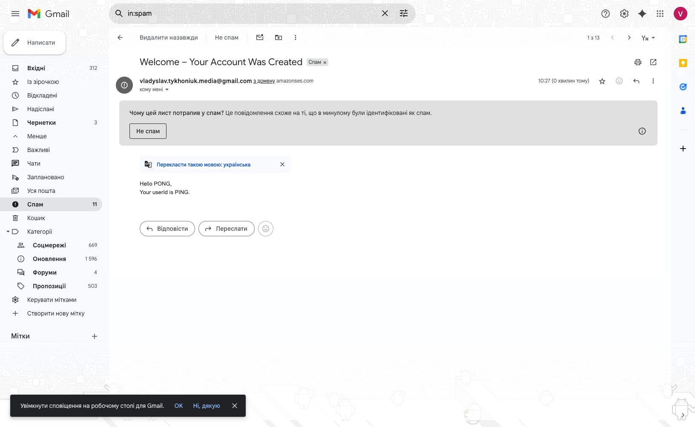

## HM-36 -> Lambda

📌 Крок 1: Підготовка DynamoDB

Створіть таблицю DynamoDB з іменем, наприклад, Users, для зберігання даних про користувачів. Таблиця повинна мати первинний ключ на кшталт userId (типу String).

Додайте записи до таблиці з атрибутами, як-от email (електронна адреса користувача), name (ім'я), та будь-якою іншою інформацією, яку ви хочете внести до листа.

📌 Крок 2: Налаштування DynamoDB Streams

Активуйте DynamoDB Streams для своєї таблиці Users. Це дасть вам змогу відстежувати зміни в таблиці (наприклад, додавання нових записів).

Оберіть тип даних потоку, який ви хочете отримувати. Для цього завдання рекомендовано вибрати New and old images, щоб мати доступ до повної інформації про змінені записи.

📌 Крок 3: Створення Lambda-функції

Створіть нову Lambda-функцію через AWS Management Console. Виберіть Node.js або Python як мову виконання.

Налаштуйте тригер для своєї Lambda-функції, обравши DynamoDB Streams як джерело подій і вказавши потік, пов’язаний з вашою таблицею Users.

Надайте Lambda-функції дозволи IAM-ролі для читання з DynamoDB Streams та відправлення листів через Amazon SES.

📌 Крок 4: Налаштування Amazon SES

Перейдіть до Amazon SES в AWS Console і переконайтеся, що ви підтвердили свою електронну адресу або домен, з якого відправлятимете листи.

Створіть шаблон електронного листа, якщо ви плануєте надсилати форматовані або стандартизовані повідомлення.

📌 Крок 5: Написання коду Lambda-функції

Ваша Lambda-функція повинна виконувати такі дії:

* Читання подій з DynamoDB Streams для визначення нових або оновлених записів
* Формування електронного листа на основі отриманої інформації. Ви можете використати підтверджену електронну адресу в SES як відправника.
* Відправлення електронного листа через Amazon SES, застосовуючи API SES

## Terraform (main.tf)
```textmate
terraform {
  required_providers {
    aws = {
      source  = "hashicorp/aws"
      version = "5.81.0"
    }
  }
}

provider "aws" {
  region = "eu-north-1"
}

resource "aws_dynamodb_table" "users" {
  name             = "Users"
  billing_mode     = "PAY_PER_REQUEST"
  hash_key         = "userId"
  stream_enabled   = true
  stream_view_type = "NEW_AND_OLD_IMAGES"

  attribute {
    name = "userId"
    type = "S"
  }
}

resource "aws_iam_role" "lambda_exec_role" {
  name = "lambda-dynamodb-ses-role"
  assume_role_policy = jsonencode({
    Version = "2012-10-17",
    Statement = [{
      Action = "sts:AssumeRole",
      Principal = {
        Service = "lambda.amazonaws.com"
      },
      Effect = "Allow"
    }]
  })
}

data "aws_iam_policy_document" "lambda_policy_document" {
  statement {
    actions = [
      "dynamodb:DescribeStream",
      "dynamodb:GetRecords",
      "dynamodb:GetShardIterator",
      "dynamodb:ListStreams"
    ]
    resources = [aws_dynamodb_table.users.stream_arn]
  }

  statement {
    actions = [
      "ses:SendEmail",
      "ses:SendRawEmail"
    ]
    resources = ["*"]
  }

  statement {
    actions = [
      "logs:CreateLogGroup",
      "logs:CreateLogStream",
      "logs:PutLogEvents"
    ]
    resources = ["*"]
  }
}

resource "aws_iam_policy" "lambda_policy" {
  name   = "lambda-dynamodb-ses-policy"
  policy = data.aws_iam_policy_document.lambda_policy_document.json
}

resource "aws_iam_role_policy_attachment" "lambda_policy_attach" {
  role       = aws_iam_role.lambda_exec_role.name
  policy_arn = aws_iam_policy.lambda_policy.arn
}

resource "aws_lambda_function" "send_email" {
  filename         = "../go-lambda/lambda.zip"
  function_name    = "SendEmailOnUserChange"
  role             = aws_iam_role.lambda_exec_role.arn
  handler          = "bootstrap"
  runtime          = "provided.al2"
  source_code_hash = filebase64sha256("../go-lambda/lambda.zip")

  environment {
    variables = {
      SES_SENDER = "vladyslav.tykhoniuk.media@gmail.com"
    }
  }
}

resource "aws_lambda_permission" "allow_dynamodb" {
  statement_id  = "AllowExecutionFromDynamoDB"
  action        = "lambda:InvokeFunction"
  function_name = aws_lambda_function.send_email.function_name
  principal     = "dynamodb.amazonaws.com"
  source_arn    = aws_dynamodb_table.users.stream_arn
}

resource "aws_lambda_event_source_mapping" "dynamodb_trigger" {
  event_source_arn  = aws_dynamodb_table.users.stream_arn
  function_name     = aws_lambda_function.send_email.arn
  starting_position = "LATEST"
}
```

## Terraform Apply 
```textmate
hibana@mac terraform % terraform apply

Terraform used the selected providers to generate the following execution plan. Resource actions are indicated with the following symbols:
  + create
 <= read (data resources)

Terraform will perform the following actions:

  # data.aws_iam_policy_document.lambda_policy_document will be read during apply
  # (config refers to values not yet known)
 <= data "aws_iam_policy_document" "lambda_policy_document" {
      + id            = (known after apply)
      + json          = (known after apply)
      + minified_json = (known after apply)

      + statement {
          + actions   = [
              + "dynamodb:DescribeStream",
              + "dynamodb:GetRecords",
              + "dynamodb:GetShardIterator",
              + "dynamodb:ListStreams",
            ]
          + resources = [
              + (known after apply),
            ]
        }
      + statement {
          + actions   = [
              + "ses:SendEmail",
              + "ses:SendRawEmail",
            ]
          + resources = [
              + "*",
            ]
        }
      + statement {
          + actions   = [
              + "logs:CreateLogGroup",
              + "logs:CreateLogStream",
              + "logs:PutLogEvents",
            ]
          + resources = [
              + "*",
            ]
        }
    }

  # aws_dynamodb_table.users will be created
  + resource "aws_dynamodb_table" "users" {
      + arn              = (known after apply)
      + billing_mode     = "PAY_PER_REQUEST"
      + hash_key         = "userId"
      + id               = (known after apply)
      + name             = "Users"
      + read_capacity    = (known after apply)
      + stream_arn       = (known after apply)
      + stream_enabled   = true
      + stream_label     = (known after apply)
      + stream_view_type = "NEW_AND_OLD_IMAGES"
      + tags_all         = (known after apply)
      + write_capacity   = (known after apply)

      + attribute {
          + name = "userId"
          + type = "S"
        }

      + point_in_time_recovery (known after apply)

      + server_side_encryption (known after apply)

      + ttl (known after apply)
    }

  # aws_iam_policy.lambda_policy will be created
  + resource "aws_iam_policy" "lambda_policy" {
      + arn              = (known after apply)
      + attachment_count = (known after apply)
      + id               = (known after apply)
      + name             = "lambda-dynamodb-ses-policy"
      + name_prefix      = (known after apply)
      + path             = "/"
      + policy           = (known after apply)
      + policy_id        = (known after apply)
      + tags_all         = (known after apply)
    }

  # aws_iam_role.lambda_exec_role will be created
  + resource "aws_iam_role" "lambda_exec_role" {
      + arn                   = (known after apply)
      + assume_role_policy    = jsonencode(
            {
              + Statement = [
                  + {
                      + Action    = "sts:AssumeRole"
                      + Effect    = "Allow"
                      + Principal = {
                          + Service = "lambda.amazonaws.com"
                        }
                    },
                ]
              + Version   = "2012-10-17"
            }
        )
      + create_date           = (known after apply)
      + force_detach_policies = false
      + id                    = (known after apply)
      + managed_policy_arns   = (known after apply)
      + max_session_duration  = 3600
      + name                  = "lambda-dynamodb-ses-role"
      + name_prefix           = (known after apply)
      + path                  = "/"
      + tags_all              = (known after apply)
      + unique_id             = (known after apply)

      + inline_policy (known after apply)
    }

  # aws_iam_role_policy_attachment.lambda_policy_attach will be created
  + resource "aws_iam_role_policy_attachment" "lambda_policy_attach" {
      + id         = (known after apply)
      + policy_arn = (known after apply)
      + role       = "lambda-dynamodb-ses-role"
    }

  # aws_lambda_event_source_mapping.dynamodb_trigger will be created
  + resource "aws_lambda_event_source_mapping" "dynamodb_trigger" {
      + arn                           = (known after apply)
      + enabled                       = true
      + event_source_arn              = (known after apply)
      + function_arn                  = (known after apply)
      + function_name                 = (known after apply)
      + id                            = (known after apply)
      + last_modified                 = (known after apply)
      + last_processing_result        = (known after apply)
      + maximum_record_age_in_seconds = (known after apply)
      + maximum_retry_attempts        = (known after apply)
      + parallelization_factor        = (known after apply)
      + starting_position             = "LATEST"
      + state                         = (known after apply)
      + state_transition_reason       = (known after apply)
      + tags_all                      = (known after apply)
      + uuid                          = (known after apply)

      + amazon_managed_kafka_event_source_config (known after apply)

      + self_managed_kafka_event_source_config (known after apply)
    }

  # aws_lambda_function.send_email will be created
  + resource "aws_lambda_function" "send_email" {
      + architectures                  = (known after apply)
      + arn                            = (known after apply)
      + code_sha256                    = (known after apply)
      + filename                       = "../go-lambda/lambda.zip"
      + function_name                  = "SendEmailOnUserChange"
      + handler                        = "bootstrap"
      + id                             = (known after apply)
      + invoke_arn                     = (known after apply)
      + last_modified                  = (known after apply)
      + memory_size                    = 128
      + package_type                   = "Zip"
      + publish                        = false
      + qualified_arn                  = (known after apply)
      + qualified_invoke_arn           = (known after apply)
      + reserved_concurrent_executions = -1
      + role                           = (known after apply)
      + runtime                        = "provided.al2"
      + signing_job_arn                = (known after apply)
      + signing_profile_version_arn    = (known after apply)
      + skip_destroy                   = false
      + source_code_hash               = "KN80eEsyu7MJ4gaKAhEFyJTwhAoE7ikuhp0dLpmzg54="
      + source_code_size               = (known after apply)
      + tags_all                       = (known after apply)
      + timeout                        = 3
      + version                        = (known after apply)

      + environment {
          + variables = {
              + "SES_SENDER" = "vladyslav.tykhoniuk.media@gmail.com"
            }
        }

      + ephemeral_storage (known after apply)

      + logging_config (known after apply)

      + tracing_config (known after apply)
    }

  # aws_lambda_permission.allow_dynamodb will be created
  + resource "aws_lambda_permission" "allow_dynamodb" {
      + action              = "lambda:InvokeFunction"
      + function_name       = "SendEmailOnUserChange"
      + id                  = (known after apply)
      + principal           = "dynamodb.amazonaws.com"
      + source_arn          = (known after apply)
      + statement_id        = "AllowExecutionFromDynamoDB"
      + statement_id_prefix = (known after apply)
    }

Plan: 7 to add, 0 to change, 0 to destroy.

Do you want to perform these actions?
  Terraform will perform the actions described above.
  Only 'yes' will be accepted to approve.

  Enter a value: yes

aws_iam_role.lambda_exec_role: Creating...
aws_dynamodb_table.users: Creating...
aws_iam_role.lambda_exec_role: Creation complete after 1s [id=lambda-dynamodb-ses-role]
aws_lambda_function.send_email: Creating...
aws_dynamodb_table.users: Creation complete after 7s [id=Users]
data.aws_iam_policy_document.lambda_policy_document: Reading...
data.aws_iam_policy_document.lambda_policy_document: Read complete after 0s [id=2164528815]
aws_iam_policy.lambda_policy: Creating...
aws_iam_policy.lambda_policy: Creation complete after 0s [id=arn:aws:iam::602682890304:policy/lambda-dynamodb-ses-policy]
aws_iam_role_policy_attachment.lambda_policy_attach: Creating...
aws_iam_role_policy_attachment.lambda_policy_attach: Creation complete after 1s [id=lambda-dynamodb-ses-role-20250719072515452800000001]
aws_lambda_function.send_email: Still creating... [10s elapsed]
aws_lambda_function.send_email: Creation complete after 13s [id=SendEmailOnUserChange]
aws_lambda_permission.allow_dynamodb: Creating...
aws_lambda_event_source_mapping.dynamodb_trigger: Creating...
aws_lambda_permission.allow_dynamodb: Creation complete after 0s [id=AllowExecutionFromDynamoDB]
aws_lambda_event_source_mapping.dynamodb_trigger: Creation complete after 1s [id=470d9ac8-7131-4ea5-a88e-fdcf90526db6]

Apply complete! Resources: 7 added, 0 changed, 0 destroyed.
```

## Important: [Link to Golang binary create](https://github.com/aws/aws-lambda-go)
### Execution script
```textmate
GOOS=linux GOARCH=amd64 go build -o bootstrap main.go
zip lambda.zip bootstrap
```

```textmate
Там в заданні було вказано про пайтон або ж Node.js, але відкрив для себе останнім часом Golang.

І вирішив спробувати зробити на Golang, за допомогою добрих людей в інтернеті і індійськими LLM.
```
```js
package main

import (
    "context"
"fmt"
"log"
"os"
"strings"

"github.com/aws/aws-lambda-go/events"
"github.com/aws/aws-lambda-go/lambda"
"github.com/aws/aws-sdk-go/aws/session"
"github.com/aws/aws-sdk-go/service/ses"
)

var sesClient *ses.SES
var sender string

func init() {
    sess := session.Must(session.NewSession())
    sesClient = ses.New(sess)
    sender = os.Getenv("SES_SENDER")
}

func handler(ctx context.Context, event events.DynamoDBEvent) error {
    for _, record := range event.Records {
        if record.EventName != "INSERT" && record.EventName != "MODIFY" {
            continue
        }

        newImage := record.Change.NewImage
        emailAttr, emailOk := newImage["email"]
        nameAttr, nameOk := newImage["name"]
        idAttr, idOk := newImage["userId"]

        if !emailOk || !nameOk || !idOk {
            log.Println("Missing required fields in DynamoDB record")
            continue
        }

        email := trimQuotes(emailAttr.String())
        name := trimQuotes(nameAttr.String())
        userId := trimQuotes(idAttr.String())

        log.Printf("Preparing to send email to: %s (name: %s, userId: %s)", email, name, userId)

        body := fmt.Sprintf("Hello %s,\nYour userId is %s.", name, userId)
        var subject string
        switch record.EventName {
            case "INSERT":
                subject = "Welcome – Your Account Was Created"
            case "MODIFY":
                subject = "Your Account Details Were Updated"
            default:
                subject = "Account Notification"
        }

        input := &ses.SendEmailInput{
            Source: &sender,
                Destination: &ses.Destination{
                ToAddresses: []*string{&email},
            },
            Message: &ses.Message{
                Subject: &ses.Content{Data: &subject},
                Body: &ses.Body{
                    Text: &ses.Content{Data: &body},
                },
            },
        }

        output, err := sesClient.SendEmail(input)
        if err != nil {
            log.Printf("Failed to send email to %s: %v", email, err)
            return err
        }

        log.Printf("Email successfully sent to %s. SES Message ID: %s", email, *output.MessageId)
    }

    return nil
}

func main() {
    lambda.Start(handler)
}

func trimQuotes(s string) string {
    return strings.Trim(s, `"`)
}
```

## DynamoDB item creation:



## SES Identities (with test email send)





## Lambda Monitoring && Emails on target Email address



## Emails After provide external fixes into logic of create email subject to spearate emails by subject (CREATE, UPDATE)



## Lambda Logs (CloudWatch):

### Part 1:
```csv
timestamp,message
1752910145251,"INIT_START Runtime Version: provided:al2.v119	Runtime Version ARN: arn:aws:lambda:eu-north-1::runtime:8a930096449100afef45b8782979173254578ed1757f57a55a4111a51aba8fb7
"
1752910145358,"START RequestId: 6d0c5537-0fcf-4330-b25e-0b04ab3534ee Version: $LATEST
"
1752910145992,"2025/07/19 07:29:05 {""errorMessage"":""MessageRejected: Email address is not verified. The following identities failed the check in region EU-NORTH-1: vladyslav.tykhoniuk.media@gmail.com, vladyslav.tykhoniuk.works@gmail.com
\tstatus code: 400, request id: 166597f4-8957-4b21-9b87-2345e18612e1"",""errorType"":""requestError""}
"
1752910145995,"END RequestId: 6d0c5537-0fcf-4330-b25e-0b04ab3534ee
"
1752910145995,"REPORT RequestId: 6d0c5537-0fcf-4330-b25e-0b04ab3534ee	Duration: 637.07 ms	Billed Duration: 744 ms	Memory Size: 128 MB	Max Memory Used: 34 MB	Init Duration: 106.38 ms	
"
1752910146271,"START RequestId: 6d0c5537-0fcf-4330-b25e-0b04ab3534ee Version: $LATEST
"
1752910146346,"2025/07/19 07:29:06 {""errorMessage"":""MessageRejected: Email address is not verified. The following identities failed the check in region EU-NORTH-1: vladyslav.tykhoniuk.media@gmail.com, vladyslav.tykhoniuk.works@gmail.com
\tstatus code: 400, request id: 796d54a5-7cc8-4bbd-99c1-2d85246ee15d"",""errorType"":""requestError""}
"
1752910146347,"END RequestId: 6d0c5537-0fcf-4330-b25e-0b04ab3534ee
"
1752910146347,"REPORT RequestId: 6d0c5537-0fcf-4330-b25e-0b04ab3534ee	Duration: 76.56 ms	Billed Duration: 77 ms	Memory Size: 128 MB	Max Memory Used: 35 MB	
"
1752910146801,"START RequestId: 6d0c5537-0fcf-4330-b25e-0b04ab3534ee Version: $LATEST
"
1752910146852,"2025/07/19 07:29:06 {""errorMessage"":""MessageRejected: Email address is not verified. The following identities failed the check in region EU-NORTH-1: vladyslav.tykhoniuk.media@gmail.com, vladyslav.tykhoniuk.works@gmail.com
\tstatus code: 400, request id: b9182df3-3a97-4190-ab20-123700d8ac99"",""errorType"":""requestError""}
"
1752910146853,"END RequestId: 6d0c5537-0fcf-4330-b25e-0b04ab3534ee
"
1752910146853,"REPORT RequestId: 6d0c5537-0fcf-4330-b25e-0b04ab3534ee	Duration: 52.31 ms	Billed Duration: 53 ms	Memory Size: 128 MB	Max Memory Used: 35 MB	
"
1752910147827,"START RequestId: 6d0c5537-0fcf-4330-b25e-0b04ab3534ee Version: $LATEST
"
1752910147840,"2025/07/19 07:29:07 {""errorMessage"":""MessageRejected: Email address is not verified. The following identities failed the check in region EU-NORTH-1: vladyslav.tykhoniuk.media@gmail.com, vladyslav.tykhoniuk.works@gmail.com
\tstatus code: 400, request id: a329b217-9acd-4ff4-8a4a-59ee2598f955"",""errorType"":""requestError""}
"
1752910147841,"END RequestId: 6d0c5537-0fcf-4330-b25e-0b04ab3534ee
"
1752910147841,"REPORT RequestId: 6d0c5537-0fcf-4330-b25e-0b04ab3534ee	Duration: 13.66 ms	Billed Duration: 14 ms	Memory Size: 128 MB	Max Memory Used: 35 MB	
"
1752910149244,"START RequestId: 6d0c5537-0fcf-4330-b25e-0b04ab3534ee Version: $LATEST
"
1752910149305,"2025/07/19 07:29:09 {""errorMessage"":""MessageRejected: Email address is not verified. The following identities failed the check in region EU-NORTH-1: vladyslav.tykhoniuk.media@gmail.com, vladyslav.tykhoniuk.works@gmail.com
\tstatus code: 400, request id: c371dda5-bf96-4fc8-90c1-e233e33a2e99"",""errorType"":""requestError""}
"
1752910149307,"END RequestId: 6d0c5537-0fcf-4330-b25e-0b04ab3534ee
"
1752910149307,"REPORT RequestId: 6d0c5537-0fcf-4330-b25e-0b04ab3534ee	Duration: 62.27 ms	Billed Duration: 63 ms	Memory Size: 128 MB	Max Memory Used: 35 MB	
"
1752910151956,"START RequestId: 6d0c5537-0fcf-4330-b25e-0b04ab3534ee Version: $LATEST
"
1752910152041,"2025/07/19 07:29:12 {""errorMessage"":""MessageRejected: Email address is not verified. The following identities failed the check in region EU-NORTH-1: vladyslav.tykhoniuk.media@gmail.com, vladyslav.tykhoniuk.works@gmail.com
\tstatus code: 400, request id: 0a58e917-b5fc-4005-a234-11784600c468"",""errorType"":""requestError""}
"
1752910152043,"END RequestId: 6d0c5537-0fcf-4330-b25e-0b04ab3534ee
"
1752910152043,"REPORT RequestId: 6d0c5537-0fcf-4330-b25e-0b04ab3534ee	Duration: 86.78 ms	Billed Duration: 87 ms	Memory Size: 128 MB	Max Memory Used: 35 MB	
"
1752910157121,"START RequestId: 6d0c5537-0fcf-4330-b25e-0b04ab3534ee Version: $LATEST
"
1752910157182,"2025/07/19 07:29:17 {""errorMessage"":""MessageRejected: Email address is not verified. The following identities failed the check in region EU-NORTH-1: vladyslav.tykhoniuk.media@gmail.com, vladyslav.tykhoniuk.works@gmail.com
\tstatus code: 400, request id: 241bb453-6e73-46d9-9705-dade23cf1eb0"",""errorType"":""requestError""}
"
1752910157183,"END RequestId: 6d0c5537-0fcf-4330-b25e-0b04ab3534ee
"
1752910157183,"REPORT RequestId: 6d0c5537-0fcf-4330-b25e-0b04ab3534ee	Duration: 61.45 ms	Billed Duration: 62 ms	Memory Size: 128 MB	Max Memory Used: 35 MB	
"
1752910166855,"START RequestId: 6d0c5537-0fcf-4330-b25e-0b04ab3534ee Version: $LATEST
"
1752910166913,"2025/07/19 07:29:26 {""errorMessage"":""MessageRejected: Email address is not verified. The following identities failed the check in region EU-NORTH-1: vladyslav.tykhoniuk.media@gmail.com, vladyslav.tykhoniuk.works@gmail.com
\tstatus code: 400, request id: 79a5cc50-df2b-49f6-bf3c-0f3d33792a44"",""errorType"":""requestError""}
"
1752910166914,"END RequestId: 6d0c5537-0fcf-4330-b25e-0b04ab3534ee
"
1752910166914,"REPORT RequestId: 6d0c5537-0fcf-4330-b25e-0b04ab3534ee	Duration: 59.12 ms	Billed Duration: 60 ms	Memory Size: 128 MB	Max Memory Used: 36 MB	
"
1752910190063,"START RequestId: 6d0c5537-0fcf-4330-b25e-0b04ab3534ee Version: $LATEST
"
1752910190116,"2025/07/19 07:29:50 {""errorMessage"":""MessageRejected: Email address is not verified. The following identities failed the check in region EU-NORTH-1: vladyslav.tykhoniuk.media@gmail.com, vladyslav.tykhoniuk.works@gmail.com
\tstatus code: 400, request id: a62ea845-8a96-43d6-8ded-1485f7587905"",""errorType"":""requestError""}
"
1752910190117,"END RequestId: 6d0c5537-0fcf-4330-b25e-0b04ab3534ee
"
1752910190117,"REPORT RequestId: 6d0c5537-0fcf-4330-b25e-0b04ab3534ee	Duration: 54.03 ms	Billed Duration: 55 ms	Memory Size: 128 MB	Max Memory Used: 36 MB	
"
1752910252078,"START RequestId: 6d0c5537-0fcf-4330-b25e-0b04ab3534ee Version: $LATEST
"
1752910252180,"2025/07/19 07:30:52 {""errorMessage"":""MessageRejected: Email address is not verified. The following identities failed the check in region EU-NORTH-1: vladyslav.tykhoniuk.media@gmail.com, vladyslav.tykhoniuk.works@gmail.com
\tstatus code: 400, request id: 8feb9d92-47bb-4f70-a715-73719d85d595"",""errorType"":""requestError""}
"
1752910252181,"END RequestId: 6d0c5537-0fcf-4330-b25e-0b04ab3534ee
"
1752910252181,"REPORT RequestId: 6d0c5537-0fcf-4330-b25e-0b04ab3534ee	Duration: 102.69 ms	Billed Duration: 103 ms	Memory Size: 128 MB	Max Memory Used: 36 MB	
"
1752910326295,"START RequestId: 6d0c5537-0fcf-4330-b25e-0b04ab3534ee Version: $LATEST
"
1752910326365,"2025/07/19 07:32:06 {""errorMessage"":""MessageRejected: Email address is not verified. The following identities failed the check in region EU-NORTH-1: vladyslav.tykhoniuk.media@gmail.com, vladyslav.tykhoniuk.works@gmail.com
\tstatus code: 400, request id: 280e5343-d15f-469a-b16d-05150c382ecb"",""errorType"":""requestError""}
"
1752910326367,"END RequestId: 6d0c5537-0fcf-4330-b25e-0b04ab3534ee
"
1752910326367,"REPORT RequestId: 6d0c5537-0fcf-4330-b25e-0b04ab3534ee	Duration: 71.61 ms	Billed Duration: 72 ms	Memory Size: 128 MB	Max Memory Used: 36 MB	
"
1752910375939,"START RequestId: 6d0c5537-0fcf-4330-b25e-0b04ab3534ee Version: $LATEST
"
1752910376003,"2025/07/19 07:32:56 {""errorMessage"":""MessageRejected: Email address is not verified. The following identities failed the check in region EU-NORTH-1: vladyslav.tykhoniuk.works@gmail.com
\tstatus code: 400, request id: 8afb7351-a00b-44a4-9150-86161d83c525"",""errorType"":""requestError""}
"
1752910376004,"END RequestId: 6d0c5537-0fcf-4330-b25e-0b04ab3534ee
"
1752910376004,"REPORT RequestId: 6d0c5537-0fcf-4330-b25e-0b04ab3534ee	Duration: 65.14 ms	Billed Duration: 66 ms	Memory Size: 128 MB	Max Memory Used: 36 MB	
"
1752910433103,"START RequestId: 6d0c5537-0fcf-4330-b25e-0b04ab3534ee Version: $LATEST
"
1752910433165,"2025/07/19 07:33:53 {""errorMessage"":""MessageRejected: Email address is not verified. The following identities failed the check in region EU-NORTH-1: vladyslav.tykhoniuk.works@gmail.com
\tstatus code: 400, request id: 855245f4-324d-47de-be61-955b9859202a"",""errorType"":""requestError""}
"
1752910433166,"END RequestId: 6d0c5537-0fcf-4330-b25e-0b04ab3534ee
"
1752910433166,"REPORT RequestId: 6d0c5537-0fcf-4330-b25e-0b04ab3534ee	Duration: 63.07 ms	Billed Duration: 64 ms	Memory Size: 128 MB	Max Memory Used: 36 MB	
"
1752910489822,"START RequestId: 6d0c5537-0fcf-4330-b25e-0b04ab3534ee Version: $LATEST
"
1752910489925,"2025/07/19 07:34:49 {""errorMessage"":""MessageRejected: Email address is not verified. The following identities failed the check in region EU-NORTH-1: vladyslav.tykhoniuk.works@gmail.com
\tstatus code: 400, request id: 2926fd98-3e97-451a-a757-cfc21c27d7b7"",""errorType"":""requestError""}
"
1752910489926,"END RequestId: 6d0c5537-0fcf-4330-b25e-0b04ab3534ee
"
1752910489926,"REPORT RequestId: 6d0c5537-0fcf-4330-b25e-0b04ab3534ee	Duration: 104.38 ms	Billed Duration: 105 ms	Memory Size: 128 MB	Max Memory Used: 36 MB	
"
1752910560386,"START RequestId: 6d0c5537-0fcf-4330-b25e-0b04ab3534ee Version: $LATEST
"
1752910560529,"2025/07/19 07:36:00 {""errorMessage"":""MessageRejected: Email address is not verified. The following identities failed the check in region EU-NORTH-1: vladyslav.tykhoniuk.works@gmail.com
\tstatus code: 400, request id: 69efd28b-8fc9-4044-87a7-f1319f9ca5ac"",""errorType"":""requestError""}
"
1752910560530,"END RequestId: 6d0c5537-0fcf-4330-b25e-0b04ab3534ee
"
1752910560530,"REPORT RequestId: 6d0c5537-0fcf-4330-b25e-0b04ab3534ee	Duration: 144.17 ms	Billed Duration: 145 ms	Memory Size: 128 MB	Max Memory Used: 36 MB	
"
1752910626190,"START RequestId: 6d0c5537-0fcf-4330-b25e-0b04ab3534ee Version: $LATEST
"
1752910626278,"2025/07/19 07:37:06 {""errorMessage"":""MessageRejected: Email address is not verified. The following identities failed the check in region EU-NORTH-1: vladyslav.tykhoniuk.works@gmail.com
\tstatus code: 400, request id: 04408ce6-0926-44ec-9f1c-34e9df393c07"",""errorType"":""requestError""}
"
1752910626279,"END RequestId: 6d0c5537-0fcf-4330-b25e-0b04ab3534ee
"
1752910626279,"REPORT RequestId: 6d0c5537-0fcf-4330-b25e-0b04ab3534ee	Duration: 89.64 ms	Billed Duration: 90 ms	Memory Size: 128 MB	Max Memory Used: 36 MB	
"
1752910683929,"START RequestId: 6d0c5537-0fcf-4330-b25e-0b04ab3534ee Version: $LATEST
"
1752910684005,"2025/07/19 07:38:04 {""errorMessage"":""MessageRejected: Email address is not verified. The following identities failed the check in region EU-NORTH-1: vladyslav.tykhoniuk.works@gmail.com
\tstatus code: 400, request id: 77d38548-d1af-4283-bb7f-816bda14e67c"",""errorType"":""requestError""}
"
1752910684007,"END RequestId: 6d0c5537-0fcf-4330-b25e-0b04ab3534ee
"
1752910684007,"REPORT RequestId: 6d0c5537-0fcf-4330-b25e-0b04ab3534ee	Duration: 78.45 ms	Billed Duration: 79 ms	Memory Size: 128 MB	Max Memory Used: 36 MB	
"
1752910747058,"START RequestId: 6d0c5537-0fcf-4330-b25e-0b04ab3534ee Version: $LATEST
"
1752910747158,"2025/07/19 07:39:07 {""errorMessage"":""MessageRejected: Email address is not verified. The following identities failed the check in region EU-NORTH-1: vladyslav.tykhoniuk.media@gmail.com, vladyslav.tykhoniuk.works@gmail.com
\tstatus code: 400, request id: b5806f30-1e70-4ec8-9c51-990dee25322d"",""errorType"":""requestError""}
"
1752910747159,"END RequestId: 6d0c5537-0fcf-4330-b25e-0b04ab3534ee
"
1752910747159,"REPORT RequestId: 6d0c5537-0fcf-4330-b25e-0b04ab3534ee	Duration: 100.68 ms	Billed Duration: 101 ms	Memory Size: 128 MB	Max Memory Used: 36 MB	
"
1752910809948,"START RequestId: 6d0c5537-0fcf-4330-b25e-0b04ab3534ee Version: $LATEST
"
1752910810035,"2025/07/19 07:40:10 {""errorMessage"":""MessageRejected: Email address is not verified. The following identities failed the check in region EU-NORTH-1: vladyslav.tykhoniuk.works@gmail.com
\tstatus code: 400, request id: 5719fd82-c9a9-4afd-bf1e-bdaad3614b0e"",""errorType"":""requestError""}
"
1752910810036,"END RequestId: 6d0c5537-0fcf-4330-b25e-0b04ab3534ee
"
1752910810036,"REPORT RequestId: 6d0c5537-0fcf-4330-b25e-0b04ab3534ee	Duration: 88.19 ms	Billed Duration: 89 ms	Memory Size: 128 MB	Max Memory Used: 36 MB	
"
1752910870081,"START RequestId: 6d0c5537-0fcf-4330-b25e-0b04ab3534ee Version: $LATEST
"
1752910870184,"2025/07/19 07:41:10 {""errorMessage"":""MessageRejected: Email address is not verified. The following identities failed the check in region EU-NORTH-1: vladyslav.tykhoniuk.works@gmail.com
\tstatus code: 400, request id: 4955a30c-f61e-4759-8526-61d2ff0e6bfa"",""errorType"":""requestError""}
"
1752910870186,"END RequestId: 6d0c5537-0fcf-4330-b25e-0b04ab3534ee
"
1752910870186,"REPORT RequestId: 6d0c5537-0fcf-4330-b25e-0b04ab3534ee	Duration: 104.34 ms	Billed Duration: 105 ms	Memory Size: 128 MB	Max Memory Used: 36 MB	
"
1752910926010,"START RequestId: 6d0c5537-0fcf-4330-b25e-0b04ab3534ee Version: $LATEST
"
1752910926126,"2025/07/19 07:42:06 {""errorMessage"":""MessageRejected: Email address is not verified. The following identities failed the check in region EU-NORTH-1: vladyslav.tykhoniuk.works@gmail.com
\tstatus code: 400, request id: 44174e5f-18f7-4157-a6d7-34dc62771902"",""errorType"":""requestError""}
"
1752910926127,"END RequestId: 6d0c5537-0fcf-4330-b25e-0b04ab3534ee
"
1752910926127,"REPORT RequestId: 6d0c5537-0fcf-4330-b25e-0b04ab3534ee	Duration: 116.90 ms	Billed Duration: 117 ms	Memory Size: 128 MB	Max Memory Used: 36 MB	
"
1752910982593,"START RequestId: 6d0c5537-0fcf-4330-b25e-0b04ab3534ee Version: $LATEST
"
1752910982725,"2025/07/19 07:43:02 {""errorMessage"":""MessageRejected: Email address is not verified. The following identities failed the check in region EU-NORTH-1: vladyslav.tykhoniuk.works@gmail.com
\tstatus code: 400, request id: 2d73fbf6-fa82-4382-bb7a-cf69920804cc"",""errorType"":""requestError""}
"
1752910982726,"END RequestId: 6d0c5537-0fcf-4330-b25e-0b04ab3534ee
"
1752910982726,"REPORT RequestId: 6d0c5537-0fcf-4330-b25e-0b04ab3534ee	Duration: 133.42 ms	Billed Duration: 134 ms	Memory Size: 128 MB	Max Memory Used: 36 MB	
"
1752911045987,"START RequestId: 6d0c5537-0fcf-4330-b25e-0b04ab3534ee Version: $LATEST
"
1752911046045,"2025/07/19 07:44:06 {""errorMessage"":""MessageRejected: Email address is not verified. The following identities failed the check in region EU-NORTH-1: vladyslav.tykhoniuk.works@gmail.com
\tstatus code: 400, request id: a0e4db7b-4b20-4d59-8c61-c43ed566b845"",""errorType"":""requestError""}
"
1752911046046,"END RequestId: 6d0c5537-0fcf-4330-b25e-0b04ab3534ee
"
1752911046046,"REPORT RequestId: 6d0c5537-0fcf-4330-b25e-0b04ab3534ee	Duration: 59.50 ms	Billed Duration: 60 ms	Memory Size: 128 MB	Max Memory Used: 36 MB	
"
1752911117557,"START RequestId: 6d0c5537-0fcf-4330-b25e-0b04ab3534ee Version: $LATEST
"
1752911117772,"END RequestId: 6d0c5537-0fcf-4330-b25e-0b04ab3534ee
"
1752911117772,"REPORT RequestId: 6d0c5537-0fcf-4330-b25e-0b04ab3534ee	Duration: 215.56 ms	Billed Duration: 216 ms	Memory Size: 128 MB	Max Memory Used: 36 MB	
"
1752911117784,"START RequestId: 11a59ac7-9494-4473-930c-fc3fa05caab4 Version: $LATEST
"
1752911117995,"END RequestId: 11a59ac7-9494-4473-930c-fc3fa05caab4
"
1752911117995,"REPORT RequestId: 11a59ac7-9494-4473-930c-fc3fa05caab4	Duration: 211.48 ms	Billed Duration: 212 ms	Memory Size: 128 MB	Max Memory Used: 36 MB	
"
```

### Part 2:
```csv
timestamp,message
1752911471665,"INIT_START Runtime Version: provided:al2.v119	Runtime Version ARN: arn:aws:lambda:eu-north-1::runtime:8a930096449100afef45b8782979173254578ed1757f57a55a4111a51aba8fb7
"
1752911471769,"START RequestId: 7fc6f096-7916-4334-9988-b89d955cb8ba Version: $LATEST
"
1752911471770,"2025/07/19 07:51:11 Preparing to send email to: vladyslav.tykhoniuk.works@gmail.com (name: Some New User after update lambda, userId: test123)
"
1752911472465,"2025/07/19 07:51:12 Email successfully sent to vladyslav.tykhoniuk.works@gmail.com. SES Message ID: 0110019821aa66fd-3b77c31a-acc9-4467-9fde-b3c7735fccf7-000000
"
1752911472482,"END RequestId: 7fc6f096-7916-4334-9988-b89d955cb8ba
"
1752911472482,"REPORT RequestId: 7fc6f096-7916-4334-9988-b89d955cb8ba	Duration: 712.98 ms	Billed Duration: 817 ms	Memory Size: 128 MB	Max Memory Used: 34 MB	Init Duration: 103.09 ms	
"
1752911708467,"START RequestId: 4222e0a6-927d-4fd8-bb5e-20960ba68436 Version: $LATEST
"
1752911708467,"2025/07/19 07:55:08 Preparing to send email to: vladyslav.tykhoniuk.works@gmail.com (name: Bingo Bango Bongo Bish Bash Bosh, userId: 1111-2222-3333-4444-5555)
"
1752911708587,"2025/07/19 07:55:08 Failed to send email to vladyslav.tykhoniuk.works@gmail.com: MessageRejected: Email address is not verified. The following identities failed the check in region EU-NORTH-1: vladyslav.tykhoniuk.works@gmail.com
"
1752911708587,"status code: 400, request id: b76cc90b-913d-45e1-9f0c-8bfbf133b292
"
1752911708587,"2025/07/19 07:55:08 {""errorMessage"":""MessageRejected: Email address is not verified. The following identities failed the check in region EU-NORTH-1: vladyslav.tykhoniuk.works@gmail.com
\tstatus code: 400, request id: b76cc90b-913d-45e1-9f0c-8bfbf133b292"",""errorType"":""requestError""}
"
1752911708588,"END RequestId: 4222e0a6-927d-4fd8-bb5e-20960ba68436
"
1752911708588,"REPORT RequestId: 4222e0a6-927d-4fd8-bb5e-20960ba68436	Duration: 121.90 ms	Billed Duration: 122 ms	Memory Size: 128 MB	Max Memory Used: 34 MB	
"
1752911708841,"START RequestId: 4222e0a6-927d-4fd8-bb5e-20960ba68436 Version: $LATEST
"
1752911708841,"2025/07/19 07:55:08 Preparing to send email to: vladyslav.tykhoniuk.works@gmail.com (name: Bingo Bango Bongo Bish Bash Bosh, userId: 1111-2222-3333-4444-5555)
"
1752911708898,"2025/07/19 07:55:08 Failed to send email to vladyslav.tykhoniuk.works@gmail.com: MessageRejected: Email address is not verified. The following identities failed the check in region EU-NORTH-1: vladyslav.tykhoniuk.works@gmail.com
"
1752911708898,"status code: 400, request id: dd9518b5-5b3b-4367-aa13-3bf3f6d083f2
"
1752911708898,"2025/07/19 07:55:08 {""errorMessage"":""MessageRejected: Email address is not verified. The following identities failed the check in region EU-NORTH-1: vladyslav.tykhoniuk.works@gmail.com
\tstatus code: 400, request id: dd9518b5-5b3b-4367-aa13-3bf3f6d083f2"",""errorType"":""requestError""}
"
1752911708900,"END RequestId: 4222e0a6-927d-4fd8-bb5e-20960ba68436
"
1752911708900,"REPORT RequestId: 4222e0a6-927d-4fd8-bb5e-20960ba68436	Duration: 58.56 ms	Billed Duration: 59 ms	Memory Size: 128 MB	Max Memory Used: 34 MB	
"
1752911709245,"START RequestId: 4222e0a6-927d-4fd8-bb5e-20960ba68436 Version: $LATEST
"
1752911709245,"2025/07/19 07:55:09 Preparing to send email to: vladyslav.tykhoniuk.works@gmail.com (name: Bingo Bango Bongo Bish Bash Bosh, userId: 1111-2222-3333-4444-5555)
"
1752911709307,"2025/07/19 07:55:09 Failed to send email to vladyslav.tykhoniuk.works@gmail.com: MessageRejected: Email address is not verified. The following identities failed the check in region EU-NORTH-1: vladyslav.tykhoniuk.works@gmail.com
"
1752911709307,"status code: 400, request id: 04c5b197-e0c5-4e90-8f58-d543b6e7a4ce
"
1752911709307,"2025/07/19 07:55:09 {""errorMessage"":""MessageRejected: Email address is not verified. The following identities failed the check in region EU-NORTH-1: vladyslav.tykhoniuk.works@gmail.com
\tstatus code: 400, request id: 04c5b197-e0c5-4e90-8f58-d543b6e7a4ce"",""errorType"":""requestError""}
"
1752911709308,"END RequestId: 4222e0a6-927d-4fd8-bb5e-20960ba68436
"
1752911709308,"REPORT RequestId: 4222e0a6-927d-4fd8-bb5e-20960ba68436	Duration: 63.28 ms	Billed Duration: 64 ms	Memory Size: 128 MB	Max Memory Used: 34 MB	
"
1752911709980,"START RequestId: 4222e0a6-927d-4fd8-bb5e-20960ba68436 Version: $LATEST
"
1752911709980,"2025/07/19 07:55:09 Preparing to send email to: vladyslav.tykhoniuk.works@gmail.com (name: Bingo Bango Bongo Bish Bash Bosh, userId: 1111-2222-3333-4444-5555)
"
1752911710031,"2025/07/19 07:55:10 Failed to send email to vladyslav.tykhoniuk.works@gmail.com: MessageRejected: Email address is not verified. The following identities failed the check in region EU-NORTH-1: vladyslav.tykhoniuk.works@gmail.com
"
1752911710031,"status code: 400, request id: 5ace33ca-d0e5-40cd-abb7-4ab47a3ee308
"
1752911710031,"2025/07/19 07:55:10 {""errorMessage"":""MessageRejected: Email address is not verified. The following identities failed the check in region EU-NORTH-1: vladyslav.tykhoniuk.works@gmail.com
\tstatus code: 400, request id: 5ace33ca-d0e5-40cd-abb7-4ab47a3ee308"",""errorType"":""requestError""}
"
1752911710032,"END RequestId: 4222e0a6-927d-4fd8-bb5e-20960ba68436
"
1752911710032,"REPORT RequestId: 4222e0a6-927d-4fd8-bb5e-20960ba68436	Duration: 52.19 ms	Billed Duration: 53 ms	Memory Size: 128 MB	Max Memory Used: 34 MB	
"
1752911711833,"START RequestId: 4222e0a6-927d-4fd8-bb5e-20960ba68436 Version: $LATEST
"
1752911711833,"2025/07/19 07:55:11 Preparing to send email to: vladyslav.tykhoniuk.works@gmail.com (name: Bingo Bango Bongo Bish Bash Bosh, userId: 1111-2222-3333-4444-5555)
"
1752911711941,"2025/07/19 07:55:11 Email successfully sent to vladyslav.tykhoniuk.works@gmail.com. SES Message ID: 0110019821ae0e6f-c309d1bd-58bc-4c15-914f-345b914126fa-000000
"
1752911711942,"END RequestId: 4222e0a6-927d-4fd8-bb5e-20960ba68436
"
1752911711942,"REPORT RequestId: 4222e0a6-927d-4fd8-bb5e-20960ba68436	Duration: 108.92 ms	Billed Duration: 109 ms	Memory Size: 128 MB	Max Memory Used: 34 MB	
"
```

## Part 3:
```textmate
timestamp,message
1752913328304,"INIT_START Runtime Version: provided:al2.v119	Runtime Version ARN: arn:aws:lambda:eu-north-1::runtime:8a930096449100afef45b8782979173254578ed1757f57a55a4111a51aba8fb7
"
1752913328410,"START RequestId: dd834824-28c1-4ff4-b219-6b21c91af929 Version: $LATEST
"
1752913328410,"2025/07/19 08:22:08 Preparing to send email to: vladyslav.tykhoniuk.works@gmail.com (name: Change name from Bingo Bango Bongo Bish Bash Bosh to Hello world, userId: 1111-2222-3333-4444-5555)
"
1752913329111,"2025/07/19 08:22:09 Failed to send email to vladyslav.tykhoniuk.works@gmail.com: MessageRejected: Email address is not verified. The following identities failed the check in region EU-NORTH-1: vladyslav.tykhoniuk.works@gmail.com
"
1752913329111,"status code: 400, request id: f1823e41-901e-496d-88c0-4de48d489015
"
1752913329111,"2025/07/19 08:22:09 {""errorMessage"":""MessageRejected: Email address is not verified. The following identities failed the check in region EU-NORTH-1: vladyslav.tykhoniuk.works@gmail.com
\tstatus code: 400, request id: f1823e41-901e-496d-88c0-4de48d489015"",""errorType"":""requestError""}
"
1752913329124,"END RequestId: dd834824-28c1-4ff4-b219-6b21c91af929
"
1752913329124,"REPORT RequestId: dd834824-28c1-4ff4-b219-6b21c91af929	Duration: 714.70 ms	Billed Duration: 820 ms	Memory Size: 128 MB	Max Memory Used: 34 MB	Init Duration: 104.73 ms	
"
1752913329309,"START RequestId: dd834824-28c1-4ff4-b219-6b21c91af929 Version: $LATEST
"
1752913329310,"2025/07/19 08:22:09 Preparing to send email to: vladyslav.tykhoniuk.works@gmail.com (name: Change name from Bingo Bango Bongo Bish Bash Bosh to Hello world, userId: 1111-2222-3333-4444-5555)
"
1752913329399,"2025/07/19 08:22:09 Failed to send email to vladyslav.tykhoniuk.works@gmail.com: MessageRejected: Email address is not verified. The following identities failed the check in region EU-NORTH-1: vladyslav.tykhoniuk.works@gmail.com
"
1752913329399,"status code: 400, request id: c3221e2d-d2c7-4cf3-8cb4-d2df9b3fbaba
"
1752913329399,"2025/07/19 08:22:09 {""errorMessage"":""MessageRejected: Email address is not verified. The following identities failed the check in region EU-NORTH-1: vladyslav.tykhoniuk.works@gmail.com
\tstatus code: 400, request id: c3221e2d-d2c7-4cf3-8cb4-d2df9b3fbaba"",""errorType"":""requestError""}
"
1752913329400,"END RequestId: dd834824-28c1-4ff4-b219-6b21c91af929
"
1752913329400,"REPORT RequestId: dd834824-28c1-4ff4-b219-6b21c91af929	Duration: 90.94 ms	Billed Duration: 91 ms	Memory Size: 128 MB	Max Memory Used: 34 MB	
"
1752913329752,"START RequestId: dd834824-28c1-4ff4-b219-6b21c91af929 Version: $LATEST
"
1752913329752,"2025/07/19 08:22:09 Preparing to send email to: vladyslav.tykhoniuk.works@gmail.com (name: Change name from Bingo Bango Bongo Bish Bash Bosh to Hello world, userId: 1111-2222-3333-4444-5555)
"
1752913329807,"2025/07/19 08:22:09 Failed to send email to vladyslav.tykhoniuk.works@gmail.com: MessageRejected: Email address is not verified. The following identities failed the check in region EU-NORTH-1: vladyslav.tykhoniuk.works@gmail.com
"
1752913329807,"status code: 400, request id: 9219206a-cd97-44d0-b5d4-626fe6919030
"
1752913329807,"2025/07/19 08:22:09 {""errorMessage"":""MessageRejected: Email address is not verified. The following identities failed the check in region EU-NORTH-1: vladyslav.tykhoniuk.works@gmail.com
\tstatus code: 400, request id: 9219206a-cd97-44d0-b5d4-626fe6919030"",""errorType"":""requestError""}
"
1752913329808,"END RequestId: dd834824-28c1-4ff4-b219-6b21c91af929
"
1752913329808,"REPORT RequestId: dd834824-28c1-4ff4-b219-6b21c91af929	Duration: 56.15 ms	Billed Duration: 57 ms	Memory Size: 128 MB	Max Memory Used: 34 MB	
"
1752913330436,"START RequestId: dd834824-28c1-4ff4-b219-6b21c91af929 Version: $LATEST
"
1752913330436,"2025/07/19 08:22:10 Preparing to send email to: vladyslav.tykhoniuk.works@gmail.com (name: Change name from Bingo Bango Bongo Bish Bash Bosh to Hello world, userId: 1111-2222-3333-4444-5555)
"
1752913330445,"2025/07/19 08:22:10 Failed to send email to vladyslav.tykhoniuk.works@gmail.com: MessageRejected: Email address is not verified. The following identities failed the check in region EU-NORTH-1: vladyslav.tykhoniuk.works@gmail.com
"
1752913330445,"status code: 400, request id: a78db5d3-0d95-417f-af28-1a980843b1dd
"
1752913330445,"2025/07/19 08:22:10 {""errorMessage"":""MessageRejected: Email address is not verified. The following identities failed the check in region EU-NORTH-1: vladyslav.tykhoniuk.works@gmail.com
\tstatus code: 400, request id: a78db5d3-0d95-417f-af28-1a980843b1dd"",""errorType"":""requestError""}
"
1752913330446,"END RequestId: dd834824-28c1-4ff4-b219-6b21c91af929
"
1752913330446,"REPORT RequestId: dd834824-28c1-4ff4-b219-6b21c91af929	Duration: 10.59 ms	Billed Duration: 11 ms	Memory Size: 128 MB	Max Memory Used: 34 MB	
"
1752913332109,"START RequestId: dd834824-28c1-4ff4-b219-6b21c91af929 Version: $LATEST
"
1752913332110,"2025/07/19 08:22:12 Preparing to send email to: vladyslav.tykhoniuk.works@gmail.com (name: Change name from Bingo Bango Bongo Bish Bash Bosh to Hello world, userId: 1111-2222-3333-4444-5555)
"
1752913332164,"2025/07/19 08:22:12 Failed to send email to vladyslav.tykhoniuk.works@gmail.com: MessageRejected: Email address is not verified. The following identities failed the check in region EU-NORTH-1: vladyslav.tykhoniuk.works@gmail.com
"
1752913332164,"status code: 400, request id: df87efd9-0105-4fef-95f8-5e50d1c8f8c3
"
1752913332164,"2025/07/19 08:22:12 {""errorMessage"":""MessageRejected: Email address is not verified. The following identities failed the check in region EU-NORTH-1: vladyslav.tykhoniuk.works@gmail.com
\tstatus code: 400, request id: df87efd9-0105-4fef-95f8-5e50d1c8f8c3"",""errorType"":""requestError""}
"
1752913332165,"END RequestId: dd834824-28c1-4ff4-b219-6b21c91af929
"
1752913332165,"REPORT RequestId: dd834824-28c1-4ff4-b219-6b21c91af929	Duration: 55.40 ms	Billed Duration: 56 ms	Memory Size: 128 MB	Max Memory Used: 34 MB	
"
1752913335050,"START RequestId: dd834824-28c1-4ff4-b219-6b21c91af929 Version: $LATEST
"
1752913335050,"2025/07/19 08:22:15 Preparing to send email to: vladyslav.tykhoniuk.works@gmail.com (name: Change name from Bingo Bango Bongo Bish Bash Bosh to Hello world, userId: 1111-2222-3333-4444-5555)
"
1752913335138,"2025/07/19 08:22:15 Failed to send email to vladyslav.tykhoniuk.works@gmail.com: MessageRejected: Email address is not verified. The following identities failed the check in region EU-NORTH-1: vladyslav.tykhoniuk.works@gmail.com
"
1752913335138,"status code: 400, request id: 4ce62ec5-2203-4c99-9864-7977411e639f
"
1752913335138,"2025/07/19 08:22:15 {""errorMessage"":""MessageRejected: Email address is not verified. The following identities failed the check in region EU-NORTH-1: vladyslav.tykhoniuk.works@gmail.com
\tstatus code: 400, request id: 4ce62ec5-2203-4c99-9864-7977411e639f"",""errorType"":""requestError""}
"
1752913335139,"END RequestId: dd834824-28c1-4ff4-b219-6b21c91af929
"
1752913335139,"REPORT RequestId: dd834824-28c1-4ff4-b219-6b21c91af929	Duration: 89.69 ms	Billed Duration: 90 ms	Memory Size: 128 MB	Max Memory Used: 34 MB	
"
1752913340165,"START RequestId: dd834824-28c1-4ff4-b219-6b21c91af929 Version: $LATEST
"
1752913340165,"2025/07/19 08:22:20 Preparing to send email to: vladyslav.tykhoniuk.works@gmail.com (name: Change name from Bingo Bango Bongo Bish Bash Bosh to Hello world, userId: 1111-2222-3333-4444-5555)
"
1752913340224,"2025/07/19 08:22:20 Failed to send email to vladyslav.tykhoniuk.works@gmail.com: MessageRejected: Email address is not verified. The following identities failed the check in region EU-NORTH-1: vladyslav.tykhoniuk.works@gmail.com
"
1752913340224,"status code: 400, request id: 73625142-fb4d-46bf-aab3-1c3f873244b4
"
1752913340224,"2025/07/19 08:22:20 {""errorMessage"":""MessageRejected: Email address is not verified. The following identities failed the check in region EU-NORTH-1: vladyslav.tykhoniuk.works@gmail.com
\tstatus code: 400, request id: 73625142-fb4d-46bf-aab3-1c3f873244b4"",""errorType"":""requestError""}
"
1752913340225,"END RequestId: dd834824-28c1-4ff4-b219-6b21c91af929
"
1752913340225,"REPORT RequestId: dd834824-28c1-4ff4-b219-6b21c91af929	Duration: 60.06 ms	Billed Duration: 61 ms	Memory Size: 128 MB	Max Memory Used: 34 MB	
"
1752913351439,"START RequestId: dd834824-28c1-4ff4-b219-6b21c91af929 Version: $LATEST
"
1752913351440,"2025/07/19 08:22:31 Preparing to send email to: vladyslav.tykhoniuk.works@gmail.com (name: Change name from Bingo Bango Bongo Bish Bash Bosh to Hello world, userId: 1111-2222-3333-4444-5555)
"
1752913351529,"2025/07/19 08:22:31 Failed to send email to vladyslav.tykhoniuk.works@gmail.com: MessageRejected: Email address is not verified. The following identities failed the check in region EU-NORTH-1: vladyslav.tykhoniuk.works@gmail.com
"
1752913351529,"status code: 400, request id: 4ff41586-7679-4afc-8034-2e1db891a055
"
1752913351529,"2025/07/19 08:22:31 {""errorMessage"":""MessageRejected: Email address is not verified. The following identities failed the check in region EU-NORTH-1: vladyslav.tykhoniuk.works@gmail.com
\tstatus code: 400, request id: 4ff41586-7679-4afc-8034-2e1db891a055"",""errorType"":""requestError""}
"
1752913351530,"END RequestId: dd834824-28c1-4ff4-b219-6b21c91af929
"
1752913351530,"REPORT RequestId: dd834824-28c1-4ff4-b219-6b21c91af929	Duration: 90.72 ms	Billed Duration: 91 ms	Memory Size: 128 MB	Max Memory Used: 34 MB	
"
1752913380819,"START RequestId: dd834824-28c1-4ff4-b219-6b21c91af929 Version: $LATEST
"
1752913380819,"2025/07/19 08:23:00 Preparing to send email to: vladyslav.tykhoniuk.works@gmail.com (name: Change name from Bingo Bango Bongo Bish Bash Bosh to Hello world, userId: 1111-2222-3333-4444-5555)
"
1752913380933,"2025/07/19 08:23:00 Failed to send email to vladyslav.tykhoniuk.works@gmail.com: MessageRejected: Email address is not verified. The following identities failed the check in region EU-NORTH-1: vladyslav.tykhoniuk.works@gmail.com
"
1752913380933,"status code: 400, request id: 63f9ff5a-b658-459a-97f5-17cf4e806d89
"
1752913380933,"2025/07/19 08:23:00 {""errorMessage"":""MessageRejected: Email address is not verified. The following identities failed the check in region EU-NORTH-1: vladyslav.tykhoniuk.works@gmail.com
\tstatus code: 400, request id: 63f9ff5a-b658-459a-97f5-17cf4e806d89"",""errorType"":""requestError""}
"
1752913380934,"END RequestId: dd834824-28c1-4ff4-b219-6b21c91af929
"
1752913380934,"REPORT RequestId: dd834824-28c1-4ff4-b219-6b21c91af929	Duration: 115.68 ms	Billed Duration: 116 ms	Memory Size: 128 MB	Max Memory Used: 34 MB	
"
1752913441773,"START RequestId: dd834824-28c1-4ff4-b219-6b21c91af929 Version: $LATEST
"
1752913441773,"2025/07/19 08:24:01 Preparing to send email to: vladyslav.tykhoniuk.works@gmail.com (name: Change name from Bingo Bango Bongo Bish Bash Bosh to Hello world, userId: 1111-2222-3333-4444-5555)
"
1752913441822,"2025/07/19 08:24:01 Failed to send email to vladyslav.tykhoniuk.works@gmail.com: MessageRejected: Email address is not verified. The following identities failed the check in region EU-NORTH-1: vladyslav.tykhoniuk.works@gmail.com
"
1752913441822,"status code: 400, request id: 2ff67dda-2556-4d47-8458-e47ee09ba80a
"
1752913441822,"2025/07/19 08:24:01 {""errorMessage"":""MessageRejected: Email address is not verified. The following identities failed the check in region EU-NORTH-1: vladyslav.tykhoniuk.works@gmail.com
\tstatus code: 400, request id: 2ff67dda-2556-4d47-8458-e47ee09ba80a"",""errorType"":""requestError""}
"
1752913441823,"END RequestId: dd834824-28c1-4ff4-b219-6b21c91af929
"
1752913441823,"REPORT RequestId: dd834824-28c1-4ff4-b219-6b21c91af929	Duration: 49.67 ms	Billed Duration: 50 ms	Memory Size: 128 MB	Max Memory Used: 34 MB	
"
1752913501124,"START RequestId: dd834824-28c1-4ff4-b219-6b21c91af929 Version: $LATEST
"
1752913501124,"2025/07/19 08:25:01 Preparing to send email to: vladyslav.tykhoniuk.works@gmail.com (name: Change name from Bingo Bango Bongo Bish Bash Bosh to Hello world, userId: 1111-2222-3333-4444-5555)
"
1752913501343,"2025/07/19 08:25:01 Email successfully sent to vladyslav.tykhoniuk.works@gmail.com. SES Message ID: 0110019821c95c09-1c11befa-fb3d-4d5c-9e51-e5087f86bb54-000000
"
1752913501344,"END RequestId: dd834824-28c1-4ff4-b219-6b21c91af929
"
1752913501344,"REPORT RequestId: dd834824-28c1-4ff4-b219-6b21c91af929	Duration: 220.21 ms	Billed Duration: 221 ms	Memory Size: 128 MB	Max Memory Used: 34 MB	
"
1752913503134,"START RequestId: a6556e84-b5de-4a3d-abbc-e5a8ee219a09 Version: $LATEST
"
1752913503134,"2025/07/19 08:25:03 Preparing to send email to: vladyslav.tykhoniuk.works@gmail.com (name: Updated Name From Bingo etc. to CHANGED_NAME_LOL, userId: 1111-2222-3333-4444-5555)
"
1752913503262,"2025/07/19 08:25:03 Email successfully sent to vladyslav.tykhoniuk.works@gmail.com. SES Message ID: 0110019821c963b4-aaef8d29-9211-46f1-9c07-8184414e1219-000000
"
1752913503263,"END RequestId: a6556e84-b5de-4a3d-abbc-e5a8ee219a09
"
1752913503263,"REPORT RequestId: a6556e84-b5de-4a3d-abbc-e5a8ee219a09	Duration: 129.49 ms	Billed Duration: 130 ms	Memory Size: 128 MB	Max Memory Used: 34 MB	
"
1752913649422,"START RequestId: ba4c4f4b-a831-4e8d-bbaa-30ef9c9ca51b Version: $LATEST
"
1752913649422,"2025/07/19 08:27:29 Preparing to send email to: vladyslav.tykhoniuk.works@gmail.com (name: PONG, userId: PING)
"
1752913649608,"2025/07/19 08:27:29 Email successfully sent to vladyslav.tykhoniuk.works@gmail.com. SES Message ID: 0110019821cb9f52-78693fed-a9bc-4f28-bed9-b1538f49ff45-000000
"
1752913649609,"END RequestId: ba4c4f4b-a831-4e8d-bbaa-30ef9c9ca51b
"
1752913649609,"REPORT RequestId: ba4c4f4b-a831-4e8d-bbaa-30ef9c9ca51b	Duration: 186.87 ms	Billed Duration: 187 ms	Memory Size: 128 MB	Max Memory Used: 34 MB	
"
```

## Post-run
```textmate
Plan: 0 to add, 0 to change, 7 to destroy.

Do you really want to destroy all resources?
  Terraform will destroy all your managed infrastructure, as shown above.
  There is no undo. Only 'yes' will be accepted to confirm.

  Enter a value: yes

aws_iam_role_policy_attachment.lambda_policy_attach: Destroying... [id=lambda-dynamodb-ses-role-20250719072515452800000001]
aws_lambda_permission.allow_dynamodb: Destroying... [id=AllowExecutionFromDynamoDB]
aws_lambda_event_source_mapping.dynamodb_trigger: Destroying... [id=470d9ac8-7131-4ea5-a88e-fdcf90526db6]
aws_lambda_permission.allow_dynamodb: Destruction complete after 0s
aws_lambda_event_source_mapping.dynamodb_trigger: Destruction complete after 0s
aws_lambda_function.send_email: Destroying... [id=SendEmailOnUserChange]
aws_iam_role_policy_attachment.lambda_policy_attach: Destruction complete after 1s
aws_lambda_function.send_email: Destruction complete after 1s
aws_iam_policy.lambda_policy: Destroying... [id=arn:aws:iam::602682890304:policy/lambda-dynamodb-ses-policy]
aws_iam_role.lambda_exec_role: Destroying... [id=lambda-dynamodb-ses-role]
aws_iam_policy.lambda_policy: Destruction complete after 0s
aws_dynamodb_table.users: Destroying... [id=Users]
aws_iam_role.lambda_exec_role: Destruction complete after 0s
aws_dynamodb_table.users: Destruction complete after 7s

Destroy complete! Resources: 7 destroyed.
```