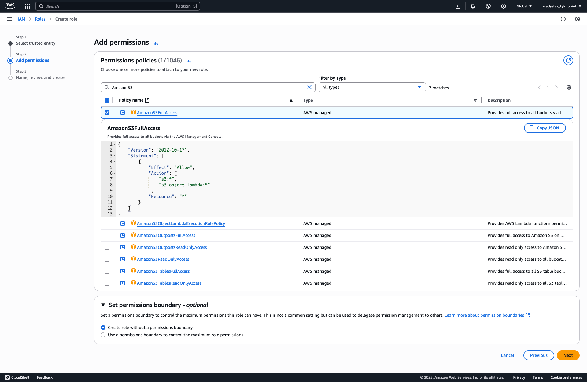
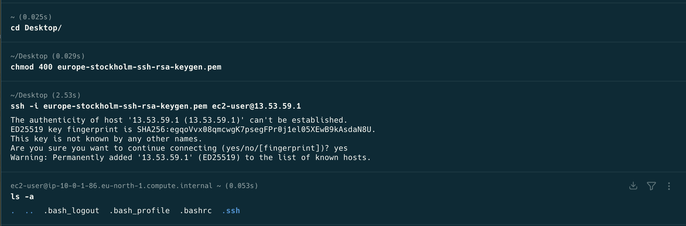

## HM 23 - S3

Створення бакета S3
1.1 Створіть новий бакет S3:
2. ○ Використайте консоль AWS для створення бакета
   ○ Виберіть унікальне ім’я для бакета
   1.2 Налаштуйте політику доступу для бакета:
   ○ Додайте політику бакета, яка дозволяє доступ з вашого облікового запису
3. Налаштування IAM-ролі для EC2
   2.1 Створіть нову IAM-роль для EC2:
4. ○ Використайте консоль IAM для створення ролі
   ○ Оберіть роль для EC2 та додайте політику доступу до S3
   2.2 Призначте роль до вашого інстансу EC2:
   ○ Перейдіть до консолі EC2 та призначте створену IAM роль до вашого інстансу
5. Завантаження та управління файлами в S3 з EC2
      3.1 Підключіться до вашого інстансу EC2:
      ○ Використайте SSH для підключення до вашого інстансу
6. 3.2 Встановіть AWS CLI:
   ○ Встановіть AWS CLI на вашому інстансі EC2
7. 3.3 Налаштуйте AWS CLI з використанням IAM-ролі:
   ○ Виконайте команду aws configure для налаштування AWS CLI
8. 3.4 Завантажте файл в S3:
   Використайте команду aws s3 cp для завантаження файлу у ваш бакет S3
9. 3.5 Отримайте список файлів у бакеті S3:
   ○ Використайте команду aws s3 ls для перегляду файлів у бакеті


## Screens:

### Create Bucket


### Create IAM Role:




### Assignment IAM Role to EC2 instance


### Added IAM Role to S3 bucket


### SSH terminal
```textmate
Тут я зробив скріни конкретних операцій, 
тому що тут було ще багато моментів де я тупив,
тому не знаю наскільки цінна та інформація.
```



### Bucket


### Bucket additional configuration changes
```textmate
Тут трошки додав скрінів наскільки я правильно покажу операції,
бо робив це все трошки одночасно і змінював різні параметри щоб 
досягнути конкретної цілі, а саме щоб при відкритті S3 Uri,
була змога показати картинку, а не лог xml, з тим що 
пермішенів немає(
```


